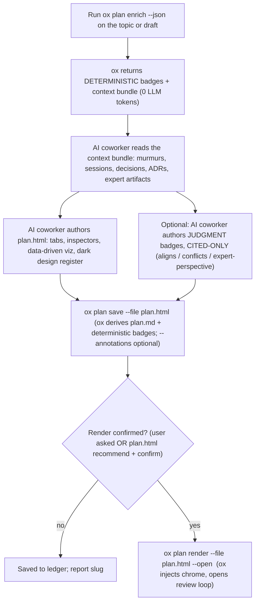

<!-- Keep behavioral "when to render" guidance lean — that belongs in the
     `ox plan` JSON output (signals.material, guidance) and in the
     <plan-enrichment-guidance> block from `ox agent prime`, not duplicated here.
     What legitimately lives in THIS skill is what the binary CANNOT do:
     (1) authoring the rich interactive page that IS the plan of record, and
     (2) reasoning the context bundle into cited judgment badges. ox owns the
     chrome (enrichment overlay, footer credit, review loop — injected between
     ox-chrome markers) and the derived plan.md — never hand-author those. -->

**Whether to render at all is decided by the `ox plan` JSON (`signals.material`, `guidance`) + the user's confirmation / the `plan.html` config setting — not by this skill.** Do not nag on trivial plans; honor the command's signal.

**You author the page. ox injects the chrome.** For any material plan, author a rich, self-contained interactive HTML page — that page IS the plan of record. `ox plan save --file plan.html` stores it verbatim in the ledger, derives `plan.md` from it, and computes the deterministic badges itself. `ox plan render --file plan.html` serves it with the ox chrome injected (append-only, between `<!-- ox-chrome:start/end -->` markers — never wrapped, never rewritten). Contract + quality bar: **docs/specs/plan-authoring-html.md**. Markdown-first remains only the quick path for small, low-stakes plans.

---

## Orchestration (what this skill does)



1. **Get the deterministic signals + context bundle.** Run:

   ```bash
   ox plan enrich --json --file <plan-file>   # or --topic "<subject>" before drafting
   ```

   This makes **no LLM or network call**. It returns a `Result` JSON:
   - `annotations[]` — deterministic, ox-computed badges: `collision`, `prior-art`, `expert-routing`. Each carries `{section, kind:"deterministic", type, why, source_url, expert, files}`. These are **factual** — keep them as-is, do not second-guess them. On save, ox computes these itself; you never re-author them.
   - `context[]` — the pre-retrieved bundle the AI coworker reasons over: `{kind: murmur|session|decision|adr|commit|discussion, title, ref, snippet, score, author, when}`.
   - `signals` — `{collisions, prior_art, expert_routes, material}`. `material` is ox's call on whether a render is worth recommending.

2. **Author the page (the main event — see "Authoring the page" below).** Build the rich, self-contained `plan.html` that carries the plan's whole argument: tabbed views, interactive inspectors, data-driven visualizations, the dark design register.

3. **Optionally author JUDGMENT badges (ox does NO inference).** Read the `context[]` bundle and produce judgment annotations — additive, passed via `--annotations`:
   - `aligns` / `conflicts` — does the plan agree or clash with a cited ADR, decision, or convention?
   - `expert-perspective` — the synthesized stance of the area expert.

   **CITED-ONLY is non-negotiable.** Every judgment badge MUST point at a real artifact from the bundle (`ref` / `source_url`): a specific ADR, decision doc, session, commit, or discussion. Rules:
   - Never invent an opinion, a quote, or a conflict. Precision over recall.
   - When the evidence is **thin or ambiguous, degrade to a routing nudge** — `expert-perspective` becomes "consult `<name>`" (naming the expert from `annotations[].expert`), NOT a fabricated stance. Putting words in a teammate's mouth is the one failure mode that destroys trust.
   - When unsure whether a conflict is real, downgrade to "Novel — no prior decision found," not a false `conflicts`.
   - Set `kind:"judgment"` on every badge you author so the chrome styles it distinctly from ox's deterministic ones (outlined vs. filled — ox owns that treatment).

   **NEVER dump the `context[]` bundle into the plan.** The bundle is your *reasoning input*, not output. A bundle item becomes a badge *only* after you reason over it into a cited judgment attached to a specific plan section. An item you can't turn into a section-anchored, cited badge does not appear at all. Worked example:

   > Bundle item → `{kind:"adr", title:"ADR-018 codedb perf budget", ref:"docs/adr/018...", snippet:"...512MB resident ceiling..."}`
   > Plan section 3 proposes an in-memory index. →
   > **Authored badge** → `{section:"3. Index", kind:"judgment", type:"conflicts", why:"In-memory index may breach the 512MB ceiling set in ADR-018", source_url:"docs/adr/018...", ...}`
   >
   > If the same ADR were only tangentially related: degrade to `expert-perspective` → "consult `<name>`", NOT a pasted raw snippet.

4. **Persist with `ox plan save`.**

   ```bash
   ox plan save --file plan.html [--annotations <judgment.json>]
   ```

   ox stores the authored page verbatim as the canonical artifact (`meta.json` records `"primary":"html"`), derives `plan.md` from it (headings/paragraphs/lists/tables/code; tabs and `[data-ox-section]` views become H2 sections), computes the deterministic badges, and prints the slug. `--annotations` merges in your judgment badges. **Never hand-edit the derived `plan.md`** — it is regenerated on every save.

5. **Render with chrome (only when a render is confirmed).**

   ```bash
   ox plan render --file plan.html --open
   ```

   ox serves your authored page with the chrome injected — the enrichment overlay (collision / prior-art / expert-routing chips, **including your judgment badges**), the footer credit, and the live review loop (click any element to attach a mark; content-hash anchored, so it works on your arbitrary markup). `--open` launches `ox plan review <slug>` so the reviewer's marks write back to the ledger. On a headless shell it prints the path. `--artifact` exports the authored page verbatim, zero injection.

---

## Authoring the page (your artifact)

**The contract and the quality bar live in `docs/specs/plan-authoring-html.md` — read it before authoring.** The bar is the SageOx conversation-format comparison page: tabbed views behind a sticky nav, interactive field inspectors (hover/click a field, its counterpart lights up, a docked explainer updates), animated timelines with toggles, side-by-side comparison panes, verdict cards, and the design register, all in one self-contained file. A page that merely reformats prose has missed the point.

**The design register is not optional, and it is the one part of the bar you can get wrong without noticing.** Three families, no fourth: **Hedvig Letters Serif** for headings (weight **400 only** — 600/700 synthesizes a fake bold), **Inter** for body, **Spline Sans Mono** for code, IDs and eyebrows. A geometric sans on the headings is the fastest way to make a plan look like a generic dev-tool doc instead of a SageOx one. Dark runs on the warm green-black Crater ramp (canvas `#0b0d0b`, surface `#111411`, accent sage-400 `#99c693`); light is a pure-white sheet on warm cream panels, with every accent two stops deeper for AA. Copy the token block from the spec verbatim rather than picking hexes by eye — the plan is embedded in the app, so a page a few degrees off temperature reads as a foreign object no matter how good its content is.

The minimal hooks (all optional, all degrade gracefully): `<title>` for the topic/slug, `<meta name="ox-plan-slug">` to pin the slug, and H2 headings or `data-ox-section="Name"` on view containers so enrichment badges and review anchors group by section. A page with none of these still works.

### The reader's ten minutes — audience & time contract

You are writing for a **senior / principal engineer or EM whose time is worth ~$10,000/hour.** They will spend **no more than ten minutes** and must walk away able to decide. Author the page against that budget:

- **Lead with the conclusion**, the decision needed, and the biggest risk — not the backstory. The opening view is a tight TL;DR (problem, approach, cost, biggest risk).
- **The plan stands on its own.** Never reference a symbol, file, ID, or PR without enough context to understand *why it matters* — a reader who hasn't opened the codebase still follows the argument.
- **No minutiae up top.** Interaction is your relocation tool: exact `file:line` steps and code trivia live in a collapsed "Implementation notes" view — essential to the implementing AI coworker, invisible to the ten-minute approver.
- **Every element earns its pixels.** Interactivity that compresses understanding (an inspector, a toggleable timeline) is the point; interactivity as decoration is noise.

### Visualizations do the heavy lifting

Prefer a visualization over a paragraph wherever a relationship, flow, state machine, sequence, comparison, or before/after exists — and in an authored page you are not limited to static diagrams: build the inspector, animate the timeline, wire the hover states. `ox viz suggest "<what needs explaining>"` is the shared catalog (architecture, flows, swimlanes, risk matrices, device mockups) to adapt into the page or any other artifact. For user-facing changes, show the resulting UI state — don't describe it in prose.

### What you do NOT author

The **ox chrome** — enrichment overlay, footer credit, review loop — is injected by ox between `<!-- ox-chrome:start/end -->` markers; never hand-roll it, never write inside the markers. The **derived `plan.md`** is ox's output; never author or edit it. If the chrome is missing something you expected (a badge treatment, an overlay behavior), that is a gap in the binary — file a bd issue, don't fake it in the page.

---

## The quick path (markdown, low-stakes only)

For a **small, low-stakes plan** where an authored page isn't worth the effort, markdown-first remains: author the plan markdown, then `ox plan save --file plan.md [--annotations ...]` and `ox plan render --file plan.md`. The renderer auto-renders tabs (>3 H2 sections), a TL;DR hero, `:::compare`/`:::` side-by-side panes, ` ```html-interactive ` passthrough fences, and auto-visualizations (gated-track tables → swimlanes; comparison tables → a click-to-inspect field inspector). It approximates; a material plan gets an authored page. Never use the rejected legacy `--plan + --html` pair: competing sources can cause review to discard the authored visualization. Apply the GitHub-strict Mermaid rules from CLAUDE.md to any ` ```mermaid ` fences, and treat `plan-diagram [...]` advisories as fixes, not suggestions.

---

## SageOx attribution

The chrome injects the earned, conditional SageOx credit by construction (a restrained footer line + the `● ox-computed` marker on deterministic badges) — you don't add it, and you must not overclaim. When the plan carried enrichment, `ox plan render` / `ox plan save` lint the output for this contract (footer credit + anchored OX marker; no overclaim on un-enriched plans; no live-remote avatar). Re-check anytime with `ox plan lint <slug>` (`--strict` to fail on findings). A clean lint is part of "done."

---

## Process

1. Run `ox plan enrich --json` to get deterministic badges + the context bundle (0 tokens, local).
2. Author `plan.html` to the contract + quality bar in `docs/specs/plan-authoring-html.md`: TL;DR view up top, interactive views that compress understanding, minutiae in a collapsed implementation-notes view.
3. Optionally: read the `context[]` bundle and author judgment badges **cited-only**, degrading to "consult `<name>`" when evidence is thin.
4. `ox plan save --file plan.html [--annotations <judgment.json>]` — ox stores the page, derives the markdown, computes deterministic badges, prints the slug.
5. **If no render is confirmed:** stop here — report the saved slug (`ox plan view <slug>` reads the derived markdown in the terminal). Steps 6–7 apply only once a render exists.
6. **If a render is confirmed:** `ox plan render --file plan.html --open` — ox injects the chrome and opens the review loop (`ox plan review <slug>`).
7. **Architect review pass (recommended for material plans, render only).** Spawn an `architect` (or general-purpose) reviewer AI coworker to read the served page *as the $10k/hour principal reader*: is the decision + biggest risk up top and graspable in ten minutes? Does every file/ID/PR carry enough context to matter? Do the views compress understanding? Revise the page / badges and re-render until it signs off.
8. Report the slug — and, when you rendered, the served/exported path.

The goal: a $10k/hour principal reader opens the page, skims the TL;DR view + the enrichment overlay, and within ten minutes knows whether the plan aligns with team direction and whether to approve — with ox-computed facts visually separate from your cited judgment, and every badge saying where its claim comes from. You supply the page and the reasoning; ox supplies the chrome, the derived markdown, and the ledger.
