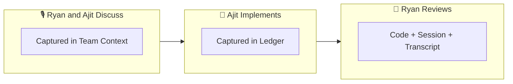

<!-- doc-audience: human -->
# SageOx CLI (ox)

[](https://github.com/rsnodgrass/ai-human-docs)

SageOx is agentic context infrastructure — we call it the hivemind. It makes architectural and product intent persistent and automatically available across humans and agents.

This initial version is intended for AI-native teams — teams that build products almost exclusively through prompts.

Sessions, ledgers, and team knowledge ensure your AI coworkers understand your project's patterns, security requirements, and architectural decisions from the start, making agentic engineering multiplayer by default.

## Demo


## Install the CLI

**Quick install (macOS / Linux / FreeBSD):**

```bash
curl -sSL https://raw.githubusercontent.com/sageox/ox/main/scripts/install.sh | bash
```

**From source:**

```bash
git clone https://github.com/sageox/ox.git && cd ox
make build && make install
```

## Set up ox in your repo

```bash
# cd into your code repo (e.g. ~/src/my-project)
cd ~/src/my-project
ox login

# one time setup, done ONCE per repo
ox init
# commit the changes in your repo, e.g. git commit -a -m 'SageOx init'

ox doctor
# ox doctor --fix may be needed in the alpha stage
ox status
# will give you the location of the team context and ledger repos
```

## 👥 Go to [sageox.ai](https://sageox.ai) - Setup team

Go into your newly created team in SageOx and invite your coworkers by copying the invite in the upper right, displayed in Team Overview.

<!-- TODO: add screenshot of team invite UI -->

## 🎙️ Record discussions

Team discussions impacting the product are captured and transcribed in the app and the context is automatically available to Claude.

<!-- TODO: add screenshot of transcription UI -->

## 🤖 Capture sessions

`ox-session` capture the conversation between a developer and Claude so the decisions, patterns, and reasoning become available to the rest of the team.

```bash
pwd
/home/me/src/my-project
claude
/ox-session-start
<implement fizz buzz>
/ox-session-stop
```

<!-- TODO: add screenshot of session viewer -->

## 🚀 Just Ask

Start your AI coworker in your repo and just ask:

- *"What decisions were made in the last coding session on this project?"*
- *"Create a plan of work based on the SageOx team discussions from today."*
- *"Look at my team's SageOx coding sessions from this week and teach me a really effective prompt that was used."*

## ⚙️ How it works

1. **ox init** creates a `.sageox/` directory with shared team context for your project
2. **ox integrate** sets up hooks so your AI coworker automatically loads context at session start
3. Your AI coworker receives team context, security conventions, and architectural patterns
4. Coworkers (human and AI) share context through ledgers and team knowledge

### SageOx in Practice

Here's a real example from [PR #4](https://github.com/sageox/ox/pull/4):



Ryan and Ajit discussed the daemon design in a recorded team discussion. Ajit then implemented it with Claude (session captured in the ledger). When Ryan reviewed the PR, he had the full picture — the original discussion audio, the implementation session, and the code.

## ⚙️  Configuration

SageOx looks for configuration in:

1. CLI flags (`--verbose`, `--quiet`, `--json`)
2. Environment variables (`OX_*` prefix)
3. Config file (`.sageox/config.yaml`)

## Legal

- [Privacy Policy](https://sageox.ai/privacy)
- [Terms of Service](https://sageox.ai/terms)
- [Acceptable Use Policy](https://sageox.ai/acceptable-use)
