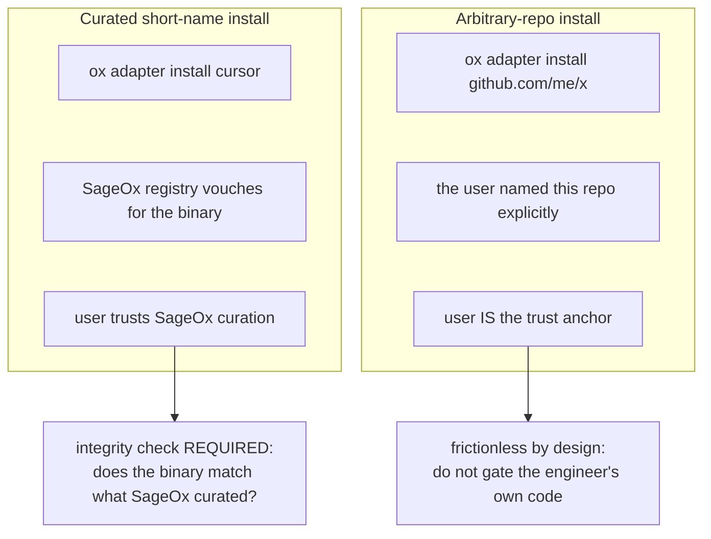

# ADR-022: Adapter Security Posture

**Status**: Accepted
**Date**: 2026-06-10

## Context

Adapters (ADR-008) let any engineer extend ox to drive a new AI coworker backend
by shipping a standalone `ox-adapter-<name>` binary that speaks the adapter
protocol (ADR-010). ox discovers it (ADR-009), installs it (ADR-013), and the
daemon runs it — one-shot or long-lived in `--serve` mode (ADR-012). **Executing
adapter code is the entire point of the mechanism.** It is how the platform stays
open to backends we did not write and cannot anticipate.

The adapter ADR family (008–015) documents the architecture but never states the
*security posture* — what we trust, where, and why. A 2026-06-10 security review
exposed the cost of that omission: it flagged the install path as a CRITICAL
"executes a binary with no integrity check," a framing that reads the extension
mechanism itself as a vulnerability. That is wrong, but a real, narrower gap hides
inside it. This ADR records the posture so reviewers — human and AI — do not
re-litigate the extensibility decision, and so the genuine gaps are fixed without
breaking the open mechanism.

This ADR sits inside the trust boundary defined in `security/SECURITY.md`. It does
not restate that boundary; it applies it to adapters.

## Decision

### 1. Running third-party adapter code is intended design, not a vulnerability

Reviews must not flag "adapters execute code" as a finding. The mechanism's value
is precisely that ox runs binaries it did not compile. What we secure is the
*moment of acquisition* and the *blast radius of an already-trusted adapter* — not
the fact of execution.

### 2. Two install paths, two trust anchors

`resolveAdapterSource` (`cmd/ox/adapter.go`) deliberately keeps these distinct:

- **Curated short-name path** (`ox adapter install cursor`): the user trusts that
  SageOx vetted what sits behind the name. Today the code resolves
  `releases/latest` and runs whatever `browser_download_url` the GitHub API returns
  — no version pin, no checksum. A compromised maintainer release, a swapped asset,
  or a CDN/MITM substitution can deliver a *different* binary **under a name the
  user was taught to trust**, with no signal. This authenticity gap is the
  legitimate finding (`ox-5ihl`).
- **Arbitrary-repo path** (`ox adapter install github.com/<owner>/<repo>`): the user
  explicitly names a repo they already trust. The user is the trust anchor; a
  SageOx-side checksum gate here would break the "anyone can build and install an
  adapter" contract for zero security gain.

### 3. Integrity is enforced only where SageOx is the trust anchor

For curated entries, pin a release `tag` and a per-platform `sha256` in the
embedded `registry.yaml` (ADR-013). Verify downloaded bytes against the pin with a
constant-time compare **before** the binary is made executable or run; treat a
missing pin as fail-closed. A code-reviewed tag/checksum bump becomes the control
— the review *is* the trust decision. (Implementation: `ox-5ihl`.)

The arbitrary-repo path requires an explicit `@<tag>` plus an explicit
`--allow-unverified` opt-in, after which ox installs without a SageOx-side checksum.
We do not add a checksum gate the user cannot satisfy for their own code.

### 4. No standalone download-host allowlist

GitHub rotates release-asset CDN hosts, so a hardcoded allowlist is a maintenance
landmine that breaks real installs, and it does not stop malicious bytes served at
a legitimate URL. Checksum verification (decision 3) subsumes it. We do not ship a
separate host allowlist as a control.

### 5. `verifyAdapterBinary` checks conformance, not provenance

`verifyAdapterBinary` runs the binary's `info` subcommand and validates the
response. **This is protocol-conformance verification, not provenance.** It answers
"is this a runnable ox adapter?", never "is this the binary SageOx curated?". The
name has misled reviewers into reading it as an integrity check; it is not, and was
never intended to be. It will be renamed `verifyAdapterProtocol`, and the
install-path ordering becomes an invariant: **download → checksum gate → chmod →
exec** (provenance is established before any execution).

### 6. An installed adapter is inside the user's trust unit

Per `security/SECURITY.md`, ox does not defend against a process already running as
the user's own UID — such a process can edit the ledger, read the 0600 daemon
token, and invoke `ox` directly. Applied to adapters: **once installed, an adapter
runs every session as the user; installation IS the trust decision.** We harden
acquisition (decisions 3–5); we do not pretend to sandbox an installed adapter from
the user's own session. That would contradict the documented threat model and the
purpose of the mechanism.

This is also why the daemon spawning a *first-party* `ox distill` subprocess with
the daemon's own environment is not a leak (ox trusting itself), whereas spawning a
*third-party* adapter in `--serve` mode with the full daemon environment **is** a
real boundary crossing — that env must be sanitized to the adapter's declared
`RequiredEnv` (see `internal/session/adapters/external.go`; tracked in `ox-gkqu`).

### 7. Self-declared capabilities are convenience metadata, not a security boundary

An adapter's `Capabilities` (ADR-010 `InfoResponse`) are self-reported. ox uses
them to *gate features it offers* (e.g. only request subagent control from an
adapter that declares `subagent_controller`), not to *contain* the adapter. A
malicious adapter can declare any capability set; capabilities therefore protect
ox from accidentally driving an incomplete adapter, not from a hostile one. The
defense against a hostile adapter is acquisition integrity (decisions 2–5), not
capability checks.

### 8. Adapter-reported fixes are constrained input

`ox doctor --fix` executes `FixArgv` from an adapter's `diagnose` output
(`cmd/ox/doctor_adapters.go`). `FixArgv[0]` is allowlisted to `{git, ox}` and
`FixSafe=false` issues are never auto-run — but a malicious adapter can still
return `git config --global …` to gain persistence. Because this is downstream of
an already-installed (already-trusted, decision 6) adapter, the residual control is
to **surface the full command to the terminal and confirm `--global`/`--system`
mutations**, rather than maintain a losing denylist of dangerous git-config keys
(tracked in the review as a MEDIUM, downstream of `ox-5ihl`).

## Consequences

- Engineers can still build and install any adapter from any repo — the
  extensibility promise (ADR-008) is intact.
- The curated path gains real authenticity guarantees; a compromised upstream
  release no longer silently installs under a trusted name.
- Adding a curated adapter now requires recording its tag + checksum in
  `registry.yaml` — a reviewed change, by design.
- Severity of the curated-path gap is **positioning-dependent**: CRITICAL *only
  because* SageOx markets the short-name registry as the safe, curated default. If
  that positioning changes, it drops to HIGH. The arbitrary-repo path is, and
  remains, accepted risk.
- A future move to signed releases (sigstore/cosign, verified in pure Go to honor
  ADR-001 / ADR-007's no-external-binary rule) can replace manual checksum rotation
  without changing this posture.

## See also

- ADR-008 (external adapter binaries), ADR-010 (IPC mechanism), ADR-012 (daemon as
  adapter supervisor), ADR-013 (distribution & registry) — the architecture this
  posture secures.
- `security/SECURITY.md` — the trust boundary this ADR sits inside.
- `security/.output/FINDINGS.md`, `security/.output/FIX-DESIGN.md` — the review and
  remediation design.
- `ox-5ihl` (curated-path integrity), `ox-gkqu` (serve-mode env sanitization).
