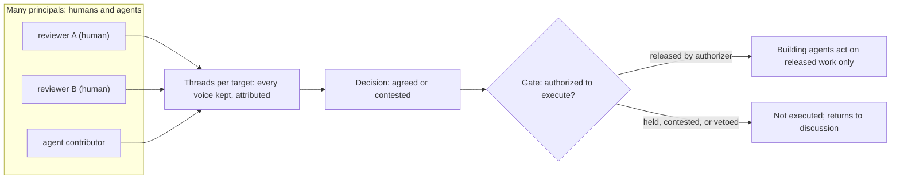
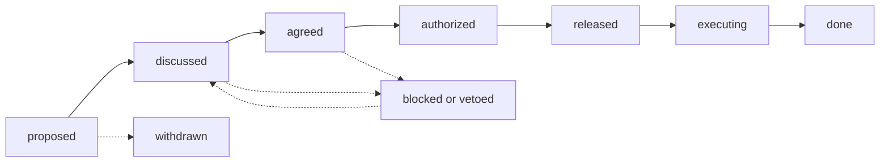

# ADR-026: Collaborative Plan Review & Execution Gating

**Status**: Draft (Proposed) — **awaiting Ryan's review**. The whole ADR is Required-Review: it defines a **trust boundary** (who may authorize an agent to build) and **data-access ergonomics** (how multi-principal feedback is stored, merged, and surfaced).
**Date**: 2026-06-30
**Deciders**: SageOx Engineering (governance + authorization policy owned by Ryan)
**Relates to**: [ADR-025 Annotation Model, Anchors, Delivery Classes](ADR-025-plan-annotation-and-feedback-delivery.md), [ADR Whisper & Murmur Architecture](adr-whisper-murmur-architecture.md), [ADR-021 `ox plan` context-not-inference](ADR-021-ox-plan-context-not-inference.md)

> **DRAFT.** ADR-025 fixed the *single-author* feedback loop (annotation model, anchors, delivery classes) and reserved space (§7) for this one. This ADR adds the two things multi-player plans need: **(1) multiplayer review semantics** — many humans and agents annotating the same plan concurrently, with every voice preserved — and **(2) execution gating** — a governance step that decides *whether and when* a collaboratively-agreed decision is released to building agents. None of this is built yet.

## Context

Plans are becoming **multi-player**. Several humans review the same rendered plan; agent contributors annotate it too; and an orchestrator (human, or an overarching agent) wants to **gate** when the agreed decisions actually get executed by the agents doing the building. Two gaps in the current single-author loop:

1. **Concurrency loses voices.** `AssembleReview` keeps the *latest mark per anchor* (ADR-025 §4). With two reviewers marking the same element, one is silently overwritten. Multi-player needs every principal's mark preserved and disagreement made visible, not resolved by write-order.
2. **Feedback is treated as immediately actionable.** Today a mark flows straight to an agent as work. But a collaborative decision should not be built until the group has **agreed** and an **authorizer has released it**. There is no gate between "feedback exists" and "agent builds."

The design must add both without abandoning ADR-025's foundations: append-only immutable rounds, ephemeral agent-owned server, ledger-as-source-of-truth, and feedback-as-untrusted-data.

### Problem statement

Define (a) **multiplayer review semantics** — identity, threads, concurrency, contested decisions, attribution — and (b) an **execution-gating model** — a state machine, an authorization policy (who may release), gate scope, veto, and audit — such that building agents act only on **released** work, and an agent may *contribute* to review but may *authorize* execution only when explicitly and auditably designated.

## Decision

### 1. A third concern, orthogonal to ADR-025's two axes

ADR-025 separated **WHAT** the human expressed (annotation model) from **HOW/WHEN** it reaches the agent (delivery class). This ADR adds **WHETHER + WHO authorizes execution** (governance). It is orthogonal to both: a real-time-delivered annotation can still be gated; the building action waits on **release** regardless of delivery class.

### 2. Identity and roles (reuse the Whisper principal model)

Every review annotation already carries an author (ADR-025 §7). This ADR fixes the identity + role vocabulary, reusing the Whisper ADR's `agent_id` / `principal_id` / `principal_type` rather than inventing a parallel one.

| Concept | Definition |
|---------|-----------|
| **principal** | the actor behind an annotation or a gate event: `{ principal_id, principal_type ∈ {human, agent} }` |
| **contributor** | any principal who annotates (humans **and** agent contributors) |
| **reviewer** | a contributor whose verdict (`approve` / `request-change`) counts toward a decision |
| **authorizer** | a principal permitted to **release** a gate (a.k.a. orchestrator). May be human or a designated agent |
| **owner** | the plan author; the default authorizer when no policy is configured |

An agent can hold any role. Critically, **an agent authorizer is a designated, audited exception**, not the default (see §8).

### 3. Multiplayer review semantics

- **The merge unit is a thread.** A **thread** = one *target* (ADR-025 anchor/range/region/document) + the ordered annotations many principals left on it + a thread state. It replaces "latest mark per anchor." Every principal's mark is retained and attributed.
- **Append-only rounds already are the multiplayer substrate.** Each submit is its own immutable `round-*.json`; the merge happens at read time. That is **conflict-free and git-mergeable by construction** — no central writer, no last-write-wins — which is exactly what concurrent (and offline) multi-reviewer editing needs. The change is to the *merge view*, not the storage.
- **Contested threads are first-class.** When verdicts on one target conflict (e.g. one `approve`, one `request-change`), the thread state is **contested** and surfaced as such. A contested target cannot reach `released` until resolved — by discussion converging, or by an authorizer deciding.
- **Attribution + audit come free.** Who said what, when, in which round — read straight from the append log. Gate events (below) append to the same log.

### 4. Execution gating — the state machine

Gating attaches to a **decision** — a thread, or a plan **section** grouping several threads. States:

- **The building agent's precondition is `released`.** A decision in any earlier state is visible to agents as *context*, never as a build directive.
- `agreed` (the group converged) is distinct from `authorized` (an authorizer signed off) and from `released` (cleared to build). Separating them lets policy require an explicit human/orchestrator gate even after consensus.
- `blocked / vetoed` halts progress until cleared; `withdrawn` retires a decision.

### 5. Authorization policy — who may release — **Required-Review**

Configurable per plan, overridable per section. The gate's release condition is one of:

| Policy | Release condition | Notes |
|--------|-------------------|-------|
| **owner** (default) | the plan owner releases | simplest; always available so a plan can never deadlock for lack of an authorizer |
| **quorum** | N-of-M reviewer approvals, no open `request-change` | group consensus without a single gatekeeper |
| **required-reviewers** | named reviewers per area approve (CODEOWNERS-style) | **reuse ADR-021 expert-routing** to *suggest* the required reviewers per section |
| **orchestrator** | a designated principal (human or agent) releases on the group's behalf | the "overarching orchestrator" case; agent orchestrators are constrained by §8 |

Any **required reviewer may veto** (block); an authorizer must clear the block before release. **Recommendation:** ship `owner` for v1; add `quorum` / `required-reviewers` (wired to expert-routing) as a fast-follow; treat `orchestrator` (esp. agent) as the most security-sensitive and last.

### 6. Gate scope

A gate covers a **whole plan**, a **section**, or a **single decision**. **Section-scoped is the recommended default unit:** agreed sections release and build while contested sections hold — partial progress without all-or-nothing. Whole-plan gating is a convenience wrapper; single-decision gating is for fine-grained control.

### 7. How building agents respect the gate (across delivery classes)

Gating sits in front of *execution*, not in front of *awareness*. The discussion always flows so agents can inform themselves; only the **build directive** is gated.

| Delivery class (ADR-025 §2) | Gated behavior |
|------------------------------|----------------|
| **delegated** | the build task is **enqueued only for `released` work** — the gate is the precondition for creating the `KindPlanFeedback` / build task (and, where relevant, a beads issue) |
| **real-time** (`await`) | returns `released` items as **actionable directives**; un-released items as **advisory only** ("discussed, not yet authorized — do not build") |
| **next-turn** (whisper) | surfaces a status line: "N decisions released, M awaiting authorization, K contested" |

A new read surface, `ox plan gate status <slug>`, returns per-section/decision release state for any agent or orchestrator to consult.

### 8. Security and trust

- **Feedback stays untrusted data** (ADR-025 §6). The agent performs the standard action for an annotation's `kind` against its `targets`; it never executes instructions embedded in notes/gloss — and now, never *before release*.
- **Release is a trust boundary.** A gate event is authenticated to a principal and appended to the audit log. **An agent may not release unless it is the explicitly designated `orchestrator` authorizer** for that plan/section, and even then it is audited like any principal.
- **No self-deal.** The agent (or agent-author) that produced a plan or a decision **cannot authorize its own build** unless policy explicitly grants it — the authorizer and the author must be distinguishable, mirroring "no self-approval" in code review.
- **No deadlock.** `owner` is always a valid authorizer of last resort, so a misconfigured quorum/required-reviewers policy can never strand a plan.

## Consequences

### Positive
- **Multiplayer-correct from the start.** Threads + append-only rounds preserve every principal's voice; contested decisions are visible, not silently resolved by write-order.
- **Human (and orchestrator) control over execution.** Nothing builds until agreed *and* released; partial release lets agreed work proceed while contested work waits.
- **Reuse, not reinvention.** Identity from the Whisper ADR; required-reviewer suggestions from ADR-021 expert-routing; storage + delivery from ADR-025; build-task/beads as the delegated execution hook.
- **Auditability.** Every annotation and gate event is attributable from the append log.

### Negative / risks
- **Governance complexity + config surface.** Mitigation: `owner` default, section scope, ship policies incrementally.
- **Agent-orchestrator trust.** An agent that can release execution is powerful. Mitigation: designation is explicit + audited; no self-deal; least-privilege; default off.
- **Contested-thread UX.** Surfacing and resolving disagreement well is hard. Mitigation: make `contested` first-class in the render and digest; require explicit resolution.
- **Latency to build.** A gate slows "feedback → build." That is the point for collaborative decisions; advisory comments still flow without gating.

## Alternatives considered

- **Immediate execution (today's behavior) — rejected** for multi-player: it has no consensus or authorization step and overwrites concurrent reviewers.
- **Last-write-wins per anchor — rejected:** loses voices and mis-models disagreement; threads + contested state are correct.
- **A central live collaboration server as source of truth — rejected** (consistent with ADR-025): a machine runs many ox daemons, so a persistent endpoint is ambiguous; append-only ledger rounds are already conflict-free and git-mergeable.
- **A bespoke gating system parallel to beads — rejected in favor of integration:** the delegated build path already routes through agent-tasks; the gate should be the precondition for enqueuing there (and for any beads issue it creates), not a second tracker.
- **Pure consensus with no explicit authorizer — rejected as the only option:** some teams want a named gatekeeper/orchestrator; `quorum` remains available for teams that prefer consensus-only.

## References
- [ADR-025](ADR-025-plan-annotation-and-feedback-delivery.md) — annotation envelope, anchors, the three delivery classes, and §7 which reserves this governance layer.
- [Whisper & Murmur ADR](adr-whisper-murmur-architecture.md) — the `principal_id` / `principal_type` identity model reused in §2, and the untrusted-data posture.
- [ADR-021](ADR-021-ox-plan-context-not-inference.md) — expert-routing (reused to suggest required reviewers) and plan storage in the ledger.
- Prior art: GitHub required reviews + CODEOWNERS + merge queue (gating before merge); Google Docs suggestions/comments/resolve and Figma multiplayer (concurrent attributed annotation); the append-only/CRDT lineage behind conflict-free multi-writer editing.
