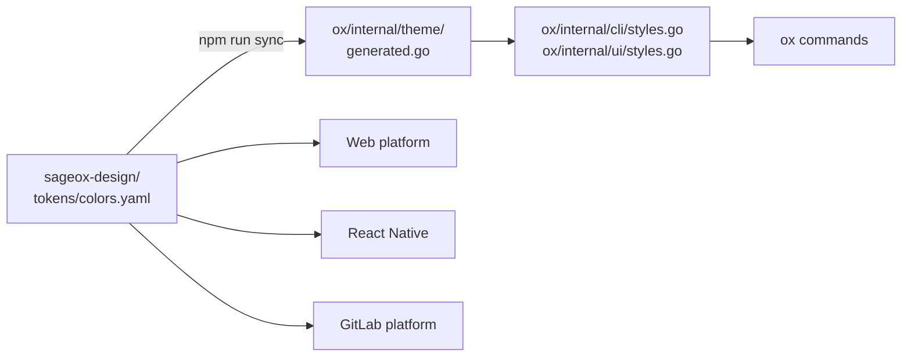

# Theming

ox's palette, themes, and light/dark behavior are owned by the [`sageox-design`](https://github.com/sageox/sageox-design) system. ox is a downstream consumer.

## Flow



The same `tokens/colors.yaml` feeds every SageOx platform. That's why ox cannot change a color unilaterally: a CLI palette tweak would drift from web, mobile, and the studio.

## Where palette decisions happen

| Question | Where |
|----------|-------|
| Adding a new brand color | `sageox-design/tokens/colors.yaml` |
| Adjusting light-mode vs dark-mode contrast | `sageox-design/tokens/themes.yaml` |
| Defining a new semantic token (e.g., "danger-strong") | `sageox-design/tokens/themes.yaml` |
| Mapping a token to terminal output | `sageox-design/platforms/cli/theme.toml` |
| Regenerating ox's Go bindings | `cd ../sageox-design && npm run sync` |

Local working copy: `/Users/ryan/conductor/workspaces/sageox-design/bogota-v2/`.

## Light vs dark detection

ox ships **one palette in two variants** and picks the right one at runtime — no config flag, no theme file, no restart. Detection runs in this order:

1. **OSC 11 query.** At first render lipgloss writes the escape sequence `\x1b]11;?\x07` to stdout. Modern terminals (iTerm2, Alacritty, Kitty, Wezterm, Windows Terminal, recent VS Code) answer back with their actual background color. lipgloss computes luminance and picks dark or light.
2. **`COLORFGBG` fallback.** Older or rxvt-derived emulators export this env var instead of answering OSC 11. lipgloss reads it.
3. **Default dark.** If nothing answers (CI, piped output, exotic terminal), ox assumes a dark background — the most common case among coworkers.
4. **`NO_COLOR=1`** short-circuits everything: no ANSI emitted, terminal default colors only.

Mechanism in code:

```go
// internal/theme/generated.go (synced from sageox-design)
ColorPrimary = compat.AdaptiveColor{
    Light: lipgloss.Color("#4F6A48"),
    Dark:  lipgloss.Color("#7A8F78"),
}
```

When the user toggles their terminal between light and dark, the next ox invocation renders with the matching variant. The published catalog page at [sageox-design.netlify.app/catalog/cli/](https://sageox-design.netlify.app/catalog/cli/) shows both variants per token, with the active variant outlined according to the page's Mode toggle.

## Color depth

Light vs dark picks *which* variant. Color **depth** decides how that variant is written to the terminal, and it is a separate mechanism that ox has to run itself.

lipgloss v1 downsampled inside `Style.Render()`. **lipgloss v2 does not** — `Render()` always emits 24-bit `38;2;R;G;B` and expects the caller to degrade at the output layer (`colorprofile.Writer`, `lipgloss.Println`). ox has ~300 `fmt.Print(style.Render(…))` call sites that write straight to `os.Stdout`, so there is no output layer to hook. ox therefore degrades **at the color**: `theme.Color(hex)` and `theme.Adapt(c)` convert to the detected profile before the color ever reaches a `Style`.

Skipping that step is not a cosmetic downgrade. A terminal without 24-bit support — macOS Terminal.app, or anything reporting `TERM=xterm-256color` with no `COLORTERM` — does not ignore an unrecognized `38;2;…`; it parses the parameters as independent SGR codes. Any channel landing in 100–107 becomes a **background** color:

```text
#E0A56A  →  ESC[38;2;224;165;106m  →  224, 165, and 106 read separately
                                       106 = bright-cyan background
```

That is how brand copper turned the `ox --help` command column and the login disclaimer into unreadable grey-on-cyan blocks. Other tokens sit one step from the same trap (`#2DD4BF` starts `0x2D` = 45 = magenta background), so the fix is the conversion, not a safer hex.

| Profile | Emits | Typical terminal |
|---|---|---|
| TrueColor | `38;2;R;G;B` | iTerm2, Ghostty, WezTerm, Kitty, VS Code (`COLORTERM=truecolor`) |
| ANSI256 | `38;5;N` | macOS Terminal.app, `TERM=xterm-256color` |
| ANSI | 4-bit `9x`/`3x` | `TERM=xterm-color`, old emulators |
| ASCII / NoTTY | no color, attributes only | `NO_COLOR=1`, pipes, CI |

Detection is `colorprofile.Detect(os.Stdout, os.Environ())`, honoring `NO_COLOR`, `CLICOLOR`, `CLICOLOR_FORCE`, `COLORTERM`, `TERM`, terminfo, and tmux. Mechanism and init-ordering notes live in [`internal/theme/profile.go`](../../internal/theme/profile.go).

**Two exemptions**, both enforced by `TestNoRawLipglossColorOutsideTUI`:

| Exempt | Why |
|---|---|
| Any file importing Bubble Tea, plus all of `internal/dashboard/**` | Bubble Tea v2 downsamples its own frames. The whole `dashboard` tree renders into one Bubble Tea frame, including leaf renderers that import only lipgloss. |
| `internal/theme/**` | It *is* the adapter, and `generated.go` is where raw token hexes legitimately live (the `ColorPrimary` snippet above is one). |

Everything else must go through `theme.Color` / `theme.Adapt`.

### Reproducing another terminal's rendering

`OX_COLOR_PROFILE` forces a profile, so a report from a 256-color terminal is reproducible on any machine:

```bash
OX_COLOR_PROFILE=ansi256 ox --help
```

Accepts `truecolor`, `ansi256`, `ansi`, `ascii`, `notty`. An unrecognized value falls through to normal detection rather than erroring. Inspect the raw bytes with `script -q /dev/null ox --help | cat -v`.

## NO_COLOR

[`NO_COLOR=1`](https://no-color.org/) strips color while leaving text attributes (bold, underline) intact — it resolves to the ASCII profile above. Test new components with `NO_COLOR=1 ox dev catalog`.

## Forbidden patterns

- Hand-editing `internal/theme/generated.go` (overwritten by sync).
- `lipgloss.Color(…)` outside the two exemptions above — use `theme.Color` / `theme.Adapt`, or the semantic styles in `internal/cli/styles.go` and `internal/ui/styles.go`.
- ANSI escape sequences in command implementations (`\033[…`, `\x1b[…`).
- New tokens added directly to `internal/dashboard/theme/tokens.go` without an upstream `sageox-design` PR.

See [.claude/rules/design.md](../../.claude/rules/design.md) for the full rule set and enforcement.

## Published catalog

The browser-rendered catalog at [sageox-design.netlify.app/2026-05-17-ox-cli-component-catalog/](https://sageox-design.netlify.app/2026-05-17-ox-cli-component-catalog/) reads the same hex tokens via CSS custom properties, so the page's Mode toggle (light/dark) updates the embedded asciinema-player themes live, without reloading recordings.
