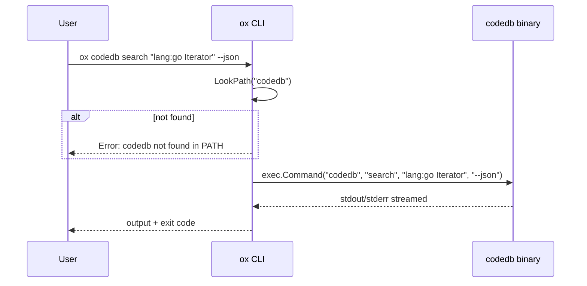

<!-- doc-audience: ai -->
# Design: `ox codedb` Integration

## Overview

Add `ox codedb` as a thin subprocess wrapper around the `codedb` binary ([CodeDBGo](https://github.com/sageox/CodeDBGo)). All three commands (`index`, `search`, `sql`) are exposed with full flag passthrough. No CGO dependency added to ox.

CodeDBGo is a Sourcegraph-style code search engine built in Go that indexes git repositories (full history) and supports full-text search (Bleve), symbol extraction (tree-sitter), and commit/diff search — all backed by SQLite + Bleve, running entirely locally.

## Architecture

```
User -> ox codedb search "lang:go Iterator" --json
          |
          +-- Find `codedb` in $PATH
          +-- Build args: ["search", "lang:go Iterator", "--json"]
          +-- exec.Command("codedb", args...)
          +-- Stream stdout/stderr to terminal
          +-- Return exit code
```



## Commands

| Command | Maps To | Description |
|---------|---------|-------------|
| `ox codedb index <url> [flags...]` | `codedb index <url> [flags...]` | Index a git repository |
| `ox codedb search <query> [flags...]` | `codedb search <query> [flags...]` | Search indexed code |
| `ox codedb sql <query>` | `codedb sql <query>` | Run raw SQL against metadata DB |

### Usage Examples

```bash
# Index a repository
ox codedb index https://github.com/sageox/ox

# Search for Go iterators
ox codedb search "lang:go type:symbol Iterator"

# Search with JSON output
ox codedb search --json "lang:rust file:*.rs serialize"

# Search commit diffs by author
ox codedb search "type:diff author:alice streaming"

# Find callers of a function
ox codedb search "calls:groupby"

# Regex search
ox codedb search "/fn\s+process_\w+/"

# Raw SQL query against metadata
ox codedb sql "SELECT name, path FROM repos"

# Limit index depth
ox codedb index --depth 100 https://github.com/sageox/ox
```

## Key Decisions

| Decision | Choice | Rationale |
|----------|--------|-----------|
| Binary discovery | `$PATH` lookup only | Simplest approach; `codedb` is actively developed and installed locally. Config override or auto-install can come later. |
| Flag handling | Full passthrough (`DisableFlagParsing: true`) | Zero maintenance when codedb adds flags. Ox help points to `codedb <cmd> --help` for full reference. |
| Data directory | CodeDBGo default (`~/.local/share/sageox/codedb/`) | CodeDBGo already uses the `sageox` XDG namespace. Ox does not pass `--root`. |
| Help group | `dev` group | Code search is a core developer workflow tool, alongside `init`, `login`, `status`. |
| Output handling | Stream stdout/stderr directly | No reformatting. Exit code propagated. |
| CodeDBGo modifications | None | CodeDBGo is under active parallel development. This integration is a pure wrapper. |

## File Structure

```
cmd/ox/
+-- codedb.go            # Parent command + binary lookup + shared exec helper
+-- codedb_index.go      # index subcommand
+-- codedb_search.go     # search subcommand
+-- codedb_sql.go        # sql subcommand
```

Follows existing ox convention: flat `cmd/ox/` directory, `<group>_<subcommand>.go` naming.

## Implementation Details

### Binary Lookup

```go
func findCodeDB() (string, error) {
    path, err := exec.LookPath("codedb")
    if err != nil {
        return "", fmt.Errorf(
            "codedb not found in PATH.\n\n" +
            "Install CodeDB:\n" +
            "  go install github.com/sageox/CodeDBGo/cmd/codedb@latest\n\n" +
            "Or build from source:\n" +
            "  cd CodeDBGo && make build && make install")
    }
    return path, nil
}
```

### Subprocess Execution (shared helper in codedb.go)

```go
func runCodeDB(bin string, args []string) error {
    c := exec.Command(bin, args...)
    c.Stdout = os.Stdout
    c.Stderr = os.Stderr
    c.Stdin = os.Stdin
    return c.Run()
}
```

### Subcommand Pattern (each subcommand follows this)

```go
var codedbSearchCmd = &cobra.Command{
    Use:                "search [query] [flags...]",
    Short:              "Search indexed code (Sourcegraph-style queries)",
    Long:               "Run codedb search --help for full options and query syntax.",
    DisableFlagParsing: true,
    RunE: func(cmd *cobra.Command, args []string) error {
        bin, err := findCodeDB()
        if err != nil {
            return err
        }
        return runCodeDB(bin, append([]string{"search"}, args...))
    },
}
```

### Parent Command (codedb.go)

```go
var codedbCmd = &cobra.Command{
    Use:   "codedb",
    Short: "Code search and indexing (powered by CodeDB)",
    Long:  "Sourcegraph-style code search across git repositories.\n\nRequires the codedb binary in PATH.",
}

func init() {
    codedbCmd.GroupID = "dev"
    codedbCmd.AddCommand(codedbIndexCmd)
    codedbCmd.AddCommand(codedbSearchCmd)
    codedbCmd.AddCommand(codedbSQLCmd)
    rootCmd.AddCommand(codedbCmd)
}
```

### Command Registration

```go
// codedb_index.go
func init() {
    // Registered via codedb.go parent init
}

// codedb_search.go
func init() {
    // Registered via codedb.go parent init
}

// codedb_sql.go
func init() {
    // Registered via codedb.go parent init
}
```

## Data Directory Convention

CodeDBGo stores all data at `~/.local/share/sageox/codedb/` by default, following XDG Base Directory Specification:

```
~/.local/share/sageox/codedb/
+-- metadata.db          # SQLite database (repos, commits, symbols, refs)
+-- bleve/
|   +-- code/            # Full-text index for file contents
|   +-- diff/            # Full-text index for commit diffs
+-- repos/
    +-- github.com/
    |   +-- user/repo.git/    # Bare git clone
    +-- gitlab.com/
        +-- org/project.git/  # Bare git clone
```

ox does NOT manage this directory. It is owned entirely by `codedb`. The `--root` flag is available to users via passthrough if they need a custom location.

## What This Does NOT Do

- No flag curation or validation in ox
- No output reformatting or ox-styled output
- No `--root` management by ox
- No auto-install of `codedb` binary
- No modifications to CodeDBGo repo
- No CGO dependency added to ox
- No daemon integration (codedb runs synchronously)

## Future Considerations

- **Auto-install**: `ox codedb` could offer to install codedb if not found
- **Config override**: `ox config set codedb.path /custom/path` for non-PATH installs
- **Go module import**: Once CGO deps are reduced/removed in CodeDBGo, direct import becomes viable
- **Agent integration**: `ox agent prime` could surface codedb search as a tool for AI coworkers
- **Daemon indexing**: Background re-indexing via ox daemon when repos change
