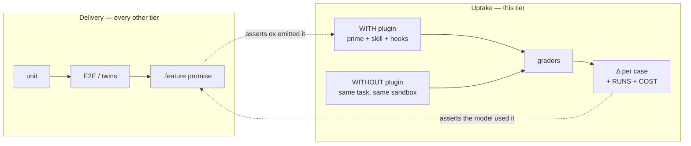

# Agent-Behavior Evals: proving the model takes up what ox delivers

Every other test tier in this repo proves **delivery**: `ox agent prime` emitted
the XML, the ledger committed, the murmur landed in a `<system-reminder>`. The
priming BDD ends at *"Then ox loads the team's context."* None of it proves
**uptake** — that the model reads the prime bundle and does something different
because of it. A prime the model ignores on every session keeps every gate green.

The eval tier closes that gap. The same coding task runs twice — WITH the ox
plugin and WITHOUT it — each run is scored by declarative graders, and the
**delta** is the result. It is the only test in the repo whose subject is the
model's behavior rather than ox's.



`tests/agents/smoke_test.go` already guards the mirror-image failure on the
capture side — *"six adapters shipped parsers for formats their agent never
wrote while every unit test stayed green: the fixtures were hand-authored in
the same guessed format the parser expected."* Prime, `guidance` JSON, skill
descriptions, and murmur directives carry exactly that exposure in the other
direction. The eval tier is that smoke test's sibling: same opt-in, costs-API
tier; opposite question.

## How it maps onto rules this repo already holds

| Rule | What the eval tier makes of it |
|---|---|
| Red-first — *"a gate nobody watched fail is a gate nobody has tested"* | The WITHOUT arm **is** the red run; WITH is the green. Red-first becomes structural, not a discipline. |
| No test theater — *"if the proof would pass with the feature removed it proves nothing"* | Δ = 0.00 on a case where ox *should* help is theater exposed, automatically, on every run. |
| Agent UX — *"every token in an agent's context window competes with the developer's actual work"* | Negative-control cases (ox irrelevant) must show Δ ≈ 0 **and** a bounded COST delta. Prime's own `<context-budget sageox=… team=…>` tag reports the numerator; `TestOutputAgentPrimeXML_SageoxOverheadBudget_Regression` pins the size; only an eval supplies the denominator — tokens per unit of behavior change. |
| ADR-006 degradation matrix (hooks / marker / README / cold) | WITHOUT is not one arm — it is the matrix's rows. Cold is the baseline; marker-only is what hookless agents get. Wave 1 measures Layer 3 (discovery) vs plugin — see *What the WITHOUT arm really is*. |
| ADR-024 — retrieval is agentic and tool-driven | The grader is *did the agent reach for the tool* (`tool_used`, `tool_order`), not *did the answer sound right*. |
| Thin-relay rule — floor lives in Layer 1 (CLI `guidance` + prime), skills are additive; `TestConsultRoutes_NoDriftWithSkill` enforces it statically | A three-arm run (cold → Layer 1 only → Layer 1 + skills) enforces it behaviorally: a large skills-over-floor Δ on a floor behavior means the floor is not carrying it. |
| Prime's anti-fabrication directive — credit SageOx only when it measurably changed the work | A `not_contains` grader on `SageOx surfaced…` / `building on your earlier session…` in the WITHOUT arm and in negative controls. |
| `ox recap` — receipts, not vibes | Deterministic graders carry every score; `llm` rubrics are secondary and never the sole scorer. The tool's own authoring guidance says the same. |
| Security review — "why no AI tier in CI" | Same reasons apply: local and on-demand first; a nightly job only behind a repository secret and a hard `--max-cost-usd`. |

## The harness: `claude plugin eval`

Claude Code ships the runner (`claude plugin eval`, early access). The suite
lives under the plugin it evaluates:

```text
claude-plugin/
├── .claude-plugin/plugin.json      the target — SessionStart/PreCompact → ox agent prime
└── evals/
    ├── scaffold/seed.sh            one anonymized sandbox, reused by every case
    ├── scaffold/check.sh           free proof the sandbox is sound (make eval-scaffold-check)
    ├── fixtures/{repo,team-context,ledger}
    ├── 01-recall-decision/case.yaml + scaffold.sh
    ├── …
    └── results/                    gitignored
```

| Command | What it does | Cost |
|---|---|---|
| `make eval-scaffold-check` | Seeds a throwaway sandbox, runs `ox agent prime` offline, asserts the team rule, docs, and ledger session appear, confirms the seeded bug is red | free |
| `make eval-smoke` | One run of the cases tagged `smoke` (03, 07, 08); run before touching prime, `guidance`, or skills | ~$2 |
| `make eval` | Full suite, `EVAL_RUNS` runs per case (default 3), capped at `EVAL_MAX_COST` (default $15) | ~$10–15 |
| `make eval-no-bash` | Only the cases tagged `no-bash` — for machines where the runner refuses a Bash grant (see *Runner limits*) | ~$4 per run |

`EVAL_ARGS` passes anything else through (`--case "02-*"`, `--tag smoke`, `--json out.json`,
`--model`). The judge is `sonnet` by default: the `haiku` default voted FAIL×3 on a
correct three-sentence answer in the first pilot. Add `--keep-temp` to keep each run's
sandbox and `trace.jsonl`; the kept directory is sealed (`chmod 700 <dir> <dir>/sealed`
to read it) and the JSON's `tracePath` points inside it.

### Runner limits found in the first pilot (2026-09-11)

- **`~/.ssh` with symlinks blocks any Bash grant.** Before granting `Bash`, the runner
  fences every credential store on the machine and refuses if it cannot: it walks
  `~/.ssh/config` includes (EACCES on a `0600` directory fails it) and refuses outright
  when `~/.ssh` *"holds a symbolic link inside it"* — which a stow-managed dotfiles
  setup does. Cases tagged `bash` (02, 05, 06) therefore cannot run on such a machine;
  `make eval-no-bash` runs the rest. The plugin's SessionStart hook still primes in
  those runs, so uptake is measured; only tool-routing cases wait for a clean runner.
- **`--case` takes a plain glob** (`07-*`); character classes silently match nothing.
  Use `--tag`.

### What the sandbox guarantees

The runner gives each run a fresh `HOME` and cwd; `scaffold/seed.sh` fills them
with the fixture the way `ox init` plus a daemon sync would have:

- the Acme repo (a Go upload service with a seeded pagination bug), `.sageox/`
  initialized, one commit;
- a team context with three rules (one always-visible: the ADR-007 retry policy;
  two indexed), ten indexed docs (two ADRs plus eight realistic distractors —
  runbook, release process, API reference, testing conventions… — each with a
  `when:` hint so the catalog has to earn its keep), three coworker profiles,
  team memory, and distilled discussions;
- a local-only ledger with sixteen summarized sessions across five personas
  (generated at seed time from `fixtures/ledger/sessions.tsv`), one dated
  *yesterday* so the recency case stays true whenever the suite runs;
- fake auth pointed at `http://127.0.0.1:9` — loopback with nothing listening —
  so every cloud call ox attempts fails fast with connection refused. **Never
  use a `*.sageox.ai` test host here; they resolve**, and the fixture bearer
  would reach a real server. (ox has no offline flag — `OX_NETWORK`/`OX_OFFLINE`
  were declared but never consumed and have been removed; a dead loopback port is
  the only honest offline switch.)

The operator shell (the Makefile) adds `OX_NO_DAEMON=1`,
`OX_SESSION_RECORDING=disabled`, and puts `bin/ox` from this checkout first on
`PATH`, so the plugin's hook primes with the binary under test and nothing is
recorded or spawned. The KB fetch is deliberately left on: it fails with
`connection refused` on every WITH run, exactly as it does on an offline laptop,
and `check.sh` asserts prime's stderr stays empty anyway — that is the sandbox-level
red-first gate for finding 1 below (remove `logger.InitPayloadMode` from prime and
the check fails).

**What the WITHOUT arm really is.** The sandbox repo is ox-initialized either way, so
a capable model without the plugin still finds `.sageox/config.local.toml`, follows
its `path =` to the team context in the sandbox home, and reads the docs, rules, and
ledger sessions directly. That is ADR-006's Layer 3 (discovery), not a cold start.
Δ therefore measures *plugin over discovery*; a cold-start arm is wave-2 work.

### Is this the right thing to evaluate?

Yes for the question no other tier can answer — *does the model act on what ox
delivered* — and honestly bounded in three ways:

- **Synthetic by construction.** Every name, decision, incident, and session in
  the fixture is invented (personas from `tests/acceptance/personas.md`). Nothing
  is copied from a real ledger or team context, and `check.sh` refuses any
  fixture that names a real SageOx host. The suite can be run and read by anyone.
- **Medium-rich, not production-rich.** Ten docs, three rules, sixteen sessions,
  three profiles is enough that discovery has a cost and the catalog's `when:`
  hints matter; it is not the hundreds of docs and dozens of sessions a real
  team accumulates. `tests/ledger_twin` (59 sessions, six devs) is the obvious
  next seed when a case needs volume.
- **Δ is plugin-over-discovery.** The WITHOUT arm can still find `.sageox/` and
  read the team context on disk; a cold arm is wave 2. What wave 1 does measure
  cleanly: whether an inlined rule is honored, whether a recency cue routes to
  the ledger, whether a warning at session start can cancel the payload, and
  what the prime bundle costs on tasks that never needed it.

### Case shape

```yaml
schema_version: "1.0"
name: 02-consult-recency
tags: [consult, recency]
context:
  scaffold_script: scaffold.sh        # must live inside the case directory
execution:
  prompt: |
    Did yesterday's session actually fix the flaky test, or is it still flaking?
  max_turns: 15
  timeout_seconds: 240
  allowed_tools: [Read, Glob, Grep, Skill, "Bash(ox:*)"]
runs: 3
graders:
  - { type: regex,     name: names-the-test,        target: last_message, pattern: "TestListingHandler_Timeout", weight: 2 }
  - { type: tool_used, name: consulted-session-list, tool: Bash, input_match: "ox session list", arm: both }
  - { type: llm,       name: honest-answer,          criteria: "…" }
```

Grader types: `regex` (`target: last_message | trace | files | {source: file, path}`,
`match: contains | not_contains | count:N`), `tool_used` (`tool`, `input_match`,
`min`, `max`, `arm: with-only | both`), `tool_order`, `file_exists`, `llm`,
`baseline`. Under `--ablation with-without`, `tool_used: Skill` without
`arm: both` is a *plugin-fired indicator*, displayed but not scored. A
"must NOT call X" check is `min: 0, max: 0, arm: both`. No absolute paths in
prompts or graders — every run is a sandbox cwd.

## The case catalog (wave 1)

| # | Case | Customer claim under test | Receipt (deterministic grader) | Expected Δ |
|---|---|---|---|---|
| 01 | recall-decision | "Add retry" honors the recorded retry decision instead of inventing one | trace cites `ADR-007` / `retry-policy`; `llm` judges the agent's own policy summary against the decision | ≫ 0 |
| 02 | consult-recency | "Did yesterday's work fix X?" routes to `ox session list` | answer names a test that exists only in the ledger | ≫ 0 |
| 03 | consult-conceptual | "Did we decide X?" follows the pointer to the indexed team doc | answer cites `ADR-012` and states the order | ≫ 0 |
| 04 | expert-routing | "Who owns this / should review?" comes from team knowledge | answer names Devon; invents nobody | ≫ 0 |
| 05 | skill-session-start | The plugin's skill fires on its stated cue and routes to the command | `Skill` fired; `ox agent session start` ran | > 0 |
| 06 | neg-unrelated-fix | Plain bug fix — ox must not hurt | bug removed, tests untouched, **no needless `ox` consult** | 0.00 |
| 07 | neg-no-false-consult | General-knowledge question — consult-first must not fire | zero Bash calls in both arms | 0.00 |
| 08 | neg-no-fabrication | Repo summary — no manufactured SageOx or teammate credit | `not_contains` on attribution phrases | 0.00 |
| 09 | prime-warning-resilience | Context arrives despite a failing KB fetch at startup and Claude Code's 10,000-char hook cap | first line is "yes"; names the inlined `retry-policy` rule; never claims the context did not arrive; zero tool calls | ≫ 0 |

Cases 06–08 are the controls. A **negative** Δ, or a WITH/WITHOUT cost ratio
that climbs release over release, is the finding — that is the context tax
made visible. Every `llm` grader is paired with a hard receipt so a rubric can
never inflate a case alone.

## First pilot — what one $4 run already found

`make eval-no-bash` with `EVAL_RUNS=1`, Opus 5 agent, sonnet judge, 2026-09-11:

| Case | WITH | W/OUT | Δ | Turns W/W-O | Cost W/W-O |
|---|---|---|---|---|---|
| 01 recall-decision | 1.00 | 0.25 | **+0.75** | 33 / 12 | $0.95 / $0.61 |
| 03 consult-conceptual | 1.00 | 0.75 | +0.25 | 19 / 19 | $0.51 / $0.34 |
| 04 expert-routing | 1.00 | 1.00 | 0.00 | 25 / 20 | $0.48 / $0.37 |
| 07 neg-no-false-consult | 1.00 | 1.00 | 0.00 | 1 / 1 | $0.08 / $0.07 |
| 08 neg-no-fabrication | 1.00 | 1.00 | 0.00 | 8 / 7 | $0.17 / $0.14 |

Mean Δ +0.20. Four product findings, none of which a delivery test could have shown
(three fixed the same day, one open P0 — status in brackets):

1. **A single WARN on prime's stderr cancels the whole payload.** The first run had
   the sandbox's KB fetch failing with `connection refused`; the hook's `2>&1` put that
   line in front of the full `<ox-prime>` XML, and the model concluded *"SageOx is
   unreachable in this session … no team context, sessions, or ledger entries
   loaded"* — and scored 0.25 on case 04 while the WITHOUT arm scored 1.00. With the
   fetch disabled the same case scored 1.00. Any transient WARN at session start (VPN,
   offline, expired token) does this to real users. Tracked as a bead; the fix is in
   prime's hook-mode logging or the hook's stderr handling, not in the eval.
2. **Prime's `<docs>` catalog carries names but no paths**, and tells the agent to
   run `ox agent team-ctx`. A read-only agent (or one that prefers `Read`) walks the
   sandbox home to find the files anyway — the WITH arm took 25 tool calls on case 04
   where the WITHOUT arm took 20. `<rule>` already carries `path=`; `<docs>` should.
   **[Fixed: the catalog now has a Path column and the hint says to Read it;
   `TestOutputAgentPrimeXML_DocsCatalogCarriesAbsolutePath`.]**
3. **Prime's consult-first guidance over-fires when the answer is already inline.**
   Case 01's retry rule was inlined in prime, yet the WITH arm still read the rule
   file, the ADR, the discussions, memory, and seven ledger sessions before editing
   (33 turns vs 12). Correctness Δ +0.75 is real; the turn cost is the price of a
   guidance block that says "consult" without saying "unless it's already in front
   of you". **[Fixed: `<consult-first>` now carries the stop condition — "consulting
   is done once the answer is in front of you … do not re-search for the same fact";
   pinned in `TestOutputAgentPrimeXML_ConsultFirst`. Re-measured in the 3-run
   baseline below.]**

Cost: the WITH arm cost 10–55% more on every case. That number, per case per release,
is the context tax.

### 3-run baseline (same day, after the three fixes, richer fixture)

`make eval-no-bash`, `EVAL_RUNS=3`, Opus 5 agent, sonnet judge, $12.04, 30 min:

| Case | WITH | W/OUT | Δ | Turns W/W-O | Cost W/W-O | Grader notes |
|---|---|---|---|---|---|---|
| 01 recall-decision | 0.75 | 0.17 | **+0.58** | 17.7 / 13.0 | $0.85 / $0.68 | `cites-the-decision` 3/3 vs 0/3 — the receipt holds. Turns fell from 33 to 17.7 after the consult stop-condition. `initial-delay-200ms` passed 2/3 WITHOUT (200 ms is a common default) — dropped. `matches-adr-007` judged a 70–100 KB trace and failed every run in both arms — now judges the agent's own policy summary. |
| 03 consult-conceptual | 1.00 | 1.00 | 0.00 | 20.0 / 16.7 | $0.46 / $0.36 | All graders 3/3 both arms; W/OUT discovers ADR-012 on disk. |
| 04 expert-routing | 1.00 | 1.00 | 0.00 | 31.7 / 23.0 | $0.63 / $0.43 | Both name Devon. WITH reads more of what the (now larger) catalog lists. |
| 07 neg-no-false-consult | 1.00 | 1.00 | 0.00 | 1 / 1 | $0.08 / $0.07 | Zero tool calls, both arms, 3/3. |
| 08 neg-no-fabrication | 1.00 | 1.00 | 0.00 | 8.0 / 7.0 | $0.16 / $0.15 | 3/3 both arms. |
| 09 prime-warning-resilience | 0.50 | 0.50 | 0.00 | 1 / 1 | $0.08 / $0.07 | `names-the-inlined-rule` **0/3 WITH** — see finding 4. |

Variance across three runs was zero on every deterministic grader; the only
grader that flip-flopped between the single-run pilot and the baseline was an
`llm` one (03 `settled-not-guessed`), which is why `llm` graders stay secondary.

4. **Claude Code caps hook output at 10,000 characters — prime is never fully
   delivered.** Case 09 forbade reading files and asked the WITH arm whether team
   context had loaded. All three runs: *"No. The SessionStart hook fired, but its
   output was too large (19KB) and got truncated — only the first ~2KB preview is in
   my context … Team rules I can see: none."* Claude Code (2.1.263) persists any hook
   output over 10,000 chars to `tool-results/hook-<id>-stdout.txt` and injects a
   2,000-char preview plus the path; the cap applies to every hook channel
   (stdout, `systemMessage`, `additionalContext`, `initialUserMessage`). Prime is
   14–24 KB; the content-free floor alone is ~14 KB. Earlier traces show the model's
   first tool call was `Read(<tool-results>/hook-…-stdout.txt)` — it has been
   recovering prime by reading the file, when it chooses to. Every delivery test in
   this repo stays green through this. **[Fixed the same day: a hook-driven Claude
   Code prime is now trimmed to 9,700 bytes by `fitPrimeToHookCap`
   (`cmd/ox/agent_prime_hookcap.go`) — whole sections are deferred in priority
   order (reference guidance and inventories first; instructions, consult-first,
   session state, always-rules, memory, and the docs catalog survive longest), the
   untrimmed bundle is written to `~/.cache/sageox/prime/<agent>-full.xml`, and a
   `<deferred>` pointer names what was left out and when to Read it. The docs catalog
   now emits its directory once instead of a path per row (a third of the bytes).
   Guards: `TestFitPrimeToHookCap_*`, `TestRunAgentPrime_HookModeFitsClaudeHookCap`
   (red-first verified), `check.sh`'s size gate, and case 09 — which went from 0/3 to
   naming the rule on every run. Post-fix smoke (2 runs, $5.87): case 09 WITH 1.00 vs
   W/OUT 0.40 (Δ +0.60), case 01 Δ +0.67, mean Δ +0.15. The 3-run table above is the
   pre-fix measurement; a full re-baseline is the next step.]**

## Reading a result

```text
CASE                  WITH   W/OUT  Δ       RUNS  COST
01-recall-decision    1.00   0.17   +0.83   6     $2.10
…
06-neg-unrelated-fix  1.00   1.00    0.00   6     $1.40
```

- **Δ ≈ 0 on a positive case** — the surface that should have carried the
  behavior did not. Check which grader failed in the report before touching
  prose: a `tool_used` miss means the routing cue did not land; a `regex`
  miss with the tool used means the agent found the source and ignored it.
- **Δ < 0 on a control** — prime pushed the model into work the task did not
  need. That is a `guidance` / `<consult-first>` precision bug, not a fixture
  bug.
- **COST ratio on controls** — the standing price of the prime bundle. Track it
  across releases alongside the `<context-budget>` numbers.
- **Score jump that looks too good** — treat as judge-gaming until a human
  spot-checks the trace.

## Red-first for the harness itself

The sandbox is a test fixture and gets the same discipline as any other:

1. `make eval-scaffold-check` must print `READY:` (green).
2. Remove `fixtures/team-context/agents/rules/retry-policy.md`; the check must
   fail on *"always-visible team rule missing from prime"* (red). Restore it.
3. For a paid proof, run case 01 with the rule removed: Δ collapses toward 0;
   restore and it returns.

Both results belong in the PR that changes a fixture or a grader.

## Tiering and gating

| Tier | Trigger | Blocks? |
|---|---|---|
| Sandbox check | `make eval-scaffold-check`; cheap enough for any fixture change | Advisory |
| Smoke | `make eval-smoke` before changes to `cmd/ox/agent_prime*.go`, `internal/prime/`, any `guidance` string, `extensions/skills/`, or the plugin | Advisory |
| Full | `make eval` on demand; nightly `.github/workflows/evals.yml` (cron + `workflow_dispatch`, skipped unless `ANTHROPIC_API_KEY` and the enablement secret exist, `continue-on-error`, hard cost cap, results as an artifact + step summary) | Advisory |
| Release | `/rs-release` reads the last full report: mean Δ ≥ 0, every control Δ ≥ −0.05, control cost ratio not worse than the previous release | Advisory blocker in the release checklist |

Never chain `eval` from `build`, `test`, or `lint`; the runs are paid and
minutes long.

## Availability

`claude plugin eval` is **early access, enabled per organization**. Where it
is not enabled the command exists but prints *"currently in early access"*.
Claude Code documents an enablement variable for machines outside the
per-organization rollout (Bedrock/Vertex gateways, CI runners); it is meant to
come from an Anthropic contact and is set in the shell or `~/.claude/settings.json`
`env`, never in a committed `.claude/settings.json`. Where it is not enabled,
`make eval-scaffold-check` is the only target that runs end to end; the case
files are still the contract and are validated as YAML.

## Wave 2 (named, not built)

- **Murmur and plan-nudge cases** (collision avoidance, `ox plan enrich`
  uptake). The plugin installs only SessionStart and PreCompact; `ox init`
  installs six events. Either bring `claude-plugin/plugin.json` to parity with
  `ox init` — a product fix in its own right, since plugin users never see
  whispers today — or scaffold-install the project hooks per arm.
- **Three-arm floor ablation** (ADR-006 rows). Note the runner sets
  `CLAUDE_CODE_DISABLE_CLAUDE_MDS=1`, so the Layer-2 `CLAUDE.md` marker is
  inert inside evals; the floor arm needs the hook or a prompt-level prime.
- **Receipt graders from `context-trace.jsonl`** — the `provided` /
  `consulted` / `injection` events `ox recap` already grades — once the
  sandbox records to its local-only ledger.
- **Skill-activation precision sweep**: one should / should-not pair per
  auto-activating `ox-cli-*` skill, once the sandbox installs them.
- **Plugin/skill drift**: `claude-plugin/skills/ox/SKILL.md` is one generic
  skill; `extensions/skills/` holds twenty-five. The eval targets what the
  plugin actually ships.
- **Codex / Droid arms** — the runner is Claude-only, matching the "Claude Code
  optimized" platform decision; the floor arm is the proxy for other hosts.

## See also

- `.claude/rules/testing.md` — the tier table this sits on top of.
- `.claude/rules/bdd-authoring.md` — the promise layer the eval tier proves uptake for.
- `docs/specs/agent-ux-principles.md` — the token-economy claims the controls measure.
- `docs/specs/skill-activation-design.md` — the thin-relay rule the three-arm run enforces.
- `docs/adr/ADR-006-context-fallback-layers.md`, `docs/adr/ADR-024-retrieval-agentic-not-vector-rag.md`.
