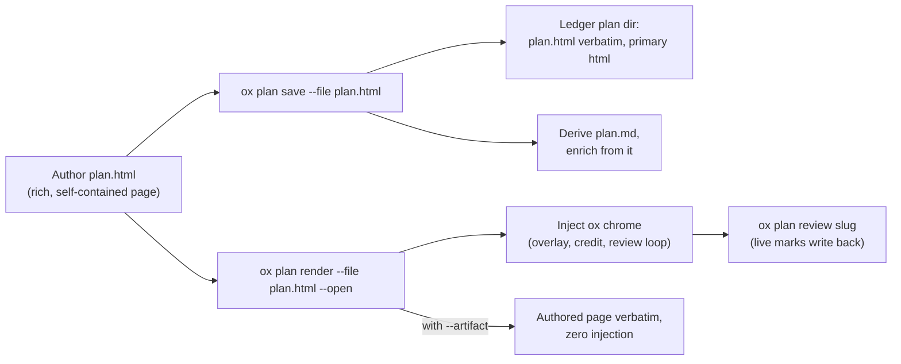

# Plan authoring: the rich HTML page leads

**Status:** active · **Owner:** plan/enrich · **Related:** [plan-render-adoption.md](plan-render-adoption.md) (adoption levers), [ADR-021](../adr/ADR-021-ox-plan-context-not-inference.md) (context, not inference), [ADR-025](../adr/ADR-025-plan-annotation-and-feedback-delivery.md) (annotation + feedback delivery)

## The inversion

The richest artifact leads. An AI coworker (or human) authors a **rich,
self-contained interactive HTML page first** — that page IS the plan of record.
Markdown is **extracted from** the HTML by ox: never authored in parallel, never
required.

This inverts the earlier flow (author markdown → the binary renders HTML). The
reason is markdown's representational ceiling: a deterministic markdown renderer
can approximate tabs and timelines, but it cannot reach what a purpose-built page
delivers — interactive inspectors, animated comparisons, layouts shaped to the
specific argument. The richest, best visualizations and ability to communicate
ideas and information are what should be generated first; everything ox needs
(terminal view, search, enrichment) is derived from that page, not the other way
around.

| Artifact | Produced by | Role |
|---|---|---|
| `plan.html` | Author (AI coworker or human) | **Plan of record.** Stored verbatim in the ledger plan dir |
| `plan.md` | ox, derived on every save | Terminal view (`ox plan view`), search, enrichment input. **Never hand-edit** — regenerated from the HTML |
| `meta.json` | ox | Records `"primary": "html"` |
| ox chrome | ox, injected at render/serve time | Enrichment overlay + footer credit + live review loop |

## The quality bar

The bar is the **SageOx conversation-format comparison page** — the hand-built
page that set the standard for what a plan can feel like:

- **Tabbed views** behind a sticky nav.
- **Interactive field inspectors** — hover or click a field, its counterpart
  lights up, a docked explainer updates.
- **Animated timelines** with toggles.
- **Side-by-side comparison panes** and **verdict cards**.
- **Design-system dark palette**: canvas `#0b0d0b`, surface `#111411`, accent
  `#99c693`, Inter + Spline Sans Mono.
- **Self-contained local page** — inline CSS/JS, no external dependencies.

A plan page that merely reformats prose has missed the point; the page should do
work a document cannot.

## The minimal authoring contract

Everything below is optional and degrades gracefully. **A page with none of these
hooks still works** — ox falls back to the title / first heading for the topic
and to ungrouped review anchors.

| Hook | What ox uses it for | Fallback when absent |
|---|---|---|
| `<title>` | Plan topic → slug + terminal listings | First heading, else filename |
| `<meta name="ox-plan-slug" content="...">` | Explicit slug override | Slug derived from title |
| H2 headings **or** `data-ox-section="Name"` on view containers | Groups enrichment badges and review anchors by section; gives the derived markdown its H2s | Ungrouped anchors; flat derived markdown |

## What ox injects — the chrome contract

`ox plan render --file plan.html` serves the authored page with the ox chrome
**injected — never wrapped, never rewritten**:

- A script+style bundle **appended before `</body>`**, between
  `<!-- ox-chrome:start -->` / `<!-- ox-chrome:end -->` markers.
- The bundle carries: (a) the **SageOx enrichment overlay** — collision /
  prior-art / expert-routing chips plus surfaced context; (b) the **footer
  credit**; (c) the full **live review loop** — click any element to attach a
  mark, content-hash anchored so it works on arbitrary authored markup, served
  via `ox plan review <slug>`.
- Injection is **idempotent and append-only** — re-rendering replaces the marker
  block and never touches authored markup.
- `--artifact` serves/writes the authored page **verbatim**, zero injection; any
  inline CSS/JS already present in the authored file remains part of that file.

## What ox derives — the markdown contract

`ox plan save --file plan.html` stores the authored page as the canonical
artifact and derives `plan.md` from it automatically:

- Headings, paragraphs, lists, tables, and code carry over directly.
- Tabs and `[data-ox-section]` view containers become **H2 sections**.
- Interactive-only content **degrades to its text**.
- The derived markdown is regenerated on **every** save — never hand-edit it.
- `ox plan view` and search read the derived markdown; enrichment runs over it.

## Command flow



Author `plan.html` → `ox plan save --file plan.html` (or `ox plan render --file
plan.html --open`) → `ox plan review <slug>` for the live loop.

## The markdown quick path (still supported)

`ox plan render --file plan.md` and `ox plan save --plan ...` remain — **for
quick, low-stakes plans only**. The markdown renderer auto-renders:

| Markdown input | Auto-rendered as |
|---|---|
| More than 3 H2 sections | Tabbed views |
| Leading summary | TL;DR hero |
| `:::compare` … `:::` blocks | Side-by-side comparison panes |
| ` ```html-interactive ` fences | Passthrough interactive blocks |
| Gated-track tables | Swimlanes |
| Comparison tables | Click-to-inspect field inspector |

Good for a small plan; it approximates. A material plan gets an authored page.

## Trust posture

The plan is the developer's **own local content rendered locally for that
developer**: the review server binds `127.0.0.1` and is token-gated, so author
scripting is a feature, not a threat — the interactivity is the point.
`--artifact` is the self-contained export for when the page needs to travel
beyond the local loop; it does not add external dependencies or ox review
scripts, and it does not rewrite authored inline assets.
