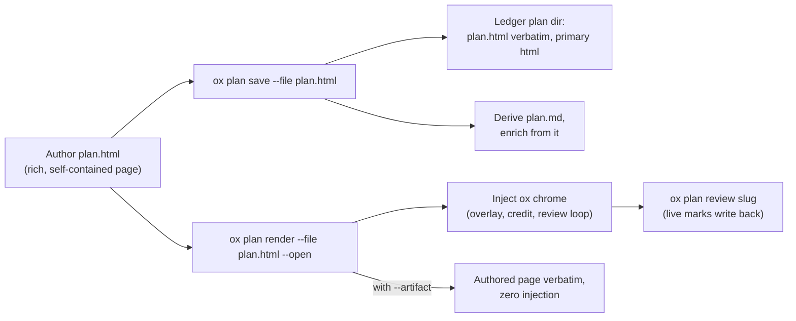

# Plan authoring: the rich HTML page leads

**Status:** active · **Owner:** plan/enrich · **Related:** [plan-render-adoption.md](plan-render-adoption.md) (adoption levers), [ADR-021](../adr/ADR-021-ox-plan-context-not-inference.md) (context, not inference), [ADR-025](../adr/ADR-025-plan-annotation-and-feedback-delivery.md) (annotation + feedback delivery)

## The inversion

The richest artifact leads. An AI coworker (or human) authors a **rich,
self-contained interactive HTML page first** — that page IS the plan of record.
Markdown is **extracted from** the HTML by ox: never authored in parallel, never
required.

This inverts the earlier flow (author markdown → the binary renders HTML). The
reason is markdown's representational ceiling: a deterministic markdown renderer
can approximate tabs and timelines, but it cannot reach what a purpose-built page
delivers — interactive inspectors, animated comparisons, layouts shaped to the
specific argument. The richest, best visualizations and ability to communicate
ideas and information are what should be generated first; everything ox needs
(terminal view, search, enrichment) is derived from that page, not the other way
around.

| Artifact | Produced by | Role |
|---|---|---|
| `plan.html` | Author (AI coworker or human) | **Plan of record.** Stored verbatim in the ledger plan dir |
| `plan.md` | ox, derived on every save | Terminal view (`ox plan view`), search, enrichment input. **Never hand-edit** — regenerated from the HTML |
| `meta.json` | ox | Records `"primary": "html"` |
| ox chrome | ox, injected at render/serve time | Enrichment overlay + footer credit + live review loop |

## The authoring philosophy

Every plan is authored against one creed:

> **Don't waste human attention. Delight them. Educate them visually and crisply.**

Each clause is enforced by a section below — this doc is the creed made concrete:

- **Don't waste human attention** → *The human-attention contract*: two layers, the
  approver never pays for the implementer's depth.
- **Delight them** → *The quality bar* and *The design register*: a page that does work
  a document cannot, in the same warm register as every other SageOx surface — not a
  generic dev-tool doc.
- **Educate them visually** → the hero visualization: teach the decision with topology,
  sequence, state, or comparison, not a wall of prose.
- **…crisply** → lead with the conclusion and the biggest risk; every element earns its
  pixels.

The clauses are not decoration. A plan that informs without delighting or educating has
met the letter of the contract and missed its point.

## The quality bar

The bar is the **SageOx conversation-format comparison page** — the hand-built
page that set the standard for what a plan can feel like. A plan should not just
inform the approver; it should **delight** them and **educate** them — teach the
decision, don't just state it:

- **Tabbed views** behind a sticky nav.
- **Interactive field inspectors** — hover or click a field, its counterpart
  lights up, a docked explainer updates.
- **Animated timelines** with toggles.
- **Side-by-side comparison panes** and **verdict cards**.
- **Self-contained single file** — inline CSS/JS, no external dependencies.

A plan page that merely reformats prose has missed the point; the page should do
work a document cannot.

## The design register (not optional)

An authored page is embedded in the SageOx web app (`/repo/…/plans/…` frames it
in an iframe) and read beside every other SageOx surface. It has to be the same
colour temperature as they are — warm green-black dark, warm cream light, warm
mid-grey text — or it reads as a foreign object no matter how good its content
is. Copy this block verbatim rather than picking hexes by eye; every value is a
sageox-design token.

```css
:root{
  --bg:#0b0d0b; --panel:#111411; --panel2:#171b17; --hair:#212620; --hair2:#1d221d;
  --ink:#f4f2ef; --dim:#b7b6a3; --faint:#8c8e7e;
  --sage:#99c693; --gold:#d9b654; --amber:#c6a23c; --red:#d77e6c; --teal:#97aebd;
}
html[data-theme="light"]{
  /* The page sheet is pure white — a plan is one big content card, the same
     object the app renders its cards as. Inner surfaces step DOWN into cream
     rather than up, inverting dark mode. */
  --bg:#ffffff; --panel:#f7f5f2; --panel2:#f2f0ec; --hair:#e5e2df; --hair2:#ebe8e5;
  --ink:#161812; --dim:#4a4d42; --faint:#6b6d60;
  --sage:#3d643b; --gold:#836726; --amber:#644f1e; --red:#9f4838; --teal:#586f80;
}
```

**Type — three families, no fourth.** Headings are **Hedvig Letters Serif**,
body is **Inter**, code/IDs/timestamps are **Spline Sans Mono**. Hedvig ships
weight **400 only**; requesting 600 or 700 synthesizes a fake bold, so heading
presence comes from size and letterform. A geometric sans on the headings (Space
Grotesk, Poppins, and friends) is the single fastest way to make a page look
like a generic dev-tool doc instead of a SageOx one.

**Colour carries one meaning each**, and never carries it alone — every hue is
paired with a label or glyph: sage = aligns/shipped, gold = gate, amber =
hold/warn, red = risk/blocker, teal = team context. **The old warm brand accent is retired**
(DDR-010, the green-black rebrand); gold, from the `warning` ramp, is its
successor. Do not introduce a second brand hue.

**Light-mode accents run two stops deeper than their dark counterparts.** The
ramps' mid stops are *fill* values — sage-700 lands at 4.31:1 and warning-600 at
3.16:1 as text on cream, both under WCAG AA. The values above are the corrected
text-safe ones.
## The human-attention contract

A material plan has two readers and therefore two layers:

1. **Decision surface (visible immediately):** conclusion, biggest risk,
   trade-offs, and one meaningful hero visualization that explains the system's
   topology, sequence, state, or comparison. Decorative icons and wordmarks do
   not count as a visualization.
2. **Implementation depth (collapsed initially):** exactly one closed
   `<details><summary>Implementation notes</summary>...</details>` appendix at
   the end with exact files, edits, rollout mechanics, and gotchas.

Do not average the two audiences into a long document. Keep the depth, but move
it behind native progressive disclosure so the approver's first scan stays
visual and the implementing AI coworker still has precise instructions.

## The minimal authoring contract

Everything below is optional and degrades gracefully. **A page with none of these
hooks still works** — ox falls back to the title / first heading for the topic
and to ungrouped review anchors.

| Hook | What ox uses it for | Fallback when absent |
|---|---|---|
| `<title>` | Plan topic → slug + terminal listings | First heading, else filename |
| `<meta name="ox-plan-slug" content="...">` | Explicit slug override | Slug derived from title |
| H2 headings **or** `data-ox-section="Name"` on view containers | Groups enrichment badges and review anchors by section; gives the derived markdown its H2s | Ungrouped anchors; flat derived markdown |

## What ox injects — the chrome contract

`ox plan render --file plan.html` serves the authored page with the ox chrome
**injected — never wrapped, never rewritten**:

- A script+style bundle **appended before `</body>`**, between
  `<!-- ox-chrome:start -->` / `<!-- ox-chrome:end -->` markers.
- The bundle carries: (a) the **SageOx enrichment overlay** — collision /
  prior-art / expert-routing chips plus surfaced context; (b) the **footer
  credit**; (c) the full **live review loop** — click any element to attach a
  mark, content-hash anchored so it works on arbitrary authored markup, served
  via `ox plan review <slug>`.
- Injection is **idempotent and append-only** — re-rendering replaces the marker
  block and never touches authored markup.
- `--artifact` serves/writes the authored page **verbatim**, zero injection.

## What ox derives — the markdown contract

`ox plan save --file plan.html` stores the authored page as the canonical
artifact and derives `plan.md` from it automatically:

- Headings, paragraphs, lists, tables, and code carry over directly.
- Tabs and `[data-ox-section]` view containers become **H2 sections**.
- Interactive-only content **degrades to its text**.
- The derived markdown is regenerated on **every** save — never hand-edit it.
- `ox plan view` and search read the derived markdown; enrichment runs over it.

## Command flow



Author `plan.html` → `ox plan save --file plan.html` (or `ox plan render --file
plan.html --open`) → `ox plan review <slug>` for the live loop.

## The markdown quick path (still supported)

`ox plan render --file plan.md` and `ox plan save --file plan.md` remain — **for
quick, low-stakes plans only**. The markdown renderer auto-renders:

| Markdown input | Auto-rendered as |
|---|---|
| More than 3 H2 sections | Tabbed views |
| Leading summary | TL;DR hero |
| `:::compare` … `:::` blocks | Side-by-side comparison panes |
| ` ```html-interactive ` fences | Passthrough interactive blocks |
| Gated-track tables | Swimlanes |
| Comparison tables | Click-to-inspect field inspector |

Good for a small plan; it approximates. A material plan gets an authored page.

## Two Mermaid renderer traps

Both were hit in real renders. They are encoded here so they don't have to be
rediscovered, and the first one is also caught by the `mermaid.font-race` lint.

- **The webfont race.** Mermaid measures node boxes using whatever font is
  loaded at render time. When a webfont swaps in later, its wider glyphs
  overflow the boxes that were sized for the fallback, and every label clips
  mid-word. The symptom is invisible until someone screenshots the diagram. In
  an authored page, re-render once the font settles:
  `document.fonts.ready.then(() => renderMermaid())`. The ox scaffold already
  does this; a page that hand-rolls its own Mermaid init must do it too.
- **Parallel groups sprawl horizontally.** Disconnected subgraphs that share a
  sink lay out side by side and overflow the column. Chain them with invisible
  links (`A ~~~ B`) to force a vertical stack, and move byte counts and other
  detail out of node labels into the caption under the diagram.

## Trust posture

The plan is the developer's **own local content rendered locally for that
developer**: the review server binds `127.0.0.1` and is token-gated, so author
scripting is a feature, not a threat — the interactivity is the point.
`--artifact` is the strict export for when the page needs to travel beyond the
local loop: a fully self-contained page — no external fonts, scripts, or
network fetches; CSS and JS inline. Self-contained is the whole claim: there is
no CSP nonce/hash handling, so a strict host CSP that disallows
`unsafe-inline` will still block the page's inline styles and scripts.
