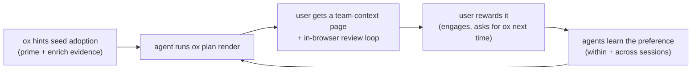

# Driving AI coworkers to choose `ox plan render`

**Status:** active · **Owner:** plan/enrich · **Related:** [ADR-021](../adr/ADR-021-ox-plan-context-not-inference.md) (context, not inference), [ADR-023](../adr/ADR-023-skill-injection-two-layer-model.md) (skill injection two-layer model)

## The problem

`ox plan render` turns an implementation plan into a self-contained HTML page that
folds in SageOx team context — open-PR / active-file collisions, prior art, expert
routing — and saves it to the ledger where teammates find it. None of that is
reproducible by an agent rendering HTML on its own: the enrichment lives **behind
the SageOx API**.

Yet agents often **don't** use it. They emit a plain-markdown plan, or reach for
their **own** HTML-rendering skill, producing a *context-blind orphan*: a page that
carries none of the team context and never reaches the ledger.

Three hard constraints shape every fix:

- **We cannot mandate the choice.** There is no hook that forces a render; PostToolUse
  stdout is discarded by Claude Code, and other agents honor even less.
- **We cannot remove or even see the competitors.** The rival HTML-plan skills are the
  *user's own*. A user may have several. We can't edit, disable, or enumerate them.
- **Agents honor different channels.** Claude Code receives ox's UserPromptSubmit /
  PostToolUse nudges; Codex / Gemini receive only the prime payload and whatever they
  read from CLI output. A Claude-only fix reaches a fraction of coworkers.

## The strategy: defense in depth, weighted toward structural pull

When you can't mandate a choice and can't remove the alternatives, you win a
**probabilistic** choice by **layering** independent levers — and by shifting weight
from *persuasion* (copy the agent may never read) toward *structural pull* (the
agent reaches `ox plan render` pursuing its **own** goals).

The layers, ranked by **durability** (how well each survives the agent ignoring our
text). Lower layers are architecture; higher layers are persuasion.

| Layer | Mechanism | Channel / moment | Cross-agent? | Durability |
|---|---|---|---|---|
| **L0 — Structural pull** | The agent reaches render via its own incentives: `enrich` is the cheap on-ramp; the in-browser review loop is the reward the user visibly wants | CLI workflow | ✅ | Highest |
| **L1 — Skill-selection capture** | Our shipped `ox-plan` skill wins "render a plan" intent on a capability competitors lack | Skill registry, at selection | ❌ Claude-only | High |
| **L2 — Evidence-backed nudge** | `enrich` guidance leads with the *real computed signals* ("9 files in open PRs, 2 expert routes") at the decision moment | `enrich` JSON (all agents) + hooks (Claude bonus) | ✅ via enrich | Medium |
| **L3 — Orphan recovery** | Detect "presented a plan *without* rendering" → offer specifically next turn | PostToolUse / next prompt | ❌ Claude-only | Medium |
| **L4 — Prime floor** | One lean capability line so an agent that ignores everything else still knows render exists and why | Prime payload | ✅ | Baseline |

**Principle: persuasion is the safety net; capability + friction + user-reinforcement
is the strategy.** Most teams over-invest at L4/L2 (copy) and under-invest at L0/L1
(incentives). Flip that.

## The two structural insights

### 1. `enrich` is the Trojan horse; render is what it unlocks

Don't try to *talk* an agent past its own skill. Make `ox plan enrich` so cheap and
independently useful — collision avoidance, prior art, per-section diagram hints the
agent wants anyway — that it runs it as a matter of course. Once the agent is
*holding* that team context, **not** rendering via ox means visibly discarding data
it can see. A capable agent skips persuasion but rarely skips its own self-interest.

This is why L2 ships in the `enrich` output (`internal/plan/diagram_hints.go`,
`buildGuidance` / `guidanceLead`): the guidance the agent reads *after* enriching now
leads with the specific counts, so the value is self-evident rather than asserted.

### 2. The user's reaction is the real training signal — the flywheel

Agents converge on **what the user rewards**, faster and more durably than on
anything we inject. So the highest-value long-term investment is **not** better hint
copy — it is making the ox-rendered experience (the in-browser `ox plan review` loop,
the surfaced team context) so visibly good that **users themselves start asking for
it**. Once that happens, every agent — Claude or not, skill-laden or not — learns the
preference from the human, and our hints become merely what seeded enough adoption to
start the loop.

The flywheel is the durable answer to "most effective long-term." Hint copy is the
ignition, not the engine. The engine is L0: a render + review experience good enough
that the human prefers it out loud.

## What NOT to do

- **Pile more persuasion into prime.** Diminishing returns, token cost, and nag-fatigue
  that trains users *and* agents to tune ox out — worse than silence.
- **Detect or suppress the user's own skills.** We can't, and shouldn't — user autonomy.
  Compete on capability, never by sabotage. Keep all framing **generic** ("does what a
  self-authored render can't"), never naming a competitor, precisely because there may
  be several.
- **Treat persuasion as the strategy.** It is the safety net (L2–L4). The strategy is
  L0/L1.

## Current status

| Layer | State | Where |
|---|---|---|
| L1 | **Shipped** — `ox-plan` skill description leads with the capability (team context + ledger + review loop) and wins plan-render intent | `extensions/claude/skills/ox-plan/SKILL.md` |
| L2 | **Shipped** — `buildGuidance` leads with the computed collision / expert-route / prior-art counts | `internal/plan/diagram_hints.go` (`guidanceLead`) |
| L4 | **Shipped** — capability line in the prime advisory | `cmd/ox/agent_prime_xml.go` (`writePlanEnrichmentGuidance`) |
| L3 | **Partial** — the exit-plan nudge already quotes signals; an explicit "presented without rendering" recovery is future work | `cmd/ox/agent_hook_plan_nudge.go` |
| L0 | **Design only (this doc)** — the review-loop flywheel is the highest-leverage and biggest piece; it needs its own implementation pass (measure render-vs-orphan rate; invest in the `ox plan review` experience users reward) | — |

## How we'd know it's working

Instrument the one bit that matters: does a planning session end with a **rendered +
ledger-saved** plan, or a markdown / skill orphan? Without that signal we are tuning
copy blind. This metric is also the flywheel's tachometer — it should climb as the
review-loop experience improves, independent of any hint change.
