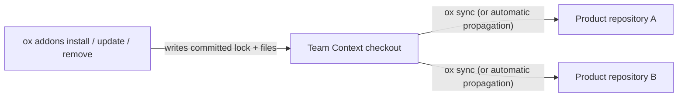

# Native-First Asset Inventory, and the Team-Scoped Add-on Catalog

> **Amended by [ADR-032](../adr/ADR-032-addon-catalog-team-scoped.md) (2026-09-21).**
> This document previously described ox's own runtime assets in project-scoped
> terms throughout, and left team-selected content as an open follow-on
> ("Team Context follow-on", below). ADR-032 settled that follow-on: an
> optional catalog exists, and it is **team-scoped**, never per-repository.
> This rewrite reflects the decision. **Part 1** covers ox's own runtime
> skills and rules — still correctly project-scoped, unchanged by the ADR.
> **Part 2** covers the Add-on Catalog. The project-scoped surface this
> document once anticipated (`ox skills catalog | install | uninstall`) was
> withdrawn before release in favor of it.

---

## Part 1 — ox's own runtime skills and rules (project-scoped)

SageOx authors each playbook once in the portable Agent Skills layout:

```text
extensions/skills/<skill>/
  SKILL.md
  references/     # optional
  assets/         # optional
  scripts/        # optional
```

This embedded catalog is ox's own content — the `ox-cli-*` relays, the
lifecycle commands, and the committed `sageox` on-ramp — compiled into the
binary. Internally it is grouped into three bundles (`core`, `onramp`,
`lifecycle`), all selected by default; a team never chooses among them, and
`ox init` / `ox doctor` keep them current automatically as the installed
binary upgrades. "Bundle" here is an implementation detail of this one
catalog (`extensions/skills/catalog.go`) — it is not a name a user ever
selects or sees, and it is not the same thing as an add-on (Part 2).

ox-owned runtime rules use that same inventory. Their catalog lives in
`extensions/rulecatalog/`; adapters declare native rule targets but do not
install, update, or retire catalog files themselves.

### Native targets

Adapters declare skill and rule target descriptors instead of independently
managing files:

```go
type SkillTarget struct {
    Key        string
    Root       string
    Format     string
    Scope      string
    LinkPolicy string
}
```

The CLI validates repository-relative paths and deduplicates targets by their
canonical root and format. Codex and Gemini therefore produce one shared
`.agents/skills` projection and one truthful change count.

| AI coworker | Target | Format |
|---|---|---|
| Claude Code | `.claude/skills/<skill>/` | Native Agent Skills |
| Codex | `.agents/skills/<skill>/` | Portable Agent Skills |
| Gemini CLI | `.agents/skills/<skill>/` | Portable Agent Skills (shared with Codex) |
| AI coworker without native skills | None | Future Skill Bridge; not implemented speculatively |

| AI coworker | Rule target | Format |
|---|---|---|
| Claude Code | `.claude/rules/*.md` | Native Markdown rules |
| Factory Droid | `.factory/rules/*.md` | Native Markdown rules |

`skill_targets` and `rule_targets` share the descriptor vocabulary. The format
discriminator selects catalog materialization: `agent-skills/v1` produces a
skill directory tree; `markdown-rules/v1` produces rule files directly beneath
the target root.

All managed targets are project-scoped, and every managed file is GITIGNORED
under a reserved namespace (ADR-031) — with exactly one exception, the committed
`sageox` on-ramp skill, which is the only SageOx artifact present on a machine
where the CLI is not installed.

All managed targets are project-scoped. Native discovery and activation remain
authoritative; SageOx does not replace vendor-trained routing with hooks, a
bootloader, or an MCP page-fault path.

### Desired state and ownership

`.sageox/skills.lock.json` records the complete native asset inventory:

- built-in source revision and ox version;
- selected skill bundle IDs and native target keys;
- normalized target descriptor snapshots;
- every managed file's repository-relative path, SHA-256 digest, and mode.

Ownership is split across two files as of schema 2 (ADR-031): the COMMITTED
`.sageox/skills.lock.json` carries the project's selection (bundles, targets),
while the machine-local, gitignored `.sageox/cache/skills-state.json` carries the
catalog revision, the ox version, and the per-file digests this machine
materialized. Without that split the manifest alone would keep producing a
tracked diff on every content-bearing release, even though every file it
describes is invisible to git. Schema-1 manifests migrate on read.

Inside the reserved namespaces (`ox-cli-*`, `sageox-team-*`) ox owns the bytes
ABSOLUTELY: a local edit is restored on the next reconcile rather than preserved
as a conflict. Preserve-on-edit was correct while these files were tracked — an
edit showed up in `git diff` — and becomes harmful once they are gitignored,
where a preserved edit is permanent silent drift. Overwrite is not delete,
though: ox removes only what it can prove it wrote, so unrecognized content
inside a reserved namespace is reported, never swept.

The lockfile—not an inline comment—is the ownership source. Existing `ox-hash`
skill stamps and agentx rule stamps are accepted only as migration evidence
when their body and generated frontmatter verify. Migration discovers verified
rule content rather than maintaining a list of old filenames. New projections
contain clean canonical content with no ownership stamp.

`Plan` is deterministic, read-only, and considers the complete skill tree:
`SKILL.md`, references, assets, and scripts. It classifies creates, updates,
removals, conflicts, and preserved files. `Apply` performs recoverable
per-file changes and commits the lockfile last.

Ownership rules are deliberately conservative:

- update or remove a file only when its current digest matches the last
  installed digest;
- recreate a recorded file that is missing;
- preserve user additions, unknown collisions, and modified managed files;
- remove unchanged retired files and clean only empty directories;
- on uninstall, preserve a modified retired file but relinquish ownership so
  it does not become a permanent Doctor conflict;
- reject symlinked targets, parent directories, lockfiles, and managed files.
  A central store symlinked into each repository was evaluated and rejected in
  ADR-031: symlinked skill entries do work in Claude Code and Codex, but as a
  delivery mechanism they silently no-op on Windows, dangle in containers, and
  make one editor save change every repository on the machine.

Apply writes `.sageox/cache/skills-apply.json` before target mutation. The
journal records each old/new digest pair. If a process exits before the
lockfile commit, the next Plan accepts only the previous or journaled digest,
finishes the operation, commits the manifest, and removes the journal. This
distinguishes interrupted SageOx writes from coincidentally similar user files.

### Lifecycle

- `ox init` adds only the skill and rule targets selected for that invocation and persists
  them. It never equates later agent detection with authorization.
- `ox doctor` plans only committed targets. For the one-release migration, a
  target with a valid legacy stamp may bootstrap selection.
- `ox doctor --fix` applies the plan and preserves conflicts.
- uninstall removes unchanged owned files once across all targets.
- an upgrade converges on the next explicit Doctor/init lifecycle operation;
  the old process does not attempt to execute a newly installed catalog.

AMENDED by ADR-031: the daemon now runs a DETERMINISTIC reconcile check on its
slow tick (`skills-inventory-drift`). The objection below was to an AI coworker
performing repair; this is the same code path `ox doctor` runs, and it is bounded
— it never installs into a repository that selected no targets, never runs while
a session is recording, never touches the git index, and never rewrites a tracked
file. The sentence below stands for the AI-coworker case only.

The daemon does not schedule an AI coworker to perform deterministic skill
repair. Explicit lifecycle commands own reconciliation. Current desired state
produces an empty plan and no daemon task.

The compatibility adapter RPCs remain in protocol v1 for third-party adapters.
Built-in adapters no longer advertise or implement rule installer RPCs; all
built-in CLI workflows use target descriptors and central reconciliation.

---

## Part 2 — the Add-on Catalog (team-scoped)

**Status: shipped and public.** `ox addons` is an ordinary command. See "Where the gate went,"
below, before running any command in this section.

### What an add-on is

An add-on packages **skills** (with their own `references/`, `assets/`,
`scripts/`) and **rules** — nothing else. There is no free-standing "context"
artifact type and no tool-artifact kind; both were considered and rejected
(ADR-032 D2), because context with no skill around it has no activation
trigger, and a tool kind would have shipped with no handler behind it.

A team selects an add-on once. Every repository on the team then receives it,
and every teammate's AI coworker sees the same selection — the opposite of
the withdrawn model, where the same content was chosen once per repository
and drifted per repository as a result.

### Where it lives, and the one rule that follows from it

`ox addons install | update | remove` write into the **Team Context**
checkout and nothing else. A product repository carries no add-on selection
and can never make one — "which Team Context" is the only location question
the command asks (`ox status` explains why one isn't configured, if that's
the failure).

`ox sync` is the separate, origin-agnostic distribution step. It transports
and converges add-on-installed and hand-authored Team Context content through
one pipeline, and it never checks the catalog for a newer version on its own.
There is no `ox addons sync` and no `ox skills sync`, now or ever — one
synchronization concept:

> `ox addons` chooses and updates what the team owns.
> `ox sync` distributes everything the team owns.



Consequently, `ox skills catalog`, `ox skills install`, and `ox skills
uninstall` are withdrawn before release — they proposed exactly the
repository-scoped selection this section replaces. `ox skills list | status |
approve | revoke | publish` remain: they are diagnostics, capability
approval, and hand-authored publishing, none of which select catalog content.

### Co-mingled roots, provenance in the lock

Add-on-installed skills land in `agents/skills/<name>/` and rules in
`agents/rules/<name>.md` in the Team Context — the same roots hand-authored
team content uses. There is no `agents/add-ons/<addon>/` namespace and no
`docs/add-ons/` directory.

Ownership is recorded in a committed lock, not inferred from the path:

| Path | Role |
|---|---|
| `<team-context>/.sageox/add-ons.lock.json` | committed; per add-on: source, version, digest, install time, owned paths, per-file digests |
| `<team-context>/agents/skills/<name>/` | canonical Team Skills, add-on-installed or hand-authored |
| `<team-context>/agents/rules/<name>.md` | canonical Team Rules, add-on-installed or hand-authored |

**One collision rule:** an add-on file colliding by name with an existing
hand-authored file is a namespace collision, not an edit — install refuses it
by name and mutates nothing. Only paths the lock already owns are ever
overwritten.

When an add-on's Team Skills and Team Rules reach a product repository, they
project through the same target-descriptor mechanism Part 1 describes,
reserved under the `sageox-team-*` prefix (ADR-031). **Delivery mechanics vary
by artifact and by AI coworker, the same way Part 1's native-target table
varies by coworker** — the promise is that a supported coworker can use the
Team Context content that applies to it, not that every coworker materializes
every artifact identically.

### Update overwrites; Team Context git history is the undo

**Add-on-installed files are not yours to edit.** `ox addons update`
overwrites every owned path unconditionally and removes owned paths the new
version drops. There is no three-way merge, no conflict state, no `ox addons
diff`, no `--keep-team`, no `--accept-upstream`. Someone who wants to
customize copies the file to a new, hand-managed name instead.

The per-file digests in the lock exist for **honesty, not resolution**: they
let `ox addons update` say which owned files your team modified, before it
overwrites them. The recovery story is Team Context's own git history — an
overwritten edit is one `git log -p` away, in a history teammates already
share.

```mermaid
sequenceDiagram
    participant Teammate
    participant TeamContext as Team Context (git)
    participant Addons as ox addons update

    Teammate->>TeamContext: hand-edits an add-on-owned file
    Addons->>TeamContext: compares current digest to the lock
    Addons-->>Teammate: warns which owned files were modified
    Addons->>TeamContext: overwrites every owned path; removes dropped ones
    Teammate->>TeamContext: git log -p -- <path>  (recovers the edit)
```

An add-on update also interacts with skill approval: overwriting owned bytes
means a previously approved add-on skill whose content changed returns to
*needing approval* again — the pin names bytes, not names, so `ox addons
update` surfaces this rather than silently re-approving.

### Third-party authorship

An add-on's author is not necessarily SageOx, and not necessarily the team
installing it. Three populations are anticipated: add-ons SageOx publishes,
add-ons a team authors for itself, and — in the future — add-ons published by
third parties. Nothing about the mechanism assumes who wrote the content:

- **Third-party bytes are untrusted input.** They route through the existing
  digest-pinned approval gate — `ox skills approve`, with runnable scripts a
  second, separate decision behind `--allow-scripts`. Installing an add-on
  grants neither by itself. Nothing on the pull path verifies signatures
  today, which is precisely why that gate exists.
- **Provenance is already recorded.** The lock carries `addon`, `version`,
  and `digest` per owned path, so "who supplied this file, at which version"
  is answerable without a new namespace.
- **Trust is a team-level decision**, which is why the catalog is team-scoped
  in the first place: adopting a third party's add-on is a judgment made once,
  visible in Team Context git history, and reviewable in a pull request.

### Where the gate went

`ox addons` used to sit behind `FEATURE_ADDONS`, default off. **It no longer
does** — the flag is deleted, and the command is registered and discoverable
like any other (ADR-032, amended 2026-09-22).

The reasoning is worth keeping, because it explains where the gate moved
rather than that the caution was abandoned:

- **A gate holds back untrusted bytes.** The only provider today is embedded —
  add-ons compiled into the binary from content in this repository, which every
  reviewer of it has already seen. There are no untrusted bytes to hold back,
  so the flag guarded a mechanism that could only install content we wrote.
- **The caution moved to the provider.** A remote or third-party provider will
  land behind its own flag, default off. That is where untrusted content enters,
  and it is where two known gaps now block: the Unicode-normalization collision
  that can record a lock naming two files where one exists (macOS/APFS), and the
  absence of secret scanning on the Team Context write path.

Nothing else changed. The selection is still team-scoped, still
overwrite-on-update, and Team Context git history is still the undo.

### Command reference

`<name>` in these examples is `post-cutoff`. This build's embedded catalog
ships two add-ons: `post-cutoff` (the shelf — grading, expiry, and the
human-only intake procedure) and `post-cutoff-jev` (one brief, on TypeSafe
Jev). They are separate so a team can take the shelf without adopting an
opinion on one vendor, or take the brief without adopting the procedure;
neither requires the other.

| Command | Effect | Flags |
|---|---|---|
| `ox addons list` | Show every add-on in the catalog and, for each, whether this team has it installed and whether an update is available | `--json` |
| `ox addons install <name>` | Install into Team Context; refuses by name on a collision with hand-authored content | `--version <v>`, `--json` |
| `ox addons update <name>` | Overwrite every file the add-on owns to the catalog's current version; remove owned files the new version drops; warn about any edits about to be replaced | `--json` |
| `ox addons remove <name>` | Remove the add-on's owned files from Team Context | `--json` |

**Browse offline.** `ox addons list` reads the catalog compiled into the ox
binary (`SourceBuiltin`) — no network call, no Team Context required. If no
Team Context is configured yet, the installed column is simply empty rather
than the command failing:

```bash
ox addons list
```

**Install.**

```bash
ox addons install post-cutoff
# Installed post-cutoff 1.0.0 (3 file(s)).
# Distribution is automatic — run `ox sync` only if you need it immediately,
# then `ox skills status` to verify.
```

**Automatic propagation, or force it now.** Every mutating verb ends with the
same guidance: the daemon converges Team Context content into repositories on
its own schedule, so no follow-up step is required. To see the change in a
repository immediately:

```bash
ox sync
ox skills status
```

**Update overwrites an edited file.** If a teammate hand-edited a file the
add-on owns, `ox addons update` still overwrites it — and says so before
moving on:

```bash
ox addons update post-cutoff
# (1.1.0 is illustrative — the catalog ships post-cutoff 1.0.0 today, so an
#  update is a no-op until a newer version exists.)
# Updated post-cutoff to 1.1.0 (3 written, 0 removed).
#   warning: your team had edited 1 file(s) this add-on owns; the new version
#   replaced them: agents/skills/post-cutoff/SKILL.md
#   Recover any of them with `git -C <team-context-path> log -p -- <path>`.
```

**Removal.**

```bash
ox addons remove post-cutoff
# Removed post-cutoff from your Team Context (3 file(s)).
```

### What has not shipped yet

- **Remote or third-party providers.** `Provider` is an interface for exactly
  this reason, but the only implementation today is the embedded, compiled-in
  catalog (`SourceBuiltin`). Third-party authorship (above) is a design
  target, not a working code path yet.
- **`ox addons diff`.** ADR-032 D4 rejects a merge model outright — Team
  Context git history is the undo — so this is not partial work toward a
  future command, it is a deliberately absent one.
- **A tool-artifact kind.** Considered and removed before release (ADR-032
  D2); an add-on ships skills and rules only.
- **Secret scanning of add-on content.** Untrusted bytes route through the
  existing `ox skills approve` gate (above); there is no additional
  content-scanning step specific to add-ons.

---

## Skill Bridge follow-on

Only an AI coworker that genuinely lacks native skill discovery should receive
a compact catalog through `ox agent prime` and activate a playbook through a
future `ox skill activate <id> --json` or equivalent MCP tool. Native-capable
AI coworkers continue receiving real native skills. Enabling the bridge for a
native-capable client requires measured activation-quality evidence first.
