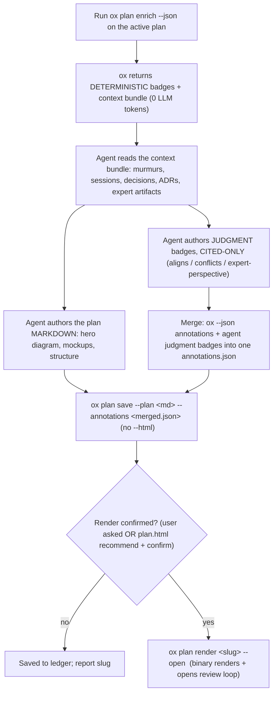

<!-- Keep behavioral "when to render" guidance lean — that belongs in the
     `ox plan` JSON output (signals.material, guidance) and in the
     <plan-enrichment-guidance> block from `ox agent prime`, not duplicated here.
     What legitimately lives in THIS skill is agent-side orchestration the binary
     CANNOT do: (1) reasoning the context bundle into cited judgment badges, and
     (2) authoring the plan markdown so the render has substance. The HTML itself
     is produced by `ox plan render` (internal/plan/render.go + assets) so every
     agent — Claude, Codex, Amp — gets the identical page. Do NOT hand-roll HTML. -->

**Whether to render at all is decided by the `ox plan` JSON (`signals.material`, `guidance`) + the user's confirmation / `plan.html` config — not by this skill.** Do not nag on trivial plans; honor the command's signal.

**The binary renders. You don't.** `ox plan render <slug>` turns a saved plan (with your merged judgment badges) into the self-contained HTML — badge rail, Mermaid, light/dark toggle, swimlane timelines, device mockups, review loop. Never write raw HTML/CSS to a `.html` file and pass it as `--html`. Your job is the two things the deterministic renderer cannot do for itself: **author cited judgment badges**, and **author plan markdown worth rendering**.

---

## Orchestration (what this skill does)



1. **Get the deterministic signals + context bundle.** Run:

   ```bash
   ox plan enrich --json --file <plan-file>   # or pipe the plan on stdin
   ```

   This makes **no LLM or network call**. It returns a `Result` JSON:
   - `annotations[]` — deterministic, ox-computed badges: `collision`, `prior-art`, `expert-routing`. Each carries `{section, kind:"deterministic", type, why, source_url, expert, files}`. These are **factual** — keep them as-is, do not second-guess them.
   - `context[]` — the pre-retrieved bundle the agent reasons over: `{kind: murmur|session|decision|adr|commit|discussion, title, ref, snippet, score, author, when}`.
   - `signals` — `{collisions, prior_art, expert_routes, material}`. `material` is ox's call on whether a render is worth recommending.

2. **Author the JUDGMENT badges (the agent's job — ox does NO inference).** Read the `context[]` bundle and produce judgment annotations:
   - `aligns` / `conflicts` — does the plan agree or clash with a cited ADR, decision, or convention?
   - `expert-perspective` — the synthesized stance of the area expert.

   **CITED-ONLY is non-negotiable.** Every judgment badge MUST point at a real artifact from the bundle (`ref` / `source_url`): a specific ADR, decision doc, session, commit, or discussion. Rules:
   - Never invent an opinion, a quote, or a conflict. Precision over recall.
   - When the evidence is **thin or ambiguous, degrade to a routing nudge** — `expert-perspective` becomes "consult `<name>`" (naming the expert from `annotations[].expert`), NOT a fabricated stance. Putting words in a teammate's mouth is the one failure mode that destroys trust.
   - When unsure whether a conflict is real, downgrade to "Novel — no prior decision found," not a false `conflicts`.
   - Set `kind:"judgment"` on every badge you author so the renderer styles it distinctly from ox's deterministic ones (outlined vs. filled — the binary owns that treatment).

   **NEVER dump the `context[]` bundle into the plan.** The bundle is your *reasoning input*, not output. A bundle item becomes a badge *only* after you reason over it into a cited judgment attached to a specific plan section. An item you can't turn into a section-anchored, cited badge does not appear at all. Worked example:

   > Bundle item → `{kind:"adr", title:"ADR-018 codedb perf budget", ref:"docs/adr/018...", snippet:"...512MB resident ceiling..."}`
   > Plan section 3 proposes an in-memory index. →
   > **Authored badge** → `{section:"3. Index", kind:"judgment", type:"conflicts", why:"In-memory index may breach the 512MB ceiling set in ADR-018", source_url:"docs/adr/018...", ...}`
   >
   > If the same ADR were only tangentially related: degrade to `expert-perspective` → "consult `<name>`", NOT a pasted raw snippet.

3. **Author the plan markdown so the render has substance (see "Authoring the plan markdown" below).** Put the hero diagram, any mockups, and the decision/appendix structure INTO the plan markdown file — the renderer draws what the markdown contains. Edit the plan file in place before saving.

4. **Merge annotations and persist with `ox plan save` — no `--html`.**

   ```bash
   ox plan save --plan <plan-file> --annotations <merged.json>
   ```

   - `--annotations <merged.json>` is the **merged** annotations: take the `ox plan enrich --json` Result and **append your judgment badges** to its `annotations[]` array (keep `signals`, `context`, and the deterministic badges intact). That merged file is stored as `annotations.json`.
   - **Do NOT pass `--html`.** You are not producing HTML — the binary does that in the next step. `ox plan save` persists the markdown + merged annotations to `data/plans/YYYY-MM-DD-<slug>/` and prints the slug.

5. **Render with the binary (only when a render is confirmed).**

   ```bash
   ox plan render <slug> --open
   ```

   `ox plan render <slug>` loads the saved plan — **including your judgment badges** — and produces the self-contained HTML deterministically, then `--open` launches the live review loop (`ox plan review`) so the human's marks write back to the ledger. On a headless shell it prints the path. Nothing you write by hand is involved. **Never render HTML just to populate the ledger** — the markdown + annotations are the canonical artifact; the render is on demand.

---

## Authoring the plan markdown (your input to the renderer)

The renderer is only as good as the markdown you hand it. `ox plan render` faithfully renders the plan's markdown and injects the badges — so the diagrams, mockups, and structure that make a plan legible must live **in the plan markdown**, authored by you, before you save. It processes ` ```mermaid ` fences, passes through inline HTML (device mockups, `<details>`), and highlights code fences — so everything below is authored as ordinary markdown/inline-HTML in the plan file.

### The reader's ten minutes — audience & time contract

You are writing for a **senior / principal engineer or EM whose time is worth ~$10,000/hour.** They will spend **no more than ten minutes** and must walk away able to decide. Author the markdown against that budget:

- **Lead with the conclusion**, the decision needed, and the biggest risk — not the backstory. Open with a tight `TL;DR` (problem, approach, cost, biggest risk).
- **The plan stands on its own.** Never reference a symbol, file, ID, or PR without enough context to understand *why it matters* — a reader who hasn't opened the codebase still follows the argument. A bare `scribe-jbf00` is wasted ink.
- **No minutiae up top.** Describe how the system behaves and why the change matters, not how each function is wired. **Relocate, don't delete:** push exact `file:line` steps and code trivia into ONE `<details>` **"Implementation notes"** block at the BOTTOM — essential to the implementing agent, invisible to the ten-minute approver. (This two-layer contract also comes from `ox plan enrich`'s `guidance`; author the markdown to that shape.)
- **Concise is a feature.** Every sentence, row, and section earns its place or is cut. If it can't be skimmed in ten minutes it has failed, however correct.

### Diagrams do the heavy lifting

Prefer a diagram over a paragraph wherever a relationship, flow, state machine, sequence, or before/after exists. **Every plan gets at least one "the shape in one picture" hero diagram near the top.** Author them as ` ```mermaid ` fences; the binary renders and theme-toggles them. Pick the type by the QUESTION the reader is asking:

| The reader is asking… | Diagram type | Earns its place when |
|---|---|---|
| "In what **order**, how many round-trips?" | `sequenceDiagram` (≤ 4–5 participants) | a call path crosses components/services/async boundaries |
| "**What connects to** what?" (topology) | `flowchart LR` dependency graph | revealing coupling, blast radius, a contended boundary |
| "What are the **steps and branches**?" | `flowchart TB` + decision gates | a pipeline/algorithm with conditionals — the default hero |
| "What **states** and **transitions**?" | `stateDiagram-v2` | a lifecycle, session model, retry/backoff |
| "**When**, in what sequence, how long?" | timeline / swimlane (see below) | phases, rollout, parallel work, latency budget |

Never draw two diagrams that show the same thing. If a diagram needs more than ~7 nodes / ~5 participants to be honest, it is two diagrams — split it.

Apply the **GitHub-strict Mermaid rules from CLAUDE.md**: double-quote every node label containing anything beyond `[A-Za-z0-9 ]`; never use arrow-shaped substrings (`->`, `=>`, `<->`) inside labels (substitute `to`, `→`, or a comma); never use reserved-ish IDs (`PR`, `URL`, `IO`, `IS`, `AS`, `END` — rename to `DPR`, `DURL`, …); quote path-shaped labels; use `<br/>` not `\n`. `ox plan render` runs a Mermaid lint and surfaces broken/non-portable diagrams as `plan-diagram [...]` advisories — treat each as a fix, not a suggestion.

For **timing** (phases, rollout, parallel work, latency budget) include a timing visual. A calendar-accurate schedule → Mermaid `gantt` with `dateFormat YYYY-MM-DD`. A relative-effort sequence → the renderer's CSS **swimlane** primitive (do NOT use `gantt` with numeric `dateFormat X` — it renders a meaningless axis).

### User-facing mockups

If the plan changes anything the user sees or hears, show the resulting UI state — don't describe it in prose. The renderer ships a **device-mockup primitive**: run `ox plan viz device-mockup` for the inline-HTML snippet (`<div class="device ios">` with `.device-statusbar` / `.device-titlebar` / `.device-row` and an iOS action sheet, `.ox` marking the single highlighted destination). Paste it into the plan markdown; the binary styles it. Annotate behavior in user-facing language ("a subtle chime plays"), never with a source filename. For a net-new or multi-state flow, recommend the `/design-mockup` skill.

### What you do NOT author

Typography, palette, light/dark toggle, badge rail, provenance chips, OX markers, scroll-spy nav, self-contained-HTML packaging — **all of that is the renderer's job** (`internal/plan/render.go` + `assets/`). Do not reproduce it in markdown, and do not hand-write a `.html` file. If the render is missing something you expected (a badge treatment, a diagram sizing rule), that is a gap in the binary — file a bd issue against the Go renderer, don't patch it with hand-authored HTML.

---

## SageOx attribution

The renderer injects the earned, conditional SageOx credit by construction (a restrained footer line + the `● ox-computed` marker on deterministic badges) — you don't add it, and you must not overclaim. When the plan carried enrichment, `ox plan render` / `ox plan save` lint the output for this contract (footer credit + anchored OX marker; no overclaim on un-enriched plans; no live-remote avatar). Re-check anytime with `ox plan lint <slug>` (`--strict` to fail on findings). A clean lint is part of "done."

---

## Process

1. Run `ox plan enrich --json` to get deterministic badges + the context bundle (0 tokens, local).
2. Read the `context[]` bundle; author judgment badges **cited-only**, degrading to "consult `<name>`" when evidence is thin. Merge them into the enrich `annotations[]`.
3. Author the plan markdown to the ten-minute contract: TL;DR up top, one hero diagram, mockups for user-facing changes, minutiae in a bottom `<details>` appendix. Edit the plan file in place.
4. `ox plan save --plan <plan-file> --annotations <merged.json>` — persist markdown + merged badges (no `--html`).
5. **If no render is confirmed:** stop here — report the saved slug (`ox plan view <slug>` reads it in the terminal). Steps 6–7 apply only once a render exists.
6. **If a render is confirmed:** `ox plan render <slug> --open` — the binary renders (including your badges) and opens the review loop. Address any `plan-diagram [...]` / `plan-craft [...]` advisories it prints.
7. **Architect review pass (recommended for material plans, render only).** Spawn an `architect` (or general-purpose) subagent to read the rendered page *as the $10k/hour principal reader*: is the decision + biggest risk up top and graspable in ten minutes? Does every file/ID/PR carry enough context to matter? Do the diagrams compress understanding? Revise the plan markdown / badges and re-render until it signs off.
8. Report the slug — and, when you rendered, the rendered path.

The goal: a $10k/hour principal reader skims the render's alignment strip + TL;DR + hero diagram and within ten minutes knows whether the plan aligns with team direction and whether to approve — with ox-computed facts visually separate from your cited judgment, and every badge saying where its claim comes from. You supply the reasoning and the markdown; `ox plan render` supplies the page.

$ox plan enrich --json
