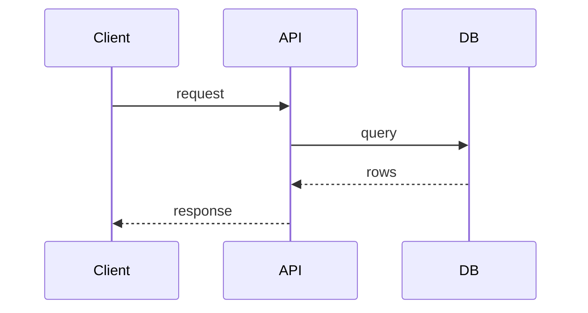
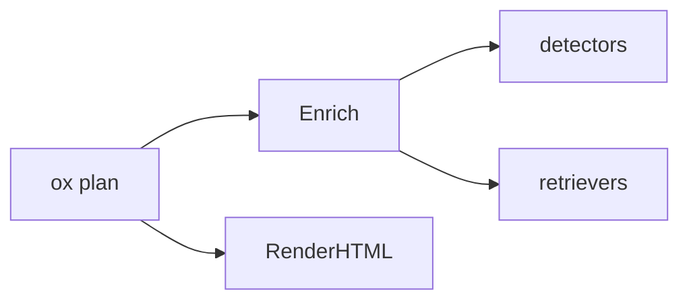
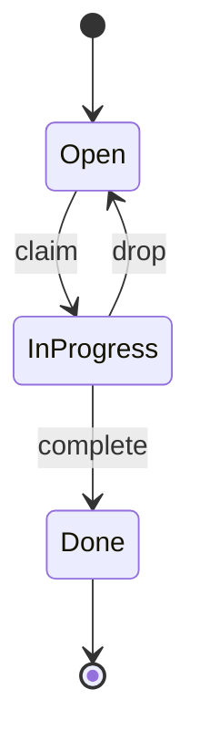
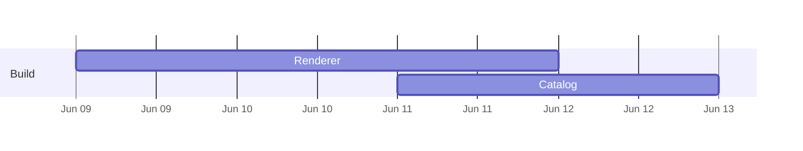
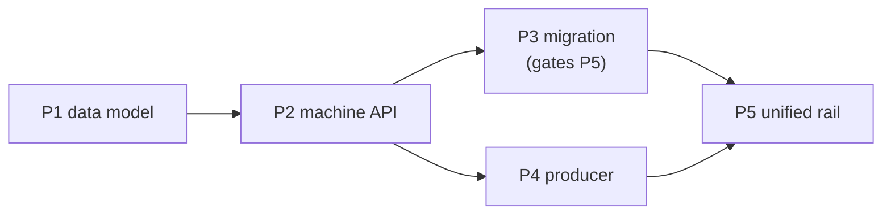
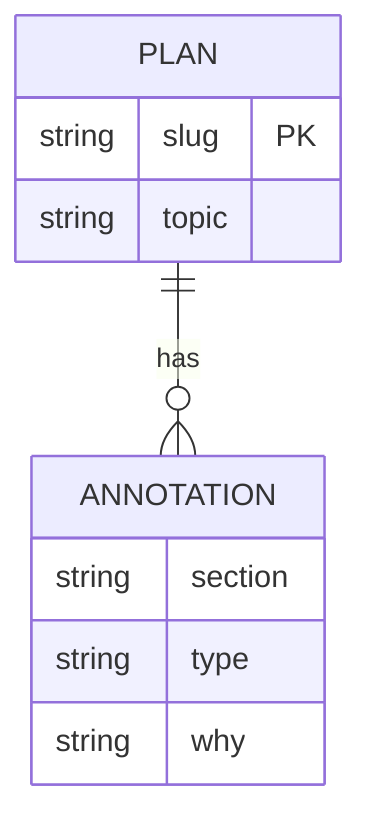

<!-- ox plan visualization catalog. One pattern per "## <id>" block.
     Each block: a `use:` line (when to reach for it), a `why:` line (the
     cognitive payoff — what it lets the reader grasp faster), then one or more
     copy-paste snippets. Snippets use the scaffold's CSS variables / classes
     (assets/scaffold.css) so they render design-faithfully and theme with the
     page. Surfaced progressively via `ox plan viz [id]` — the agent lists the
     catalog cheaply, then pulls only the patterns it needs. Goal: aid human
     understanding and cut cognitive load (Tufte: maximize data-ink, minimize
     chrome). Keep snippets minimal and self-contained — no external JS. -->

## sequence-diagram
use: an ordered call/response path that crosses components, services, or async boundaries — when "in what order, how many round-trips" is the question.
why: shows ordering and latency a flowchart can't; ≤4-5 participants keeps it legible.


## dependency-graph
use: topology, not order — "what depends on / connects to what", to reveal coupling, a contended boundary, or blast radius.
why: a graph makes coupling visible at a glance; a list buries it.


## state-machine
use: a lifecycle, connection/session model, or retry/backoff — anything with modes and time-bounded transitions.
why: states + labeled transitions compress a paragraph of "if in X then Y after Zs" into one picture.


## swimlane-timeline
use: phases, rollout, or relative-effort sequencing across workstreams (NOT calendar dates).
why: lanes + bars show what runs when and in parallel; the robust default for "when, in what order, how long".
```html
<div class="swim">
  <div class="lane"><span class="lane-name">Backend</span><div class="track"><span class="bar" style="left:0;width:40%;background:var(--sage)">schema</span><span class="bar" style="left:42%;width:30%;background:var(--teal)">API</span></div></div>
  <div class="lane"><span class="lane-name">Frontend</span><div class="track"><span class="bar" style="left:44%;width:46%;background:var(--copper)">UI</span></div></div>
  <div class="lane"><span class="lane-name">Gate</span><div class="track"><span class="gate" style="left:90%" title="ship">◆</span></div></div>
</div>
```

## gantt
use: a CALENDAR-ACCURATE schedule with real dates (only when real dates exist).
why: a date axis anchors commitments; never use numeric `dateFormat X` (renders a meaningless axis).


## sparkline
use: a trend inline in a sentence or a table cell — "p99 latency ▁▂▃▅▇ 240ms".
why: shows a whole series in the space of a word; maximum data-ink, zero chrome (Tufte's word-sized graphic).
```html
<svg class="spark" viewBox="0 0 80 20" preserveAspectRatio="none" aria-label="trend">
  <polyline points="0,18 16,14 32,15 48,8 64,9 80,2" fill="none" stroke="var(--sage)" stroke-width="1.5" vector-effect="non-scaling-stroke"/>
</svg>
```

## small-multiples
use: compare the same chart across many series/items — per-service error rates, per-core load.
why: one shape repeated lets the eye spot the outlier instantly; a single combined chart hides it.
```html
<div class="multiples">
  <figure><figcaption>api</figcaption><svg class="spark" viewBox="0 0 60 18" preserveAspectRatio="none"><polyline points="0,16 20,10 40,12 60,4" fill="none" stroke="var(--sage)" stroke-width="1.5" vector-effect="non-scaling-stroke"/></svg></figure>
  <figure><figcaption>web</figcaption><svg class="spark" viewBox="0 0 60 18" preserveAspectRatio="none"><polyline points="0,6 20,7 40,5 60,6" fill="none" stroke="var(--teal)" stroke-width="1.5" vector-effect="non-scaling-stroke"/></svg></figure>
  <figure><figcaption>db</figcaption><svg class="spark" viewBox="0 0 60 18" preserveAspectRatio="none"><polyline points="0,4 20,8 40,14 60,17" fill="none" stroke="var(--red)" stroke-width="1.5" vector-effect="non-scaling-stroke"/></svg></figure>
</div>
```

## before-after
use: a change to a structure, API, or shape — show the old and the new side by side.
why: adjacency makes the delta obvious; the reader diffs with their eyes, not by reading prose.
```html
<div class="ba">
  <div class="ba-col"><h4>Before</h4><pre><code>render: skill-only (Claude)</code></pre></div>
  <div class="ba-col"><h4>After</h4><pre><code>render: ox binary (any agent)</code></pre></div>
</div>
```

## decision-matrix
use: weigh options against criteria, or a verification/impact matrix.
why: a grid with colored verdict cells answers "which wins / what passes" in one scan. Verdict cells (yes/no/✓/✗) are auto-colored by the renderer.
```text
| Option        | Cross-agent | Tokens | Consistent |
|---------------|-------------|--------|------------|
| skill render  | no          | high   | no         |
| binary render | yes         | low    | yes        |
```

## heatmap-table
use: dense numeric comparison where magnitude matters — latency by endpoint × percentile.
why: shading encodes magnitude so the hot cell pops without the reader parsing every number (Tufte density).
```html
<table class="heat">
  <tr><th>endpoint</th><th>p50</th><th>p99</th></tr>
  <tr><td>/plan</td><td class="h1">12</td><td class="h2">40</td></tr>
  <tr><td>/render</td><td class="h2">38</td><td class="h4">210</td></tr>
</table>
```

## device-mockup
use: the plan changes something the user sees — show the resulting UI state, don't describe it.
why: a faithful mockup conveys the experience instantly; annotate in user language, never implementation detail.
```html
<div class="device">
  <div class="device-screen">
    <div class="eyebrow">ox plan</div>
    <strong>Plan rendered ✓</strong>
    <p class="dim">Self-contained HTML · opened in your browser</p>
  </div>
</div>
```

## callout
use: the one thing the reader must not miss — the decision, the blocker, the biggest risk.
why: a single bordered lede answers "do I approve, what do I watch" before any scrolling. A leading `TL;DR` block and a `Risks` section are auto-styled by the renderer.
```html
<div class="tldr"><span class="tldr-tag">TL;DR</span><p>Ship the binary renderer; the only risk is Mermaid CDN availability at view time.</p></div>
```

## rollout-dag
use: a multi-phase rollout / PR sequence where order and blocking matter — "P3 gates P5, P4 ∥ P5". The single most common plan structure.
why: prose sequencing ("ship WS-1 first, then WS-2…") forces the reader to reconstruct the critical path; a DAG shows what blocks what and what runs in parallel in one glance. Mark the critical path.


## file-impact-map
use: the "files changed" section — show scope, change type (new/edit/delete), and which subsystem, not just a flat list.
why: a flat `| file | change |` table hides scope and blast radius; grouping by subsystem with color-coded change type lets the reviewer judge "are we touching auth AND db AND web — is that the right footprint?" in seconds.
param: {"files":[{"path":"internal/plan/render.go","change":"new|edit|delete|read","scope":"sm|md|lg","note":"…"}]}
```html
<!-- generate with: ox plan viz render file-impact-map --data files.json -->
<ul class="ftree">
  <li class="grp">internal/plan
    <ul><li><span class="chg new">new</span> render.go <span class="sc lg">lg</span></li>
        <li><span class="chg edit">edit</span> enrich.go <span class="sc sm">sm</span></li></ul></li>
</ul>
```

## risk-matrix
use: a Risks section — rank risks by severity with the mitigation, instead of an undifferentiated bullet list.
why: scattered "do NOT…" / "watch out…" prose buries the load-bearing unknown; a severity-sorted, color-coded matrix puts the blocker on top and pairs each risk with its mitigation so the reviewer knows what to watch.
param: {"risks":[{"title":"…","severity":"blocker|high|medium|low","category":"data|perf|security|ux","mitigation":"…"}]}
```html
<!-- generate with: ox plan viz render risk-matrix --data risks.json -->
<table class="riskm">
  <tr><th>Risk</th><th>Sev</th><th>Mitigation</th></tr>
  <tr class="sev-blocker"><td>CDN unreachable at view time</td><td>■ blocker</td><td>vendor mermaid locally</td></tr>
</table>
```

## stat-cards
use: headline metrics or before→after numbers — token budget, latency, size, counts.
why: a row of big-number cards with a delta and an up/down trend makes the impact land instantly; numbers buried in prose ("~60KB, down from 120KB") don't.
param: {"cards":[{"label":"render size","value":"44KB","delta":"-63%","trend":"down","intent":"good|bad|warn|neutral"}]}
```html
<!-- generate with: ox plan viz render stat-cards --data stats.json -->
<div class="statrow">
  <div class="stat good"><div class="sv">44KB</div><div class="sl">render size</div><div class="sd">▼ -63%</div></div>
</div>
```

## bar-chart
use: compare a handful of labeled magnitudes — cost per component, calls per minute, lines per file.
why: bars encode magnitude pre-attentively; a column of numbers does not. Use ONE color for the series — length is the channel; a rainbow fights the "which is biggest" read. Set a bar's `color` only to flag the outlier/over-budget one. Keep ≤8 bars.
param: {"title":"cost / hr","unit":"$","bars":[{"label":"topic detector","value":0.036},{"label":"refresher","value":0.012,"color":"red"}]}
```html
<!-- generate with: ox plan viz render bar-chart --data bars.json -->
<div class="barc"><div class="bar-row"><span class="bl">topic detector</span><span class="bt"><span class="bf" style="width:90%;background:var(--sage)"></span></span><span class="bv">$0.036</span></div></div>
```

## data-model
use: a schema or entity relationship — new tables/columns, foreign keys, cardinality.
why: an ER diagram shows where the FK points and which table owns the unique index — a column list in prose does not. Use Mermaid erDiagram.


## coverage-matrix
use: a test plan — show which seam is covered at which layer, and where the gaps are.
why: a list of `go test` commands doesn't reveal whether a risky seam is tested; a seam × layer grid with verdict cells exposes the gap (the empty cell) at a glance. Verdict cells auto-color in the render.
```text
| seam | unit | integration | e2e |
|---|---|---|---|
| decide logic | yes | — | — |
| opt-out gate | no | — | yes |
```

## flag-rollout-matrix
use: a feature-flag rollout — env × stage with the percentage at each step.
why: flag posture ("dev-on, test-100%, prod-0% until review") scattered in prose is error-prone; an env × stage grid shows the whole rollout arc and the gates in one view.
param: {"envs":["dev","test","prod"],"stages":["merge","dogfood","ramp"],"cells":{"prod":{"merge":"0%","dogfood":"0%","ramp":"10→100%"}}}
```html
<!-- generate with: ox plan viz render flag-rollout-matrix --data flags.json -->
<table class="heat"><tr><th>env</th><th>merge</th><th>ramp</th></tr><tr><td>prod</td><td class="h1">0%</td><td class="h3">10→100%</td></tr></table>
```

## cost-waterfall
use: a per-action cost/budget that accumulates — token spend, $/hr by component.
why: a stacked/segmented bar with a running total shows where the cost concentrates and which lever to pull, better than line-item arithmetic in prose.
param: {"unit":"$/hr","items":[{"name":"topic detector","value":0.036},{"name":"refresher","value":0.001}]}
```html
<!-- generate with: ox plan viz render cost-waterfall --data cost.json -->
<div class="barc"><div class="bar-row"><span class="bl">topic detector</span><span class="bt"><span class="bf" style="width:97%;background:var(--copper)"></span></span><span class="bv">$0.036</span></div></div>
```

## decision-grid
use: a multi-option / multi-expert review — options scored across review lenses.
why: long per-lens prose paragraphs hide the ranking; an option × lens grid with colored verdict cells shows where each option wins and where the lenses disagree, at a glance.
```text
| option | ops | security | code-reuse |
|---|---|---|---|
| native | yes | yes | no |
| hybrid | yes | yes | yes |
```
