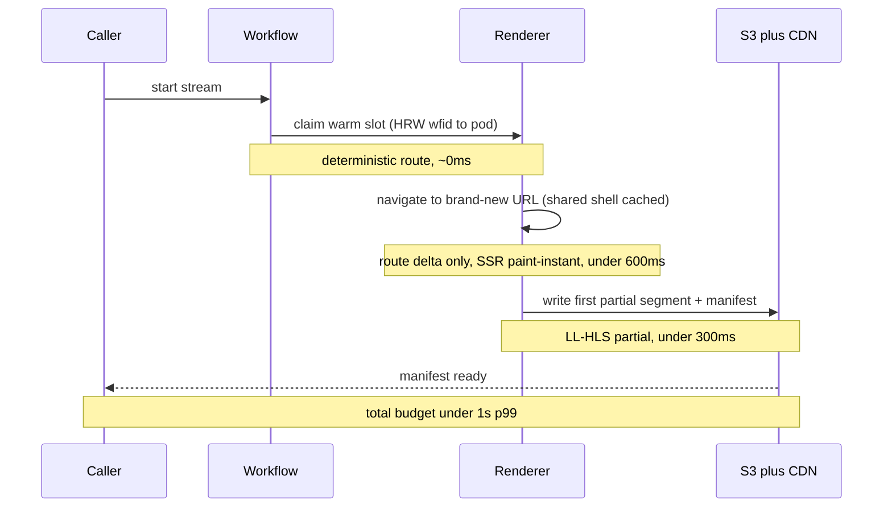
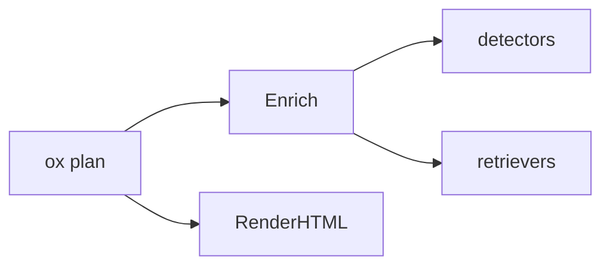
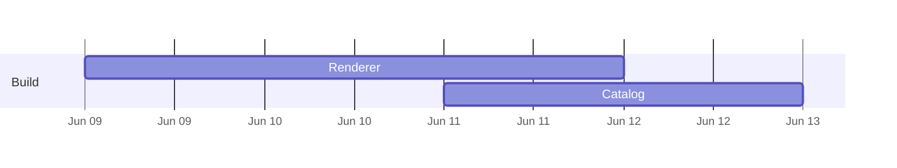
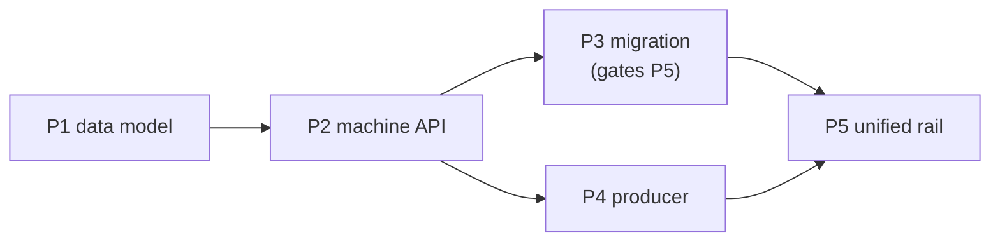
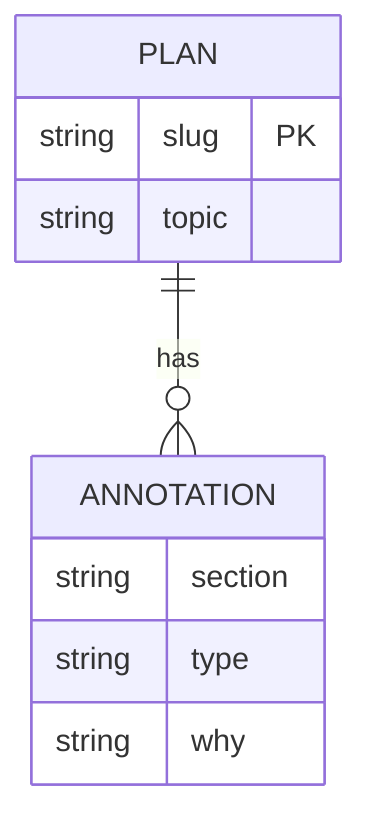

<!-- ox visualization catalog. One pattern per "## <id>" block.
     Each block: a `use:` line (when to reach for it), a `why:` line (the
     cognitive payoff — what it lets the reader grasp faster), then one or more
     copy-paste snippets. Snippets use the scaffold's CSS variables / classes
     (assets/scaffold.css) so they render design-faithfully and theme with the
     page. Surfaced progressively via `ox viz [id]` — the AI coworker lists the
     catalog cheaply, then pulls only the patterns it needs. Goal: aid human
     understanding and cut cognitive load (Tufte: maximize data-ink, minimize
     chrome). Keep snippets minimal and self-contained — no external JS.
     Compose/extend freely: stack snippets in the target artifact to frame a base
     widget — e.g. a heading above a `partition-map` and a `callout` below it. The
     renderers own the widget body; you own the surrounding layout, so the base
     components extend without any renderer change. -->

<!-- CHOOSING BETWEEN PATTERNS — two rules that decide most of it.

     Pair every diagram with the table that carries its exact values. A diagram
     shows SHAPE; a table beside it carries the NUMBERS (fields, budgets,
     thresholds, verdict cells). Never make one do the other's job — a diagram
     crammed with values clips, and a table alone hides structure. The strongest
     sections put them adjacent: a schema table beside the sequence diagram, a
     channel table beside the delivery flowchart.

     Vary the form section to section. Good textbooks alternate modes of
     comprehension on purpose — a diagram for structure, a table for exact
     values, a pull-quote for the sentence that must not be skimmed, a worked
     example for feel. A technical artifact teaches a decision, so pace it the same way.
     Two consecutive sections in the same form is a smell; three is a bug. -->

## sequence-diagram
use: an ordered call/response path that crosses components, services, or async boundaries — when "in what order, how many round-trips" is the question.
why: shows ordering and latency a flowchart can't; use 2–5 participants, explicit return paths, and one copper focal exchange. Static editorial SVG is the default; Mermaid remains a quick fallback for throwaway work.
```html
<svg data-ox-viz="sequence-diagram" class="oxv-seq" viewBox="0 0 960 600" role="img" aria-labelledby="seq-title seq-desc" style="max-width:100%;height:auto;background:var(--panel,#111411);color:var(--ink,#e8ede7)">
  <title id="seq-title">Request and response sequence</title>
  <desc id="seq-desc">The client calls the API, which queries the database before returning a response.</desc>
  <defs><marker id="seq-arrow" markerWidth="8" markerHeight="6" refX="7" refY="3" orient="auto"><path d="M0 0 8 3 0 6Z" fill="var(--dim,#a8b3a5)"/></marker><marker id="seq-focus-arrow" markerWidth="8" markerHeight="6" refX="7" refY="3" orient="auto"><path d="M0 0 8 3 0 6Z" fill="var(--copper,#e0a56a)"/></marker></defs>
  <style>.oxv-seq text{font-family:Inter,system-ui,sans-serif;fill:currentColor}.oxv-seq .name{font-weight:600;font-size:16px}.oxv-seq .msg{font:12px "Spline Sans Mono",monospace;fill:var(--dim,#a8b3a5)}.oxv-seq .life{stroke:var(--hair,#252c24);stroke-dasharray:5 5}.oxv-seq .edge{stroke:var(--dim,#a8b3a5);stroke-width:2;fill:none;marker-end:url(#seq-arrow)}.oxv-seq .focus{stroke:var(--copper,#e0a56a);marker-end:url(#seq-focus-arrow)}.oxv-seq .node{fill:var(--bg,#0b0d0b);stroke:var(--hair,#252c24);stroke-width:2}</style>
  <g data-ox-node><rect class="node" x="80" y="48" width="200" height="64" rx="6"/><text class="name" x="180" y="86" text-anchor="middle">Client</text></g>
  <g data-ox-node data-ox-focus><rect x="380" y="48" width="200" height="64" rx="6" fill="var(--copper,#e0a56a)" fill-opacity=".12" stroke="var(--copper,#e0a56a)" stroke-width="2"/><text class="name" x="480" y="86" text-anchor="middle">API</text></g>
  <g data-ox-node><rect class="node" x="680" y="48" width="200" height="64" rx="6"/><text class="name" x="780" y="86" text-anchor="middle">Database</text></g>
  <line data-ox-connector class="life" x1="180" y1="112" x2="180" y2="540"/><line data-ox-connector class="life" x1="480" y1="112" x2="480" y2="540"/><line data-ox-connector class="life" x1="780" y1="112" x2="780" y2="540"/>
  <path data-ox-connector class="edge focus" d="M180 190H480"/><text class="msg" x="330" y="178" text-anchor="middle">request</text>
  <path data-ox-connector class="edge" d="M480 280H780"/><text class="msg" x="630" y="268" text-anchor="middle">query</text>
  <path data-ox-connector class="edge" stroke-dasharray="6 4" d="M780 370H480"/><text class="msg" x="630" y="358" text-anchor="middle">rows</text>
  <path data-ox-connector class="edge" stroke-dasharray="6 4" d="M480 460H180"/><text class="msg" x="330" y="448" text-anchor="middle">response</text>
</svg>
```

## budget-sequence
use: a latency or cost budget across an ordered call path — show where each slice of the budget goes and the lever that buys it ("warm claim under 1s p99").
why: a bare sequence diagram shows order; budget bands (`Note over`) plus a paired stage/budget/lever table show WHERE the time goes and WHAT to pull — the reviewer approves the budget, not just the topology. Pair the diagram (the path) with the table (the levers); neither alone makes the budget reviewable.

```text
| stage                          | budget  | lever                                |
|--------------------------------|---------|--------------------------------------|
| route to warm pod              | ~0ms    | consistent-hash (ADR-040 #1)         |
| navigate to new URL (route Δ)  | <400ms  | generic warm pool + warm shell cache |
| first painted frame            | <300ms  | paint-instant pages                  |
| first partial segment+manifest | <300ms  | LL-HLS partials                      |
```

## dependency-graph
use: topology, not order — "what depends on / connects to what", to reveal coupling, a contended boundary, or blast radius.
why: a graph makes coupling visible at a glance; a list buries it.


## state-machine
use: a lifecycle, connection/session model, or retry/backoff — anything with modes and time-bounded transitions.
why: states plus labeled guards compress a paragraph of conditional behavior into one picture. Keep ≤7 states; terminal states and the transition under review are the only focal elements.
```html
<svg data-ox-viz="state-machine" class="oxv-state" viewBox="0 0 960 600" role="img" aria-labelledby="state-title state-desc" style="max-width:100%;height:auto;background:var(--panel,#111411);color:var(--ink,#e8ede7)">
  <title id="state-title">Work item lifecycle</title><desc id="state-desc">An open item can be claimed, dropped back to open, or completed.</desc>
  <defs><marker id="state-arrow" markerWidth="8" markerHeight="6" refX="7" refY="3" orient="auto"><path d="M0 0 8 3 0 6Z" fill="var(--dim,#a8b3a5)"/></marker></defs>
  <style>.oxv-state text{font-family:Inter,system-ui,sans-serif;fill:currentColor}.oxv-state .node{fill:var(--bg,#0b0d0b);stroke:var(--hair,#252c24);stroke-width:2}.oxv-state .name{font-size:16px;font-weight:600}.oxv-state .guard{font:12px "Spline Sans Mono",monospace;fill:var(--dim,#a8b3a5)}.oxv-state .edge{fill:none;stroke:var(--dim,#a8b3a5);stroke-width:2;marker-end:url(#state-arrow)}</style>
  <circle cx="80" cy="300" r="12" fill="var(--ink,#e8ede7)"/>
  <g data-ox-node><rect class="node" x="140" y="250" width="190" height="100" rx="8"/><text class="name" x="235" y="306" text-anchor="middle">Open</text></g>
  <g data-ox-node data-ox-focus><rect x="410" y="250" width="190" height="100" rx="8" fill="var(--copper,#e0a56a)" fill-opacity=".12" stroke="var(--copper,#e0a56a)" stroke-width="2"/><text class="name" x="505" y="306" text-anchor="middle">In progress</text></g>
  <g data-ox-node><rect x="680" y="250" width="190" height="100" rx="8" fill="var(--sage,#99c693)" fill-opacity=".12" stroke="var(--sage,#99c693)" stroke-width="2"/><text class="name" x="775" y="306" text-anchor="middle">Done</text></g>
  <path data-ox-connector class="edge" d="M92 300H140"/><path data-ox-connector class="edge" d="M330 300H410"/><text class="guard" x="370" y="286" text-anchor="middle">claim</text>
  <path data-ox-connector class="edge" d="M600 300H680"/><text class="guard" x="640" y="286" text-anchor="middle">complete</text>
  <path data-ox-connector class="edge" d="M505 350V430Q505 450 485 450H255Q235 450 235 430V350"/><text class="guard" x="370" y="474" text-anchor="middle">drop / retry</text>
</svg>
```

## swimlane-timeline
use: phases, rollout, or relative-effort sequencing across workstreams (NOT calendar dates) — a "build sequence" showing what's foundational, what unblocks the goal, and what's deferred to scale. Also a before/after comparison of how a lifecycle behaves over time — e.g. a timeout/timer model with resets (the "two-knob clock"): one lane per scenario, abutting timer-span bars, and ↺/✂ event markers.
why: lanes + bars show what runs when and in parallel; the robust default for "when, in what order, how long". Add a labeled gate (◆) for the milestone that matters, a bottom axis of phase columns, and a one-line caption stating the unit — that's what turns a bar chart into an at-a-glance build plan. For a comparison, give each scenario its own lane and use a `.mark` for a point event (↺ reset, ✂ kill, → continues) and an `.anno` for a one-line per-lane caption.
```html
<div class="swim">
  <div class="lane"><span class="lane-name">Foundation</span><div class="track"><span class="bar" style="left:0;width:18%;background:var(--copper)">measure</span><span class="bar" style="left:20%;width:14%;background:var(--sage)">fix pool</span></div></div>
  <div class="lane"><span class="lane-name">Claim &lt;1s</span><div class="track"><span class="bar" style="left:38%;width:18%;background:var(--teal)">pre-warm</span><span class="bar" style="left:58%;width:16%;background:var(--teal)">paint</span><span class="bar" style="left:76%;width:18%;background:var(--teal)">partials</span></div></div>
  <div class="lane"><span class="lane-name">Scale</span><div class="track"><span class="bar" style="left:38%;width:18%;background:var(--copper)">cost dials</span><span class="bar" style="left:58%;width:16%;background:var(--copper)">deep pool</span><span class="bar" style="left:76%;width:18%;background:var(--copper)">multi-replica</span></div></div>
  <div class="lane axis"><span class="lane-name"></span><div class="track"><span class="tick" style="left:9%">measure</span><span class="tick" style="left:27%">pool fixed</span><span class="tick" style="left:47%">claim &lt;1s ◆</span><span class="tick" style="left:66%">deep pool</span><span class="tick" style="left:85%">100k scale</span></div></div>
</div>
<p class="dim">Relative effort, not calendar. ◆ = the gate where the goal becomes meetable.</p>
```
```html
<!-- before/after comparison: a timeout/timer lifecycle with resets (the "two-knob clock") -->
<div class="swim">
  <div class="lane"><span class="lane-name">Before</span><div class="track"><span class="bar" style="left:0;width:60%;background:var(--red)">one run · 6h cap</span><span class="mark" style="left:62%;color:var(--red)">✂</span><span class="anno" style="left:64%;color:var(--red)">blank · seq → 0</span></div></div>
  <div class="lane"><span class="lane-name">After · healthy</span><div class="track"><span class="bar" style="left:0;width:30%;background:var(--sage)">run timer</span><span class="mark" style="left:31%">↺</span><span class="bar" style="left:33%;width:30%;background:var(--sage)">run timer</span><span class="mark" style="left:64%">↺</span><span class="bar" style="left:66%;width:30%;background:var(--sage)">run timer</span></div></div>
  <div class="lane axis"><span class="lane-name"></span><div class="track"><span class="anno" style="left:0">renderer adopted across each ↺ · lives indefinitely →</span></div></div>
  <div class="lane"><span class="lane-name">After · wedged</span><div class="track"><span class="bar" style="left:0;width:50%;background:var(--amber)">stuck run · run timer 4h</span><span class="anno" style="left:52%;color:var(--amber)">wfid clears · re-cast works</span></div></div>
  <div class="lane axis"><span class="lane-name"></span><div class="track"><span class="tick" style="left:0">0h</span><span class="tick" style="left:25%">2h</span><span class="tick" style="left:50%">4h</span><span class="tick" style="left:75%">6h</span><span class="tick" style="left:100%">8h</span></div></div>
</div>
<p class="dim">One lane per scenario · ↺ reset, ✂ kill · the healthy run refreshes before its timer fires; the wedged run can't outlive it.</p>
```

## gantt
use: a CALENDAR-ACCURATE schedule with real dates (only when real dates exist).
why: a date axis anchors commitments; never use numeric `dateFormat X` (renders a meaningless axis).


## sparkline
use: a trend inline in a sentence or a table cell — "p99 latency ▁▂▃▅▇ 240ms".
why: shows a whole series in the space of a word; maximum data-ink, zero chrome (Tufte's word-sized graphic).
```html
<svg class="spark" viewBox="0 0 80 20" preserveAspectRatio="none" aria-label="trend">
  <polyline points="0,18 16,14 32,15 48,8 64,9 80,2" fill="none" stroke="var(--sage)" stroke-width="1.5" vector-effect="non-scaling-stroke"/>
</svg>
```

## small-multiples
use: compare the same chart across many series/items — per-service error rates, per-core load.
why: one shape repeated lets the eye spot the outlier instantly; a single combined chart hides it.
```html
<div class="multiples">
  <figure><figcaption>api</figcaption><svg class="spark" viewBox="0 0 60 18" preserveAspectRatio="none"><polyline points="0,16 20,10 40,12 60,4" fill="none" stroke="var(--sage)" stroke-width="1.5" vector-effect="non-scaling-stroke"/></svg></figure>
  <figure><figcaption>web</figcaption><svg class="spark" viewBox="0 0 60 18" preserveAspectRatio="none"><polyline points="0,6 20,7 40,5 60,6" fill="none" stroke="var(--teal)" stroke-width="1.5" vector-effect="non-scaling-stroke"/></svg></figure>
  <figure><figcaption>db</figcaption><svg class="spark" viewBox="0 0 60 18" preserveAspectRatio="none"><polyline points="0,4 20,8 40,14 60,17" fill="none" stroke="var(--red)" stroke-width="1.5" vector-effect="non-scaling-stroke"/></svg></figure>
</div>
```

## before-after
use: a change to a structure, API, or shape — show the old and the new side by side.
why: adjacency makes the delta obvious; the reader diffs with their eyes, not by reading prose.
```html
<div class="ba">
  <div class="ba-col"><h4>Before</h4><pre><code>render: skill-only (Claude)</code></pre></div>
  <div class="ba-col"><h4>After</h4><pre><code>render: ox binary (any AI coworker)</code></pre></div>
</div>
```

## decision-matrix
use: weigh options against criteria, or a verification/impact matrix.
why: a grid with colored verdict cells answers "which wins / what passes" in one scan. Verdict cells (yes/no/✓/✗) are auto-colored by the renderer.
```text
| Option        | Cross-agent | Tokens | Consistent |
|---------------|-------------|--------|------------|
| skill render  | no          | high   | no         |
| binary render | yes         | low    | yes        |
```

## heatmap-table
use: dense numeric comparison where magnitude matters — latency by endpoint × percentile.
why: shading encodes magnitude so the hot cell pops without the reader parsing every number (Tufte density).
```html
<table class="heat">
  <tr><th>endpoint</th><th>p50</th><th>p99</th></tr>
  <tr><td>/plan</td><td class="h1">12</td><td class="h2">40</td></tr>
  <tr><td>/render</td><td class="h2">38</td><td class="h4">210</td></tr>
</table>
```

## cost-telemetry-table
use: per-stage cost/telemetry where some stages are reducible — name the cost, the telemetry field it's measured by, and whether it can be cut, then pair the table with ONE callout stating the conclusion.
why: the table establishes the numbers (and where they come from, so the reviewer can verify against prod); a leading or trailing `TL;DR` callout states the load-bearing decision ("every reducible row is reduced by not doing it on the request path") so the reviewer gets the conclusion before parsing cells. Pair the table with the callout — the table is evidence, the callout is the read.
```html
<table class="heat">
  <tr><th>cold-spawn stage</th><th>~cost</th><th>telemetry field</th><th>reducible?</th></tr>
  <tr><td>new Chromium context</td><td>500-800ms</td><td>worker-pool</td><td>yes — pre-create</td></tr>
  <tr><td>load heavy cast page</td><td>800-1500ms</td><td>navigate_ms</td><td>yes — pre-warm + SSR</td></tr>
  <tr><td>paint handshake</td><td>300-600ms</td><td>paint_ms</td><td>yes — paint-instant</td></tr>
  <tr><td>ffmpeg init + first segment</td><td>300-500ms</td><td>first_frame_ms</td><td>yes — partials</td></tr>
  <tr><td><strong>cold total</strong></td><td class="h4"><strong>2.0-3.6s</strong></td><td></td><td></td></tr>
</table>
<div class="tldr"><span class="tldr-tag">TL;DR</span><p>Every reducible row is reduced by <em>not doing it on the request path</em> — i.e. pre-warming. Pre-warming is the mechanism, not an optimization.</p></div>
```

## device-mockup
use: the plan changes something the user sees — show the resulting UI state, don't describe it.
why: a faithful mockup conveys the experience instantly; annotate in user language, never implementation detail. `.device.ios` adds an iPhone-class frame (notch + home indicator); compose a screen from `.device-statusbar`, `.device-titlebar`, `.device-row`, and an iOS share/action sheet (`.device-sheet` + `.device-actions` + `.device-action`, with `.ox` marking the single highlighted destination — one accent per view). The screen stays dark in both themes.
```html
<!-- bare frame: a single status -->
<div class="device">
  <div class="device-screen">
    <div class="eyebrow">ox plan</div>
    <strong>Plan rendered ✓</strong>
    <p class="dim">Self-contained HTML · opened in your browser</p>
  </div>
</div>
```
```html
<!-- iPhone-class screen with an iOS share sheet (one highlighted destination) -->
<div class="device ios">
  <div class="device-screen">
    <div class="device-statusbar"><span>9:41</span><span class="sb-r">5G ▰▰▰ 100%</span></div>
    <div class="device-titlebar">Voice Memos<span class="tb-action">Share</span></div>
    <div class="device-row"><span class="dr-ic">🎙️</span><span>Team sync<span class="dr-sub">18:24 · 14.2 MB</span></span></div>
    <div class="device-sheet">
      <div class="sheet-title">Send to…</div>
      <div class="device-actions">
        <div class="device-action"><span class="da-ic">✈️</span>AirDrop</div>
        <div class="device-action"><span class="da-ic">💬</span>Messages</div>
        <div class="device-action ox"><span class="da-ic">◎</span>SageOx</div>
        <div class="device-action"><span class="da-ic">✉️</span>Mail</div>
      </div>
    </div>
  </div>
</div>
<p class="dim">Tap Share in any app → pick SageOx. Annotate in user language, never a filename.</p>
```

## callout
use: the one thing the reader must not miss — the decision, the blocker, the biggest risk.
why: a single bordered lede answers "do I approve, what do I watch" before any scrolling. A leading `TL;DR` block and a `Risks` section are auto-styled by the renderer.
```html
<div class="tldr"><span class="tldr-tag">TL;DR</span><p>Ship the binary renderer; the only risk is Mermaid CDN availability at view time.</p></div>
```

## rollout-dag
use: a multi-phase rollout / PR sequence where order and blocking matter — "P3 gates P5, P4 ∥ P5". The single most common plan structure.
why: prose sequencing ("ship WS-1 first, then WS-2…") forces the reader to reconstruct the critical path; a DAG shows what blocks what and what runs in parallel in one glance. Mark the critical path.


## file-impact-map
use: the "files changed" section — show scope, change type (new/edit/delete), and which subsystem, not just a flat list.
why: a flat `| file | change |` table hides scope and blast radius; grouping by subsystem with color-coded change type lets the reviewer judge "are we touching auth AND db AND web — is that the right footprint?" in seconds.
param: {"files":[{"path":"internal/plan/render.go","change":"new|edit|delete|read","scope":"sm|md|lg","note":"…"}]}
```html
<!-- generate with: ox viz render file-impact-map --data files.json -->
<ul class="ftree">
  <li class="grp">internal/plan
    <ul><li><span class="chg new">new</span> render.go <span class="sc lg">lg</span></li>
        <li><span class="chg edit">edit</span> enrich.go <span class="sc sm">sm</span></li></ul></li>
</ul>
```

## risk-matrix
use: a Risks section — rank risks by severity with the mitigation, instead of an undifferentiated bullet list.
why: scattered "do NOT…" / "watch out…" prose buries the load-bearing unknown; a severity-sorted, color-coded matrix puts the blocker on top and pairs each risk with its mitigation so the reviewer knows what to watch.
param: {"risks":[{"title":"…","severity":"blocker|high|medium|low","category":"data|perf|security|ux","mitigation":"…"}]}
```html
<!-- generate with: ox viz render risk-matrix --data risks.json -->
<table class="riskm">
  <tr><th>Risk</th><th>Sev</th><th>Mitigation</th></tr>
  <tr class="sev-blocker"><td>CDN unreachable at view time</td><td>■ blocker</td><td>vendor mermaid locally</td></tr>
</table>
```

## stat-cards
use: headline metrics or before→after numbers — token budget, latency, size, counts.
why: a row of big-number cards with a delta and an up/down trend makes the impact land instantly; numbers buried in prose ("~60KB, down from 120KB") don't.
param: {"cards":[{"label":"render size","value":"44KB","delta":"-63%","trend":"down","intent":"good|bad|warn|neutral"}]}
```html
<!-- generate with: ox viz render stat-cards --data stats.json -->
<div class="statrow">
  <div class="stat good"><div class="sv">44KB</div><div class="sl">render size</div><div class="sd">▼ -63%</div></div>
</div>
```

## bar-chart
use: compare a handful of labeled magnitudes — cost per component, calls per minute, lines per file.
why: bars encode magnitude pre-attentively; a column of numbers does not. Use ONE color for the series — length is the channel; a rainbow fights the "which is biggest" read. Set a bar's `color` only to flag the outlier/over-budget one. Keep ≤8 bars.
param: {"title":"cost / hr","unit":"$","bars":[{"label":"topic detector","value":0.036},{"label":"refresher","value":0.012,"color":"red"}]}
```html
<!-- generate with: ox viz render bar-chart --data bars.json -->
<div class="barc"><div class="bar-row"><span class="bl">topic detector</span><span class="bt"><span class="bf" style="width:90%;background:var(--sage)"></span></span><span class="bv">$0.036</span></div></div>
```

## partition-bar
use: a memory / disk / flash layout with a FEW partitions (≤8) where the SHARE each takes is the story — "the two OTA slots are 75% of flash". Proportion-first.
why: a 100%-wide stacked bar encodes share pre-attentively — the dominant slices read instantly; a paired table carries the exact offsets/sizes the bar can't. Linear and honest about size. One color per category, not a rainbow. Segments grow in (staggered) and reveal a hover tooltip; for MANY partitions, or when offset-order / per-row annotation matters more than share, use `partition-map`.
param: {"title":"16 MB flash","total":16384,"unit":"KB","partitions":[{"label":"ota_0","size":6144,"offset":"0x20000","color":"sage","flag":"SIGNED"},{"label":"ota_1","size":6144,"offset":"0x620000","color":"sage"},{"label":"spiffs","size":2944,"offset":"0xD20000","color":"teal"},{"label":"model","size":1024,"offset":"0xC20000","color":"violet"},{"label":"system","size":128,"color":"slate"}]}
```html
<!-- prefer the param renderer: ox viz render partition-bar --data parts.json
     (--i staggers the grow-in; .pm-tip is the hover tooltip — both pure CSS) -->
<figure class="pbar-fig"><figcaption>16 MB flash</figcaption><div class="pbar"><span class="pseg" style="--i:0;width:37.5%;background:var(--sage)"><span class="pseg-lbl">ota_0</span><span class="pm-tip"><b>ota_0</b><span class="pm-tip-k">6144 KB · 37.5%</span><span class="pm-tip-flag">SIGNED</span></span></span><span class="pseg" style="--i:1;width:18%;background:var(--teal)"><span class="pseg-lbl">spiffs</span><span class="pm-tip"><b>spiffs</b><span class="pm-tip-k">2944 KB · 18%</span></span></span></div></figure>
```

## partition-map
use: a full memory / disk / flash layout with MANY partitions, or when OFFSET ORDER and per-row annotation (flags, notes) matter more than share — the vertical address-space view.
why: rows in offset order mirror the address space; a LOG-scaled size rail keeps 4 KB partitions visible next to 6 MB ones (true linear would render the small ones <1px — dishonest by omission) while the big ones still read as dominant. The rail is labeled "log" so no false linear proportion is implied — use `partition-bar` for true share. Per-row offset + flags + a one-line note annotate without crowding; hover reveals a tooltip with the full note + share; `"proposed":true` dashes/mutes an uncommitted row. Set a row's `"group"` to interleave a section divider (e.g. committed rows, then a "PROPOSED SECURE ADDITIONS" block). Frame the whole figure by stacking a heading above and a `callout` below — the renderer owns the rows, you compose the chrome.
param: {"title":"Rev B flash","unit":"KB","partitions":[{"label":"bootloader","size":32,"offset":"0x000000","color":"slate","flag":"SIGNED","note":"Secure Boot root"},{"label":"nvs","size":20,"offset":"0x009000","color":"slate","note":"WiFi creds, pairing"},{"label":"ota_0","size":6144,"offset":"0x020000","color":"sage","flag":"SIGNED","note":"firmware slot A · frozen at 0x20000"},{"label":"ota_1","size":6144,"offset":"0x620000","color":"sage","note":"rollback target"},{"label":"model","size":1024,"offset":"0xC20000","color":"teal","note":"wake-word model"},{"label":"spiffs","size":2944,"offset":"0xD20000","color":"teal"},{"label":"ds_key","size":4,"color":"violet","note":"encrypted device key","group":"PROPOSED SECURE ADDITIONS","proposed":true}]}
```html
<!-- prefer the param renderer: ox viz render partition-map --data parts.json
     (--i staggers the row fade-in + rail fill; .pm-tip is the hover tooltip — pure CSS) -->
<figure class="pmapv"><figcaption>Rev B flash <span class="pmapv-rk">size · log scale</span></figcaption><div class="pmapv-row" style="--i:0"><span class="pm-dot" style="background:var(--sage)"></span><span class="pmapv-off pm-mono">0x020000</span><span class="pmapv-nm"><b>ota_0</b><span class="pm-flag">SIGNED</span><small>firmware slot A</small></span><span class="pmapv-rail"><i style="width:100%;background:var(--sage)"></i></span><span class="pmapv-sz pm-mono">6144 KB</span><span class="pm-tip"><b>ota_0</b><span class="pm-tip-k">@ 0x20000</span><span class="pm-tip-k">6144 KB · 37.5%</span><span class="pm-tip-note">firmware slot A</span></span></div><div class="pmapv-group">PROPOSED SECURE ADDITIONS</div><div class="pmapv-row proposed" style="--i:1"><span class="pm-dot" style="background:var(--violet)"></span><span class="pmapv-off pm-mono">TBD</span><span class="pmapv-nm"><b>ds_key</b><small>encrypted device key</small></span><span class="pmapv-rail"><i style="width:10%;background:var(--violet)"></i></span><span class="pmapv-sz pm-mono">4 KB</span><span class="pm-tip"><b>ds_key</b><span class="pm-tip-flag prop">PROPOSED</span><span class="pm-tip-note">encrypted device key</span></span></div></figure>
```

## data-model
use: a schema or entity relationship — new tables/columns, foreign keys, cardinality.
why: an ER diagram shows where the FK points and which table owns the unique index — a column list in prose does not. Use Mermaid erDiagram.


## coverage-matrix
use: a test plan — show which seam is covered at which layer, and where the gaps are.
why: a list of `go test` commands doesn't reveal whether a risky seam is tested; a seam × layer grid with verdict cells exposes the gap (the empty cell) at a glance. Verdict cells auto-color in the render.
```text
| seam | unit | integration | e2e |
|---|---|---|---|
| decide logic | yes | — | — |
| opt-out gate | no | — | yes |
```

## flag-rollout-matrix
use: a feature-flag rollout — env × stage with the percentage at each step.
why: flag posture ("dev-on, test-100%, prod-0% until review") scattered in prose is error-prone; an env × stage grid shows the whole rollout arc and the gates in one view.
param: {"envs":["dev","test","prod"],"stages":["merge","dogfood","ramp"],"cells":{"prod":{"merge":"0%","dogfood":"0%","ramp":"10→100%"}}}
```html
<!-- generate with: ox viz render flag-rollout-matrix --data flags.json -->
<table class="heat"><tr><th>env</th><th>merge</th><th>ramp</th></tr><tr><td>prod</td><td class="h1">0%</td><td class="h3">10→100%</td></tr></table>
```

## cost-waterfall
use: a per-action cost/budget that accumulates — token spend, $/hr by component.
why: a stacked/segmented bar with a running total shows where the cost concentrates and which lever to pull, better than line-item arithmetic in prose.
param: {"unit":"$/hr","items":[{"name":"topic detector","value":0.036},{"name":"refresher","value":0.001}]}
```html
<!-- generate with: ox viz render cost-waterfall --data cost.json -->
<div class="barc"><div class="bar-row"><span class="bl">topic detector</span><span class="bt"><span class="bf" style="width:97%;background:var(--copper)"></span></span><span class="bv">$0.036</span></div></div>
```

## decision-grid
use: a multi-option / multi-expert review — options scored across review lenses.
why: long per-lens prose paragraphs hide the ranking; an option × lens grid with colored verdict cells shows where each option wins and where the lenses disagree, at a glance.
```text
| option | ops | security | code-reuse |
|---|---|---|---|
| native | yes | yes | no |
| hybrid | yes | yes | yes |
```

## ox-annotation
use: an inline reference (an ADR, decision, PR, prior session) you want to annotate with the team context behind it — the calm SageOx way to footnote a decision in-place.
why: a branded inline marker + hover beats inventing a circled-`i`/number glyph: it tells the reader "SageOx has context on this" without a verdict, and matches the OX marker ox already injects elsewhere — one consistent affordance instead of ad-hoc ones. Note: `ox plan render` already auto-injects this marker on references it surfaced team context for (e.g. an ADR in the bundle), so reach for this pattern only for references ox did NOT surface; never hand-author an "enriched by SageOx" credit — the render owns the footer credit.
```html
<span class="ox-annot" title="SageOx surfaced: ADR-051 Consent tooling — bundled voiceprint + recording consent; flagged the weaker BIPA position.">ADR-051 <svg class="ox-annot-mark" aria-hidden="true"><use href="#ox-ico-d" class="ico-d"></use><use href="#ox-ico-l" class="ico-l"></use></svg></span>
```

## donut
use: a part-of-whole proportion with a few slices — cost share, test pass/fail, time split. One total, broken down.
why: a ring reads share pre-attentively and frees the center for the headline total; a paired legend carries exact values + percentages so it survives grayscale. Keep ≤6 slices — beyond that a bar-chart reads cleaner.
param: {"title":"test outcomes","unit":"","slices":[{"label":"pass","value":182,"color":"sage"},{"label":"fail","value":12,"color":"red"},{"label":"skip","value":24,"color":"slate"}]}
```html
<!-- prefer the param renderer: ox viz render donut --data donut.json
     ox computes each slice's arc sweep (value/total·360) + the legend shares. -->
<figure class="donut"><div class="donut-body"><svg class="donut-svg" viewBox="0 0 140 140"><circle cx="70" cy="70" r="54" fill="none" stroke="var(--sage)" stroke-width="26" stroke-dasharray="254 85" transform="rotate(-90 70 70)"/></svg><ul class="donut-leg"><li><span class="vsw" style="background:var(--sage)"></span><span class="donut-lab">pass</span><span class="donut-val">182 · 83.5%</span></li></ul></div></figure>
```

## radar
use: compare a few options across multiple criteria — score each alternative on the same axes to see the shape of its strengths.
why: overlaid polygons make "which option is strong where" a single shape comparison instead of a table scan; ≤3 series and a per-series line dash keep it legible without relying on color.
param: {"title":"approach fit","axes":["speed","safety","cost","reuse"],"max":5,"series":[{"label":"native","values":[4,5,2,3],"color":"sage"},{"label":"hybrid","values":[3,4,4,5],"color":"copper"}]}
```html
<!-- prefer the param renderer: ox viz render radar --data radar.json
     ox computes each axis spoke angle + the per-series polygon points. -->
<figure class="radar"><div class="radar-body"><svg class="radar-svg" viewBox="0 0 240 232"><polygon class="radar-series" points="120,40 196,116 120,180 44,116" style="stroke:var(--sage);fill:var(--sage)"/></svg></div></figure>
```

## quadrant
use: a two-axis tradeoff scatter — impact vs effort, value vs risk — placing each item in a quadrant so the act-now corner is obvious.
why: a 2×2 turns "which to do first" into spatial position; the top-corner items pop without reading a single number, and labels keep it readable in grayscale.
param: {"title":"what to build first","x_label":"effort","y_label":"impact","points":[{"label":"donut","x":2,"y":8,"color":"sage"},{"label":"sankey","x":8,"y":6,"color":"copper"}]}
```html
<!-- prefer the param renderer: ox viz render quadrant --data quad.json
     ox normalizes x/y to the plot box and splits the 2×2 at the midlines. -->
<figure class="quad"><svg class="quad-svg" viewBox="0 0 300 224"><rect class="quad-box" x="50" y="14" width="238" height="182"/><line class="quad-mid" x1="169" y1="14" x2="169" y2="196"/><circle class="quad-pt" cx="98" cy="50" style="fill:var(--sage)"/></svg></figure>
```

## treemap
use: a proportional hierarchy where area encodes size — code by package, spend by category, storage by bucket. Size at a glance.
why: a squarified treemap encodes magnitude as area (the dominant block IS the dominant cost) far denser than a bar list; a legend carries exact sizes so slivers stay readable.
param: {"title":"repo by package","unit":"KB","items":[{"label":"internal/plan","size":120,"color":"sage"},{"label":"cmd/ox","size":80,"color":"copper"},{"label":"internal/lfs","size":40,"color":"teal"}]}
```html
<!-- prefer the param renderer: ox viz render treemap --data tmap.json
     ox runs the squarified layout so each cell's AREA is proportional to size. -->
<figure class="tmap"><svg class="tmap-svg" viewBox="0 0 320 200" preserveAspectRatio="none"><g class="tmap-cell"><rect x="0" y="0" width="200" height="200" style="fill:var(--sage)"/><text class="tmap-lab" x="6" y="15">internal/plan</text></g></svg></figure>
```

## sankey
use: flow magnitude across stages — where tokens, cost, traffic, or users move and split between steps. Conserved quantity, staged.
why: ribbon width encodes the magnitude flowing along each path, so the dominant route and the leaks read instantly; a node-and-arrow flowchart shows topology but hides the amounts.
param: {"title":"token budget","unit":"tok","nodes":[{"name":"prompt","color":"sage"},{"name":"tools","color":"copper"},{"name":"output","color":"teal"}],"links":[{"from":"prompt","to":"tools","value":1200},{"from":"prompt","to":"output","value":800},{"from":"tools","to":"output","value":1000}]}
```html
<!-- prefer the param renderer: ox viz render sankey --data sankey.json
     ox layers the DAG, sizes nodes by max(in,out), and sets ribbon width ∝ value. -->
<figure class="sankey"><svg class="sankey-svg" viewBox="0 0 360 240"><path class="sankey-link" d="M67 22 C140 22 140 22 213 22 L213 70 C140 70 140 70 67 70 Z" style="fill:var(--sage)"/><rect class="sankey-node" x="56" y="22" width="11" height="94" style="fill:var(--sage)"/></svg></figure>
```

## chord
use: symmetric coupling between entities — which modules, files, or people interact, and how strongly. Who-touches-what.
why: arcs sized by total coupling and ribbons sized by pairwise strength reveal the tightly-bound cluster a dependency list buries; the circular layout shows mutual relationships a left-to-right graph distorts.
param: {"title":"module coupling","labels":["api","db","auth","ui"],"matrix":[[0,8,3,2],[8,0,1,0],[3,1,0,4],[2,0,4,0]]}
```html
<!-- prefer the param renderer: ox viz render chord --data chord.json
     ox sizes each node arc by its total coupling and each chord by pairwise strength. -->
<figure class="chord"><div class="chord-body"><svg class="chord-svg" viewBox="0 0 260 260"><path class="chord-arc" d="M130 22 A108 108 0 0 1 226 86 L214 92 A96 96 0 0 0 130 34 Z" style="fill:var(--sage)"/></svg></div></figure>
```

## line-chart
use: a quantity over a continuous axis — a trend, growth curve, or latency/throughput over time; especially a before-vs-after comparison, or a value that climbs toward a limit and resets on a cadence (a sawtooth: a bounded history/buffer/log). Reach for it when "how does it move over time, and where's the ceiling" is the question.
why: axes plus a dashed threshold line make the limit and the headroom explicit, and overlaid series (each with its own line dash) put two regimes side by side — "before: climbs to the wall and gets cut; after: sawtooths safely under it" — in one read; a sparkline shows a trend but has no axis, no threshold, and no comparison.
param: {"title":"workflow history growth","x_label":"hours","y_label":"history events","x_max":8,"y_max":20000,"threshold":{"at":8000,"label":"8k cap","color":"amber"},"x_ticks":[{"at":0,"label":"0h"},{"at":2,"label":"2h"},{"at":4,"label":"4h"},{"at":6,"label":"6h"},{"at":8,"label":"8h"}],"y_ticks":[{"at":8000,"label":"8k"},{"at":20000,"label":"20k"}],"series":[{"label":"before — unbounded","color":"red","marker":true,"points":[{"x":0,"y":0},{"x":6,"y":20000,"note":"✂ 6h cap"}]},{"label":"after — reset every 8k","color":"sage","marker":true,"points":[{"x":0,"y":0},{"x":2.5,"y":8000},{"x":2.5,"y":1000,"note":"↺"},{"x":5,"y":8000},{"x":5,"y":1000,"note":"↺"},{"x":7.5,"y":8000}]}]}
```html
<!-- prefer the param renderer: ox viz render line-chart --data line.json
     ox scales both axes, projects each point to pixels, places the threshold, and draws the legend. -->
<figure class="linec"><svg class="linec-svg" viewBox="0 0 300 224"><line class="linec-axis" x1="52" y1="14" x2="52" y2="190"/><line class="linec-axis" x1="52" y1="190" x2="288" y2="190"/><line class="linec-thresh" x1="52" y1="119.6" x2="288" y2="119.6" style="stroke:var(--amber)"/><polyline class="linec-series" points="52,190 288,14" style="stroke:var(--red)"/><polyline class="linec-series" points="52,190 126,120 126,181 199,120 199,181 273,120" style="stroke:var(--sage)" stroke-dasharray="5 3"/></svg><ul class="linec-leg"><li><span class="vsw" style="background:var(--red)"></span>before</li><li><span class="vsw" style="background:var(--sage)"></span>after</li></ul></figure>
```

## pull-quote
use: a doctrine line, a decider's verbatim words from a Discussion, or the one sentence the whole plan turns on — surfaced as a visual beat between prose blocks.
why: a load-bearing sentence set in a quote block is read; the same sentence inside a paragraph is skimmed past. Also the natural home for enrichment's Discussion snippets — quote the deciders, cited.
```html
<div class="quote">Nothing post-intent can influence the turn where the user didn't think to mention it — and that turn is the entire product.</div>
<p class="sub">Ryan, 2026-07-30 Discussion with Milkana: <em>"I wanna dance on that edge — I think that's the point."</em></p>
```
```css
.quote{border-left:3px solid var(--accent,#e0a56a);padding:6px 16px;margin:16px 0;font-size:16px;font-style:italic}
```

## status-pair
use: work that is genuinely partial — a progress bar plus shipped-vs-not-built cards, side by side. Use whenever declaring anything "in flight"; never claim delivery with prose alone.
why: an honest 15% bar and a two-column done/not-done grid kill the thin-red-line illusion faster than any caveat sentence; the reviewer sees the gap instead of reading past it.
```html
<div class="progress" role="progressbar" aria-label="Tasks completed"
     aria-valuemin="0" aria-valuemax="20" aria-valuenow="3"><i style="width:15%"></i></div>
<div class="grid2">
  <div class="card"><h3>Shipped</h3><ul><li>records + two tools</li></ul></div>
  <div class="card"><h3>Not built yet</h3><ul><li>the load-bearing mechanism</li></ul></div>
</div>
```
```css
.progress{height:10px;border-radius:6px;background:var(--panel2,#1b2327);overflow:hidden}
.progress i{display:block;height:100%;background:var(--good,#7a8f78)}
.grid2{display:grid;grid-template-columns:1fr 1fr;gap:14px}
```

## wordmark
use: the SageOx two-color wordmark, fixed bottom-left. The Go renderer injects this as part of the ox chrome; reach for this snippet only on a render that bypasses that path. REQUIRED whenever the plan carried SageOx enrichment (any badge or context item) — and omitted entirely when it did not, since there is nothing to credit.
why: the lockup ("enriched by" + small mark — never the bare logo) is quiet provenance, and it LINKS: to the enriching team's console URL when known, else https://sageox.ai. Both theme variants inline so it renders from file:// and flips with the page theme.
```html
<a class="wm-corner" data-ox-wordmark href="https://sageox.ai" aria-label="enriched by SageOx"><span class="wm-label">enriched by</span><span class="wm wm-d"><svg xmlns="http://www.w3.org/2000/svg" viewBox="8 18 163 51" width="163" height="51"> <title>SageOx Wordmark (Dark, Transparent)</title> <path d="M22.89 55.67Q19.05 55.67 16.10 54.30Q13.15 52.94 11.47 50.34Q9.79 47.75 9.79 44.01V42.76H15.50V44.01Q15.50 47.32 17.51 48.95Q19.53 50.58 22.89 50.58Q26.30 50.58 28.03 49.19Q29.75 47.80 29.75 45.59Q29.75 44.10 28.94 43.17Q28.12 42.23 26.56 41.66Q25.00 41.08 22.79 40.55L21.35 40.26Q18.04 39.50 15.62 38.32Q13.19 37.14 11.90 35.27Q10.60 33.40 10.60 30.38Q10.60 27.35 12.04 25.19Q13.48 23.03 16.12 21.88Q18.76 20.73 22.31 20.73Q25.87 20.73 28.65 21.93Q31.43 23.13 33.04 25.53Q34.65 27.93 34.65 31.53V33.11H28.94V31.53Q28.94 29.46 28.12 28.22Q27.31 26.97 25.82 26.39Q24.33 25.82 22.31 25.82Q19.34 25.82 17.80 26.97Q16.27 28.12 16.27 30.23Q16.27 31.58 16.96 32.51Q17.66 33.45 19.03 34.05Q20.39 34.65 22.46 35.08L23.90 35.42Q27.35 36.18 29.95 37.36Q32.54 38.54 34.00 40.46Q35.47 42.38 35.47 45.45Q35.47 48.47 33.91 50.78Q32.35 53.08 29.54 54.38Q26.73 55.67 22.89 55.67ZM46.00 55.67Q43.50 55.67 41.49 54.78Q39.47 53.90 38.30 52.22Q37.12 50.54 37.12 48.09Q37.12 45.69 38.30 44.06Q39.47 42.42 41.54 41.58Q43.60 40.74 46.24 40.74H53.10V39.30Q53.10 37.43 51.95 36.26Q50.80 35.08 48.35 35.08Q45.95 35.08 44.73 36.21Q43.50 37.34 43.12 39.11L38.03 37.43Q38.61 35.56 39.88 34.02Q41.15 32.49 43.26 31.55Q45.38 30.62 48.45 30.62Q53.10 30.62 55.77 32.94Q58.43 35.27 58.43 39.69V49.00Q58.43 50.44 59.78 50.44H61.79V55.00H57.90Q56.18 55.00 55.07 54.14Q53.97 53.27 53.97 51.78V51.69H53.15Q52.86 52.36 52.14 53.32Q51.42 54.28 49.96 54.98Q48.50 55.67 46.00 55.67ZM46.91 51.16Q49.65 51.16 51.38 49.60Q53.10 48.04 53.10 45.40V44.92H46.58Q44.80 44.92 43.70 45.69Q42.59 46.46 42.59 47.94Q42.59 49.38 43.74 50.27Q44.90 51.16 46.91 51.16ZM62.18 43.24V42.52Q62.18 38.78 63.67 36.11Q65.15 33.45 67.65 32.03Q70.15 30.62 73.12 30.62Q76.48 30.62 78.23 31.82Q79.99 33.02 80.80 34.41H81.62V31.29H86.99V59.51Q86.99 61.86 85.65 63.23Q84.31 64.60 82.00 64.60H66.07V59.80H80.13Q81.52 59.80 81.52 58.36V51.50H80.71Q80.18 52.31 79.27 53.15Q78.35 53.99 76.87 54.57Q75.38 55.14 73.12 55.14Q70.15 55.14 67.65 53.73Q65.15 52.31 63.67 49.65Q62.18 46.98 62.18 43.24ZM74.66 50.30Q77.63 50.30 79.60 48.40Q81.57 46.50 81.57 43.10V42.62Q81.57 39.16 79.63 37.29Q77.68 35.42 74.66 35.42Q71.68 35.42 69.69 37.29Q67.70 39.16 67.70 42.62V43.10Q67.70 46.50 69.69 48.40Q71.68 50.30 74.66 50.30ZM101.78 55.67Q98.23 55.67 95.52 54.16Q92.81 52.65 91.30 49.89Q89.78 47.13 89.78 43.43V42.86Q89.78 39.11 91.27 36.38Q92.76 33.64 95.45 32.13Q98.14 30.62 101.64 30.62Q105.10 30.62 107.69 32.13Q110.28 33.64 111.72 36.38Q113.16 39.11 113.16 42.76V44.73H95.35Q95.45 47.51 97.32 49.19Q99.19 50.87 101.93 50.87Q104.62 50.87 105.91 49.70Q107.21 48.52 107.88 47.03L112.44 49.38Q111.77 50.68 110.50 52.14Q109.22 53.61 107.11 54.64Q105.00 55.67 101.78 55.67ZM95.40 40.55H107.54Q107.35 38.20 105.74 36.81Q104.14 35.42 101.59 35.42Q98.95 35.42 97.37 36.81Q95.78 38.20 95.40 40.55Z" fill="#c4d1c0"/> <path d="M130.62 55.50Q124.38 55.50 120.66 52.05Q116.94 48.60 116.94 42.14V34.26Q116.94 27.80 120.66 24.35Q124.38 20.90 130.62 20.90Q136.91 20.90 140.60 24.35Q144.30 27.80 144.30 34.26V42.14Q144.30 48.60 140.60 52.05Q136.91 55.50 130.62 55.50ZM130.62 50.06Q134.36 50.06 136.45 47.95Q138.54 45.84 138.54 42.24V34.16Q138.54 30.56 136.45 28.45Q134.36 26.34 130.62 26.34Q126.92 26.34 124.84 28.45Q122.75 30.56 122.75 34.16V42.24Q122.75 45.84 124.84 47.95Q126.92 50.06 130.62 50.06Z" fill="#7a8f78"/> <path d="M145.33 55.00L153.81 43.05L145.47 31.29H151.65L157.23 39.50H158.00L163.58 31.29H169.71L161.37 43.05L169.85 55.00H163.63L158.00 46.65H157.23L151.60 55.00Z" fill="#7a8f78"/> </svg></span><span class="wm wm-l"><svg xmlns="http://www.w3.org/2000/svg" viewBox="8 18 163 51" width="163" height="51"> <title>SageOx Wordmark (Light, Transparent)</title> <path d="M22.89 55.67Q19.05 55.67 16.10 54.30Q13.15 52.94 11.47 50.34Q9.79 47.75 9.79 44.01V42.76H15.50V44.01Q15.50 47.32 17.51 48.95Q19.53 50.58 22.89 50.58Q26.30 50.58 28.03 49.19Q29.75 47.80 29.75 45.59Q29.75 44.10 28.94 43.17Q28.12 42.23 26.56 41.66Q25.00 41.08 22.79 40.55L21.35 40.26Q18.04 39.50 15.62 38.32Q13.19 37.14 11.90 35.27Q10.60 33.40 10.60 30.38Q10.60 27.35 12.04 25.19Q13.48 23.03 16.12 21.88Q18.76 20.73 22.31 20.73Q25.87 20.73 28.65 21.93Q31.43 23.13 33.04 25.53Q34.65 27.93 34.65 31.53V33.11H28.94V31.53Q28.94 29.46 28.12 28.22Q27.31 26.97 25.82 26.39Q24.33 25.82 22.31 25.82Q19.34 25.82 17.80 26.97Q16.27 28.12 16.27 30.23Q16.27 31.58 16.96 32.51Q17.66 33.45 19.03 34.05Q20.39 34.65 22.46 35.08L23.90 35.42Q27.35 36.18 29.95 37.36Q32.54 38.54 34.00 40.46Q35.47 42.38 35.47 45.45Q35.47 48.47 33.91 50.78Q32.35 53.08 29.54 54.38Q26.73 55.67 22.89 55.67ZM46.00 55.67Q43.50 55.67 41.49 54.78Q39.47 53.90 38.30 52.22Q37.12 50.54 37.12 48.09Q37.12 45.69 38.30 44.06Q39.47 42.42 41.54 41.58Q43.60 40.74 46.24 40.74H53.10V39.30Q53.10 37.43 51.95 36.26Q50.80 35.08 48.35 35.08Q45.95 35.08 44.73 36.21Q43.50 37.34 43.12 39.11L38.03 37.43Q38.61 35.56 39.88 34.02Q41.15 32.49 43.26 31.55Q45.38 30.62 48.45 30.62Q53.10 30.62 55.77 32.94Q58.43 35.27 58.43 39.69V49.00Q58.43 50.44 59.78 50.44H61.79V55.00H57.90Q56.18 55.00 55.07 54.14Q53.97 53.27 53.97 51.78V51.69H53.15Q52.86 52.36 52.14 53.32Q51.42 54.28 49.96 54.98Q48.50 55.67 46.00 55.67ZM46.91 51.16Q49.65 51.16 51.38 49.60Q53.10 48.04 53.10 45.40V44.92H46.58Q44.80 44.92 43.70 45.69Q42.59 46.46 42.59 47.94Q42.59 49.38 43.74 50.27Q44.90 51.16 46.91 51.16ZM62.18 43.24V42.52Q62.18 38.78 63.67 36.11Q65.15 33.45 67.65 32.03Q70.15 30.62 73.12 30.62Q76.48 30.62 78.23 31.82Q79.99 33.02 80.80 34.41H81.62V31.29H86.99V59.51Q86.99 61.86 85.65 63.23Q84.31 64.60 82.00 64.60H66.07V59.80H80.13Q81.52 59.80 81.52 58.36V51.50H80.71Q80.18 52.31 79.27 53.15Q78.35 53.99 76.87 54.57Q75.38 55.14 73.12 55.14Q70.15 55.14 67.65 53.73Q65.15 52.31 63.67 49.65Q62.18 46.98 62.18 43.24ZM74.66 50.30Q77.63 50.30 79.60 48.40Q81.57 46.50 81.57 43.10V42.62Q81.57 39.16 79.63 37.29Q77.68 35.42 74.66 35.42Q71.68 35.42 69.69 37.29Q67.70 39.16 67.70 42.62V43.10Q67.70 46.50 69.69 48.40Q71.68 50.30 74.66 50.30ZM101.78 55.67Q98.23 55.67 95.52 54.16Q92.81 52.65 91.30 49.89Q89.78 47.13 89.78 43.43V42.86Q89.78 39.11 91.27 36.38Q92.76 33.64 95.45 32.13Q98.14 30.62 101.64 30.62Q105.10 30.62 107.69 32.13Q110.28 33.64 111.72 36.38Q113.16 39.11 113.16 42.76V44.73H95.35Q95.45 47.51 97.32 49.19Q99.19 50.87 101.93 50.87Q104.62 50.87 105.91 49.70Q107.21 48.52 107.88 47.03L112.44 49.38Q111.77 50.68 110.50 52.14Q109.22 53.61 107.11 54.64Q105.00 55.67 101.78 55.67ZM95.40 40.55H107.54Q107.35 38.20 105.74 36.81Q104.14 35.42 101.59 35.42Q98.95 35.42 97.37 36.81Q95.78 38.20 95.40 40.55Z" fill="#aebca7"/> <path d="M130.62 55.50Q124.38 55.50 120.66 52.05Q116.94 48.60 116.94 42.14V34.26Q116.94 27.80 120.66 24.35Q124.38 20.90 130.62 20.90Q136.91 20.90 140.60 24.35Q144.30 27.80 144.30 34.26V42.14Q144.30 48.60 140.60 52.05Q136.91 55.50 130.62 55.50ZM130.62 50.06Q134.36 50.06 136.45 47.95Q138.54 45.84 138.54 42.24V34.16Q138.54 30.56 136.45 28.45Q134.36 26.34 130.62 26.34Q126.92 26.34 124.84 28.45Q122.75 30.56 122.75 34.16V42.24Q122.75 45.84 124.84 47.95Q126.92 50.06 130.62 50.06Z" fill="#546a54"/> <path d="M145.33 55.00L153.81 43.05L145.47 31.29H151.65L157.23 39.50H158.00L163.58 31.29H169.71L161.37 43.05L169.85 55.00H163.63L158.00 46.65H157.23L151.60 55.00Z" fill="#546a54"/> </svg></span></a>
```
```css
.wm-corner{position:fixed;left:14px;bottom:12px;z-index:40;opacity:.75}
.wm-corner svg{width:96px;height:auto;display:block}
.wm-l{display:none}
html[data-theme="light"] .wm-d{display:none}
html[data-theme="light"] .wm-l{display:inline}
```

## risk-register
use: a plan's risk section — every risk scannable in one glance-row (severity dot · risk → one-line resolution · owner), with click-to-expand detail (mechanism · trigger · exit · fallback) per row. Replaces stacked risk cards, which bury the scan under detail.
why: progressive disclosure for risks: the ten-minute reader scans four rows; the skeptic expands only the row they doubt. Severity is a dot, not a paragraph; triggers are events, never invented dates; owners are visible at the scan layer because an unowned risk is unresolved.
```html
<table class="riskreg">
<tr><th></th><th>Risk → resolution</th><th>Owner</th></tr>
<tr class="rrow" tabindex="0" role="button" aria-expanded="false" aria-controls="risk-1-det"><td class="sev"><span class="sevdot" style="background:var(--red,#ef4444)"></span><span class="vis-hidden">High severity</span></td>
  <td><span class="chev" aria-hidden="true">▸</span><b>The risk, named plainly</b><br><span class="sub">One-line resolution — decisive, not a mitigation list.</span></td>
  <td class="own">Owner</td></tr>
<tr id="risk-1-det" class="det"><td colspan="3"><div class="detgrid">
  <b>Mechanism</b><span>how, concretely</span>
  <b>Trigger</b><span>the event (never an uncommitted date)</span>
  <b>Exit</b><span>the measurable criterion</span>
  <b>Fallback</b><span>what happens on failure — designed, not hoped</span>
</div></td></tr>
</table>
```
```css
.riskreg tr.rrow{cursor:pointer}
.riskreg td.sev{width:26px;text-align:center}
.riskreg .sevdot{display:inline-block;width:9px;height:9px;border-radius:50%}
.riskreg .chev{color:var(--accent,#e0a56a);margin-right:6px;display:inline-block;transition:transform .12s}
.riskreg tr.open .chev{transform:rotate(90deg)}
.riskreg tr.det{display:none}
.riskreg tr.det.show{display:table-row}
.detgrid{display:grid;grid-template-columns:88px 1fr;gap:4px 14px;font-size:13px;padding-top:10px}
.vis-hidden{position:absolute;width:1px;height:1px;overflow:hidden;clip:rect(0 0 0 0);white-space:nowrap}
```
```js
document.querySelectorAll('.riskreg tr.rrow').forEach(r=>{const t=()=>{const open=!r.classList.contains('open');r.classList.toggle('open',open);r.setAttribute('aria-expanded',String(open));const d=r.nextElementSibling;if(d)d.classList.toggle('show',open);};r.addEventListener('click',t);r.addEventListener('keydown',e=>{if(e.key==='Enter'||e.key===' '){e.preventDefault();t();}});});
```

## architecture
use: components, trust boundaries, and connections in a system — when the reader asks "what exists, where does it live, and what may talk to what?"
why: zones and orthogonal connections expose ownership, coupling, and forbidden ingress faster than a box inventory. Keep the hero view to ≤7 nodes; split detail rather than shrinking type.
```html
<svg data-ox-viz="architecture" class="oxv-arch" viewBox="0 0 960 600" role="img" aria-labelledby="arch-title arch-desc" style="max-width:100%;height:auto;background:var(--panel,#111411);color:var(--ink,#e8ede7)">
  <title id="arch-title">Service architecture</title><desc id="arch-desc">A client enters through the API boundary, which calls a worker and database while telemetry leaves through a separate path.</desc>
  <defs><marker id="arch-arrow" markerWidth="8" markerHeight="6" refX="7" refY="3" orient="auto"><path d="M0 0 8 3 0 6Z" fill="var(--dim,#a8b3a5)"/></marker></defs>
  <style>.oxv-arch text{font-family:Inter,system-ui,sans-serif;fill:currentColor}.oxv-arch .zone{fill:var(--bg,#0b0d0b);stroke:var(--hair,#252c24);stroke-width:2;stroke-dasharray:6 5}.oxv-arch .node{fill:var(--panel,#111411);stroke:var(--hair,#252c24);stroke-width:2}.oxv-arch .name{font-size:16px;font-weight:600}.oxv-arch .tag{font:11px "Spline Sans Mono",monospace;fill:var(--dim,#a8b3a5)}.oxv-arch .edge{fill:none;stroke:var(--dim,#a8b3a5);stroke-width:2;marker-end:url(#arch-arrow)}</style>
  <rect class="zone" x="300" y="70" width="590" height="430" rx="8"/><text class="tag" x="324" y="100">TRUSTED SERVICE BOUNDARY</text>
  <g data-ox-node><rect class="node" x="70" y="220" width="170" height="84" rx="6"/><text class="name" x="155" y="270" text-anchor="middle">Client</text></g>
  <g data-ox-node data-ox-focus><rect x="350" y="180" width="180" height="96" rx="6" fill="var(--copper,#e0a56a)" fill-opacity=".12" stroke="var(--copper,#e0a56a)" stroke-width="2"/><text class="name" x="440" y="236" text-anchor="middle">API boundary</text></g>
  <g data-ox-node><rect class="node" x="650" y="150" width="180" height="84" rx="6"/><text class="name" x="740" y="200" text-anchor="middle">Worker</text></g>
  <g data-ox-node><path d="M650 340H830V418Q740 452 650 418Z" fill="var(--sage,#99c693)" fill-opacity=".10" stroke="var(--sage,#99c693)" stroke-width="2"/><text class="name" x="740" y="392" text-anchor="middle">Database</text></g>
  <g data-ox-node><rect class="node" x="350" y="380" width="180" height="70" rx="6"/><text class="name" x="440" y="422" text-anchor="middle">Telemetry</text></g>
  <path data-ox-connector class="edge" d="M240 262H300Q320 262 320 242V228H350"/><path data-ox-connector class="edge" d="M530 228H650"/><path data-ox-connector class="edge" d="M740 234V340"/><path data-ox-connector class="edge" stroke="var(--teal,#14b8a6)" d="M650 192H590Q570 192 570 212V415H530"/>
</svg>
```

## flowchart
use: branching decision logic with gates, retries, or fallbacks — when the reader needs to know which path executes under each condition.
why: a top-to-bottom decision spine makes the happy path and exceptional exits independently traceable. Use verbs for actions and questions for diamonds; cap at three branch points.
```html
<svg data-ox-viz="flowchart" class="oxv-flow" viewBox="0 0 960 600" role="img" aria-labelledby="flow-title flow-desc" style="max-width:100%;height:auto;background:var(--panel,#111411);color:var(--ink,#e8ede7)">
  <title id="flow-title">Validation flow</title><desc id="flow-desc">Input is validated; valid input is applied while invalid input returns an actionable error.</desc>
  <defs><marker id="flow-arrow" markerWidth="8" markerHeight="6" refX="7" refY="3" orient="auto"><path d="M0 0 8 3 0 6Z" fill="var(--dim,#a8b3a5)"/></marker></defs>
  <style>.oxv-flow text{font-family:Inter,system-ui,sans-serif;fill:currentColor}.oxv-flow .node{fill:var(--bg,#0b0d0b);stroke:var(--hair,#252c24);stroke-width:2}.oxv-flow .name{font-size:16px;font-weight:600}.oxv-flow .edge{fill:none;stroke:var(--dim,#a8b3a5);stroke-width:2;marker-end:url(#flow-arrow)}.oxv-flow .label{font:12px "Spline Sans Mono",monospace;fill:var(--dim,#a8b3a5)}</style>
  <g data-ox-node><rect class="node" x="380" y="40" width="200" height="70" rx="6"/><text class="name" x="480" y="82" text-anchor="middle">Receive input</text></g>
  <g data-ox-node data-ox-focus><polygon points="480,160 610,240 480,320 350,240" fill="var(--copper,#e0a56a)" fill-opacity=".12" stroke="var(--copper,#e0a56a)" stroke-width="2"/><text class="name" x="480" y="246" text-anchor="middle">Valid?</text></g>
  <g data-ox-node><rect x="120" y="390" width="220" height="82" rx="6" fill="var(--bg,#0b0d0b)" stroke="var(--amber,#f59e0b)" stroke-width="2"/><text class="name" x="230" y="438" text-anchor="middle">Return useful error</text></g>
  <g data-ox-node><rect x="620" y="390" width="220" height="82" rx="6" fill="var(--sage,#99c693)" fill-opacity=".12" stroke="var(--sage,#99c693)" stroke-width="2"/><text class="name" x="730" y="438" text-anchor="middle">Apply change</text></g>
  <path data-ox-connector class="edge" d="M480 110V160"/><path data-ox-connector class="edge" d="M350 240H230V390"/><text class="label" x="285" y="226">no</text><path data-ox-connector class="edge" d="M610 240H730V390"/><text class="label" x="666" y="226">yes</text>
</svg>
```

## data-flow
use: data moving from sources through transformations to stores or consumers — when lineage, responsibility, and handoff shape matter more than control flow.
why: a role-scoped pipeline shows what changes at each boundary and where state becomes durable. Use plain verbs on edges and reserve copper for the transformation under review.
```html
<svg data-ox-viz="data-flow" class="oxv-data" viewBox="0 0 960 600" role="img" aria-labelledby="data-title data-desc" style="max-width:100%;height:auto;background:var(--panel,#111411);color:var(--ink,#e8ede7)">
  <title id="data-title">Context data flow</title><desc id="data-desc">Loose inputs are normalized, enriched, stored, and then consumed by AI coworkers.</desc>
  <defs><marker id="data-arrow" markerWidth="8" markerHeight="6" refX="7" refY="3" orient="auto"><path d="M0 0 8 3 0 6Z" fill="var(--dim,#a8b3a5)"/></marker></defs>
  <style>.oxv-data text{font-family:Inter,system-ui,sans-serif;fill:currentColor}.oxv-data .node{fill:var(--bg,#0b0d0b);stroke:var(--hair,#252c24);stroke-width:2}.oxv-data .name{font-size:15px;font-weight:600}.oxv-data .sub{font:11px "Spline Sans Mono",monospace;fill:var(--dim,#a8b3a5)}.oxv-data .edge{fill:none;stroke:var(--dim,#a8b3a5);stroke-width:2;marker-end:url(#data-arrow)}</style>
  <g data-ox-node><rect class="node" x="40" y="230" width="160" height="100" rx="6"/><text class="name" x="120" y="274" text-anchor="middle">Discussions</text><text class="sub" x="120" y="300" text-anchor="middle">loose input</text></g>
  <g data-ox-node data-ox-focus><rect x="265" y="210" width="180" height="140" rx="6" fill="var(--copper,#e0a56a)" fill-opacity=".12" stroke="var(--copper,#e0a56a)" stroke-width="2"/><text class="name" x="355" y="270" text-anchor="middle">Normalize</text><text class="sub" x="355" y="296" text-anchor="middle">structure + identity</text></g>
  <g data-ox-node><rect class="node" x="510" y="230" width="160" height="100" rx="6"/><text class="name" x="590" y="274" text-anchor="middle">Ledger</text><text class="sub" x="590" y="300" text-anchor="middle">durable state</text></g>
  <g data-ox-node><rect class="node" x="735" y="230" width="180" height="100" rx="6"/><text class="name" x="825" y="274" text-anchor="middle">AI coworkers</text><text class="sub" x="825" y="300" text-anchor="middle">context consumer</text></g>
  <path data-ox-connector class="edge" d="M200 280H265"/><path data-ox-connector class="edge" d="M445 280H510"/><path data-ox-connector class="edge" stroke="var(--teal,#14b8a6)" d="M670 280H735"/>
</svg>
```

## layer-stack
use: stacked abstractions, enforcement surfaces, or compensating defenses — when vertical order and responsibility explain the system.
why: a layer stack makes boundaries and residual-risk propagation visible without drawing redundant connectors. Keep 3–6 layers and label what each owns, not its implementation inventory.
```html
<svg data-ox-viz="layer-stack" class="oxv-layer" viewBox="0 0 960 600" role="img" aria-labelledby="layer-title layer-desc" style="max-width:100%;height:auto;background:var(--panel,#111411);color:var(--ink,#e8ede7)">
  <title id="layer-title">Responsibility layers</title><desc id="layer-desc">AI coworker guidance sits above deterministic CLI contracts, local data access, and durable team context.</desc>
  <style>.oxv-layer text{font-family:Inter,system-ui,sans-serif;fill:currentColor}.oxv-layer .band{fill:var(--bg,#0b0d0b);stroke:var(--hair,#252c24);stroke-width:2}.oxv-layer .name{font-size:17px;font-weight:600}.oxv-layer .sub{font:12px "Spline Sans Mono",monospace;fill:var(--dim,#a8b3a5)}</style>
  <g data-ox-node><rect class="band" x="120" y="70" width="720" height="90" rx="6"/><text class="name" x="160" y="112">AI coworker judgment</text><text class="sub" x="160" y="138">selects the visual · writes the explanation</text></g>
  <g data-ox-node data-ox-focus><rect x="100" y="180" width="760" height="100" rx="6" fill="var(--copper,#e0a56a)" fill-opacity=".12" stroke="var(--copper,#e0a56a)" stroke-width="2"/><text class="name" x="140" y="226">ox viz contract</text><text class="sub" x="140" y="252">catalog · deterministic rendering · lint</text></g>
  <g data-ox-node><rect class="band" x="80" y="300" width="800" height="90" rx="6"/><text class="name" x="120" y="342">Local context and code</text><text class="sub" x="120" y="368">zero-network retrieval · repository truth</text></g>
  <g data-ox-node><rect class="band" x="60" y="410" width="840" height="100" rx="6"/><text class="name" x="100" y="456">Ledger and Team Context</text><text class="sub" x="100" y="482">durable memory · attribution · shared decisions</text></g>
</svg>
```

## timeline
use: events positioned on a real or relative time axis — when chronology, inflection points, and before/after periods are the story.
why: one strong axis preserves temporal truth while annotations explain only the events that changed direction. Use 3–7 events; use a swimlane when actors or parallel workstreams matter.
```html
<svg data-ox-viz="timeline" class="oxv-time" viewBox="0 0 960 600" role="img" aria-labelledby="time-title time-desc" style="max-width:100%;height:auto;background:var(--panel,#111411);color:var(--ink,#e8ede7)">
  <title id="time-title">Delivery timeline</title><desc id="time-desc">Discovery leads to a prototype, review, and release, with review as the focal inflection point.</desc>
  <style>.oxv-time text{font-family:Inter,system-ui,sans-serif;fill:currentColor}.oxv-time .axis{stroke:var(--hair,#252c24);stroke-width:4}.oxv-time .stem{stroke:var(--dim,#a8b3a5);stroke-width:2}.oxv-time .name{font-size:15px;font-weight:600}.oxv-time .date{font:11px "Spline Sans Mono",monospace;fill:var(--dim,#a8b3a5)}</style>
  <line data-ox-connector class="axis" x1="100" y1="300" x2="860" y2="300"/>
  <g data-ox-node><line data-ox-connector class="stem" x1="160" y1="300" x2="160" y2="210"/><circle cx="160" cy="300" r="9" fill="var(--sage,#99c693)"/><text class="name" x="160" y="178" text-anchor="middle">Discover</text><text class="date" x="160" y="198" text-anchor="middle">day 0</text></g>
  <g data-ox-node><line data-ox-connector class="stem" x1="380" y1="300" x2="380" y2="390"/><circle cx="380" cy="300" r="9" fill="var(--sage,#99c693)"/><text class="name" x="380" y="430" text-anchor="middle">Prototype</text><text class="date" x="380" y="450" text-anchor="middle">day 2</text></g>
  <g data-ox-node data-ox-focus><line data-ox-connector x1="600" y1="300" x2="600" y2="210" stroke="var(--copper,#e0a56a)" stroke-width="2"/><circle cx="600" cy="300" r="12" fill="var(--copper,#e0a56a)"/><text class="name" x="600" y="178" text-anchor="middle">Human review</text><text class="date" x="600" y="198" text-anchor="middle">decision gate</text></g>
  <g data-ox-node><line data-ox-connector class="stem" x1="820" y1="300" x2="820" y2="390"/><circle cx="820" cy="300" r="9" fill="var(--sage,#99c693)"/><text class="name" x="820" y="430" text-anchor="middle">Release</text><text class="date" x="820" y="450" text-anchor="middle">after approval</text></g>
</svg>
```

## loop
use: a reinforcing cycle or flywheel where the final step feeds the first and a shared hub accumulates state.
why: stations around a hub distinguish forward motion from the durable memory that makes each turn better. Use 3–6 stations, one directional loop, and dashed write-backs into the hub.
```html
<svg data-ox-viz="loop" class="oxv-loop" viewBox="0 0 960 600" role="img" aria-labelledby="loop-title loop-desc" style="max-width:100%;height:auto;background:var(--panel,#111411);color:var(--ink,#e8ede7)">
  <title id="loop-title">Team context flywheel</title><desc id="loop-desc">Work creates sessions, sessions enrich team context, and that context improves the next piece of work.</desc>
  <defs><marker id="loop-arrow" markerWidth="8" markerHeight="6" refX="7" refY="3" orient="auto"><path d="M0 0 8 3 0 6Z" fill="var(--dim,#a8b3a5)"/></marker></defs>
  <style>.oxv-loop text{font-family:Inter,system-ui,sans-serif;fill:currentColor}.oxv-loop .node{fill:var(--bg,#0b0d0b);stroke:var(--hair,#252c24);stroke-width:2}.oxv-loop .name{font-size:15px;font-weight:600}.oxv-loop .sub{font:11px "Spline Sans Mono",monospace;fill:var(--dim,#a8b3a5)}.oxv-loop .edge{fill:none;stroke:var(--dim,#a8b3a5);stroke-width:2;marker-end:url(#loop-arrow)}.oxv-loop .write{fill:none;stroke:var(--teal,#14b8a6);stroke-width:2;stroke-dasharray:6 5}</style>
  <g data-ox-node><rect class="node" x="390" y="50" width="180" height="74" rx="6"/><text class="name" x="480" y="94" text-anchor="middle">Build</text></g>
  <g data-ox-node><rect class="node" x="690" y="245" width="180" height="74" rx="6"/><text class="name" x="780" y="289" text-anchor="middle">Record</text></g>
  <g data-ox-node><rect class="node" x="390" y="460" width="180" height="74" rx="6"/><text class="name" x="480" y="504" text-anchor="middle">Enrich</text></g>
  <g data-ox-node><rect class="node" x="90" y="245" width="180" height="74" rx="6"/><text class="name" x="180" y="289" text-anchor="middle">Plan next</text></g>
  <g data-ox-node data-ox-focus><circle cx="480" cy="290" r="92" fill="var(--copper,#e0a56a)" fill-opacity=".12" stroke="var(--copper,#e0a56a)" stroke-width="2"/><text class="name" x="480" y="282" text-anchor="middle">Team Context</text><text class="sub" x="480" y="308" text-anchor="middle">shared memory</text></g>
  <path data-ox-connector class="edge" d="M570 87C690 90 780 140 780 245"/><path data-ox-connector class="edge" d="M780 319C780 430 660 497 570 497"/><path data-ox-connector class="edge" d="M390 497C270 497 180 420 180 319"/><path data-ox-connector class="edge" d="M180 245C180 140 300 87 390 87"/>
  <path data-ox-connector class="write" d="M690 282H572"/><path data-ox-connector class="write" d="M480 460V382"/>
</svg>
```
