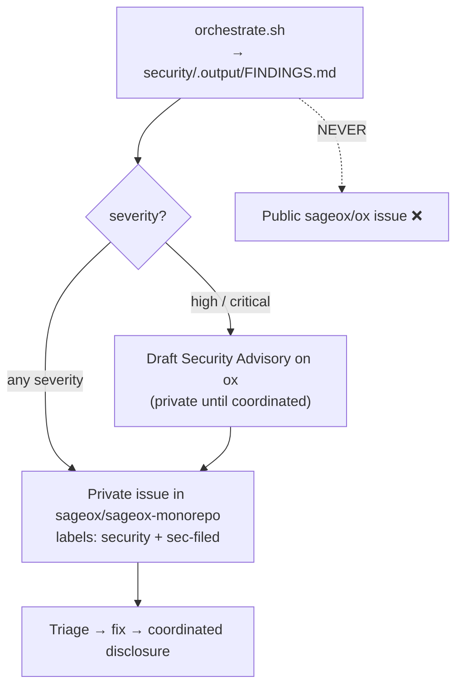

# Disclosure routing — where ox security findings go

> **ox is a PUBLIC repository.** A confirmed finding is a pre-patch 0-day the
> moment it becomes world-readable. So findings from this pipeline are **never**
> filed in ox's own public tracker. They route to the **private**
> `sageox/sageox-monorepo` instead. This file is the one authoritative statement
> of that rule; `security/scripts/orchestrate.sh` points here.

## The rule

| Finding source | Where it is filed | Never |
|---|---|---|
| `security/.output/FINDINGS.md` (this pipeline) | `sageox/sageox-monorepo` issue, labels `security` + `sec-filed` | A public `sageox/ox` issue |
| High / critical severity | The monorepo issue **plus** a draft GitHub Security Advisory on ox (private until coordinated) | A public issue or public advisory before the patch |
| Externally reported vuln | Private paths in [`README.md` → Reporting a real finding](README.md#reporting-a-real-finding) — `security@sageox.ai` or private vulnerability reporting | A public issue |

## Why the private monorepo, not ox's own tracker

- **Public issue = public 0-day.** Filing an exploitable finding on a public
  repo announces it to attackers before a fix ships. Same reasoning the pipeline
  keeps the AI tier out of CI and off the public Security tab
  (see [README → Why no AI tier in CI](README.md#why-no-ai-tier-in-ci)).
- **The monorepo is private and is the team's substrate.** Triage, severity
  ruling, and fix scheduling happen where the maintainers already work, without
  a world-readable trail.
- **`sec-filed` is the idempotency marker.** It records that a finding has
  already been routed, so re-runs of the pipeline don't file duplicates.

## Routing flow

